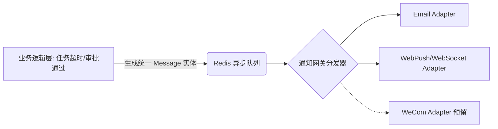

# 🌲 Project Filum 架构与设计文档 (Design Document)

> 历史草稿副本：后续请以 `memory-bank/design-document.md` 作为标准入口；本文件仅保留早期版本内容供参考。

**版本**: v1.0.0
**状态**: Draft / 规划中
**目标受众**: 研发团队、产品设计人员

## 1. 项目概述 (Overview)
**Project Filum**（拉丁语：线、脉络）是一个专为 50~100 人规模企业打造的轻量级、AI 增强型内部事务与人事管理平台。其核心愿景是通过一套统一的系统，串联起企业内的“人（档案/权限）”、“事（任务/流转）”与“信息（消息/通知）”，并通过大语言模型（LLM）的深度集成，降低员工的使用心智负担，提升组织协同效率。

## 2. 设计理念与意图 (Design Philosophy)

本系统的架构与功能设计遵循以下四大核心理念：

1. **务实的适度设计 (Pragmatic Architecture)**
   - 针对百人规模的团队，**坚决避免微服务带来的运维灾难**。采用“模块化单体架构 (Modular Monolith)”，保持代码的高内聚，以最少的人力成本实现快速迭代。
2. **抽象解耦与柔性扩展 (Decoupled & Flexible)**
   - 面对未来可能的跨平台需求（如钉钉、企微），系统在底层采用**适配器模式 (Adapter Pattern)** 设计统一数据总线。业务层只管“发消息”，不关心“怎么发”，优先保障目前最稳定的 Email 接入，为未来预留空间。
3. **AI 作为原生能力而非噱头 (AI-Native, Not Just a Chatbot)**
   - LLM 不仅仅是一个侧边栏问答机器人。通过 **Function Calling (工具调用)** 技术，LLM 被视为系统的“交互路由引擎”，能够理解用户的模糊指令，直接调用后端 API 进行任务查询、进度汇总和简单事务下发。
4. **数据结构兼容并蓄 (Hybrid Data Structuring)**
   - 人事档案和业务表单具有多变性。采用关系型结构与非关系型结构混合的设计（PostgreSQL 的原生 JSONB 能力），在保证核心业务强一致性的同时，赋予档案自定义字段极大的灵活性。

---

## 3. 技术栈选型 (Technology Stack)

系统采用现代化、前后端分离的高性能架构：

- **前端 (Frontend)**
  - **核心框架**: Vue 3 (Composition API) + TypeScript + Vite
  - **UI 库**: Element Plus / Tailwind CSS (视设计风格而定)
  - **跨平台方案**: 响应式设计 + PWA (渐进式 Web 应用)，支持桌面安装与浏览器原生推送。
- **后端 (Backend)**
  - **核心框架**: Python 3.10+ & FastAPI
  - **数据验证与序列化**: Pydantic v2
  - **ORM**: SQLAlchemy 2.0
  - **AI 集成**: 官方 API SDK (支持 OpenAI 兼容格式，如 `gpt-4o-mini`, `Qwen` 等)，轻量级 Tool Calling 封装。
- **存储与中间件 (Storage & Middleware)**
  - **主数据库**: PostgreSQL 15+ (利用 JSONB 存扩展字段，利用 pgvector 为后期 RAG 预留能力)
  - **缓存与队列**: Redis (处理 Session、系统状态缓存) + Celery/ARQ (处理异步任务如邮件发送、定时任务)。

---

## 4. 核心系统模块 (Core Modules)

### 4.1 组织与人事模块 (HR & Organization)
- **组织架构树**: 以部门为节点的树状结构，支持多层级嵌套。
- **全生命周期档案**: 建立以 `User` 为基础的 `Profile`。利用 JSONB 格式存储动态字段（如技能标签、紧急联系人）。
- **流程联动**: 员工状态变更（如入职、离职）作为 Event 触发器，自动派生出相关行政/IT 任务。

### 4.2 统一权限与安全模块 (IAM)
- **RBAC + 数据隔离**:
  - **角色级**: 区分“管理员”、“HR”、“普通员工”，控制功能菜单的可见性。
  - **数据级**: 基于组织架构树实现上下文隔离（例如：部门负责人只能查询本部门员工的任务数据）。

### 4.3 事务引擎与协同模块 (Workflow & Task)
- **多维任务管理**: 支持任务的指派、截止日期设置、前置/后置依赖关联。
- **状态流转 (State Machine)**: `Todo -> Doing -> Review -> Done`。
- **SOP 模板化**: 提供入职、采购、报销等标准化任务模板，一键生成任务群。

### 4.4 消息与 AI 路由模块 (Messaging & AI Router)
- **统一消息模型**: 系统内外沟通的收件箱。
- **指令路由**: 监听输入框的 `@` 或 `/` 符号，将文本分发至系统内置指令或 LLM Agent。

---

## 5. 核心机制设计与意图阐释 (Key Mechanisms)

### 5.1 统一通知适配总线 (Unified Notification Bus)
**意图**: 解决不同平台（邮件、系统、未来企微）通知接口各异导致的业务代码臃肿。

*设计说明*: 无论业务侧发生什么，统一调用 `NotificationService.send(message_obj)`。网关负责将消息转换为适合邮件的 HTML 模板或前端的 JSON 数据。

### 5.2 AI Tool Calling 路由机制 (LLM Intent Engine)
**意图**: 让系统拥有“自然语言 API”，使用户通过日常对话即可完成复杂交互。

1. **用户输入**: `@系统 帮我看看目前行政部有多少个没完成的任务？`
2. **意图拦截**: 前端识别到 `@系统`，将请求发送至后端专用的 LLM Router。
3. **工具决策 (Function Calling)**: LLM 分析上下文，发现需要调用后端已注册的工具 `get_department_tasks(dept_name="行政部", status="pending")`。
4. **后端执行**: FastAPI 截获 LLM 的调用请求，查询 PostgreSQL，得到结果（例如 5个任务）。
5. **LLM 总结**: 后端将原始 JSON 喂给 LLM，LLM 生成拟人化回复并推给前端：“目前行政部有 5 个待处理任务，其中 2 个已超时...”。

---

## 6. 数据库领域模型雏形 (Domain Models)

本节展示关键实体的关系意图，非最终物理表结构。

- **`users` 表**: 系统鉴权基础。(`id`, `email`, `password_hash`, `role`)
- **`profiles` 表**: 档案详情。(`user_id`, `name`, `department_id`, `custom_fields (JSONB)`)
- **`departments` 表**: 组织关系。(`id`, `name`, `parent_id`, `manager_id`)
- **`tasks` 表**: 业务核心。(`id`, `title`, `creator_id`, `assignee_id`, `status`, `due_date`, `parent_task_id`)
- **`task_logs` 表**: 审计与追溯。(`task_id`, `operator_id`, `action`, `timestamp`)

---

## 7. 演进路线图 (Roadmap & Phased Approach)

为了保证项目的顺利落地并尽早交付业务价值，开发将分为四个阶段进行：

- **Phase 1: 基础设施与底座 (Foundation)**
  - 搭建前后端框架（Vue3 + FastAPI）。
  - 实现用户系统、部门树状结构、人事档案的 CRUD 操作。
  - 构建统一通知总线，跑通内部 Web 推送与 Email 邮件发送。
- **Phase 2: 业务流转中枢 (Task & Workflow)**
  - 开发任务管理模块（看板/列表视图）。
  - 实现任务的下发、状态变更与超时自动提醒逻辑。
  - 完成任务与人事模块的联动（如入职任务自动生成）。
- **Phase 3: 注入智能化灵魂 (AI Integration)**
  - 接入 LLM API 平台。
  - 编写后端第一批 Tools 接口（如查询任务、催办任务）。
  - 联调前端 `@` 消息拦截与对话 UI，实现“对话即操作”。
- **Phase 4: 打磨与部署 (Polish & Deploy)**
  - 完善前端响应式与 PWA 本地缓存支持。
  - 性能优化、日志完善与全量内部测试。

---
