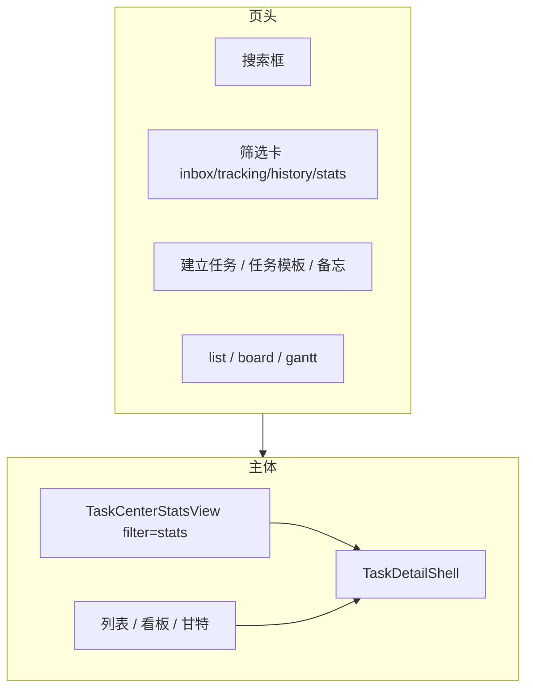
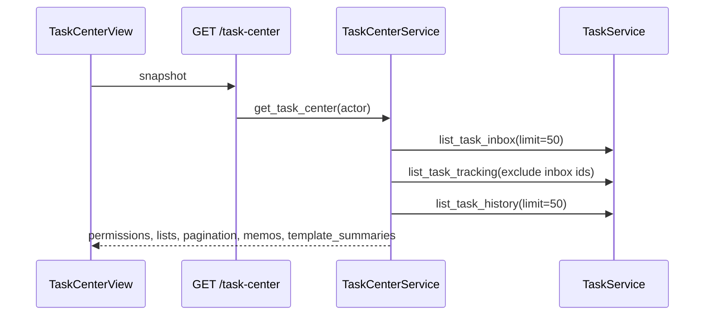
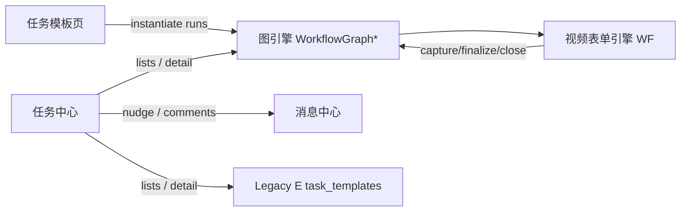

# 领域：任务中心 (Task Center)

> 🌡️ WARM — 任务协同、Inbox、多视图、统计、详情 Shell 的**全貌梳理**。  
> **最后同步**：2026-06-22 @ **TCE Phase 5 + 图模板设计器 D1–D3 + UX 抛光 ✅** · 产品 SemVer `0.89.0`  
> **排期归档**：[`plans/task-center-enhance.md`](../plans/task-center-enhance.md) · **交互基准**：[`demos/workflow-task-center-v2.1-demo.html`](../demos/workflow-task-center-v2.1-demo.html)  
> **契约索引**：[`data-contracts.md`](../data-contracts.md) §10.14–10.18B · **UI 手册**：[`handbooks/user-manual.md`](../handbooks/user-manual.md)

---

## 1. 完成度评估

### 1.1 总览

| 维度 | 状态 | 说明 |
|------|------|------|
| **TC-P0–P2**（v2 壳层 + 三视图 + 统计 + Shell） | ✅ @ `0.88.0`–`0.89.0` | 列表/看板/甘特、Master-Detail、`TaskDetailShell`、Action Profile |
| **TCE Phase 1–5**（读模型 + 性能 + 管理端 + 多部门 + TC-P3 清理） | ✅ @ 2026-06-21 | 7 个 commit on `main`（`0bebc2b` … `ae0ce55`） |
| **图模板设计器 D1–D3**（F-18–F-20） | ✅ @ 2026-06-21 | clone/draft/publish、边与拓扑、DAG/dry-run/导入导出/Run 统计（`dc08acc` … `9d2b6f5`） |
| **用户可见模板入口** | ✅ 单轨 | `/task-templates` 列表 + 实例化 + `/task-templates/:id/edit` 设计器；Legacy E UI 已移除 @ `0.89.0` |
| **Legacy E 后端** | ⏳ backlog | `task_templates` API / `TaskTemplateService` 仍存在 — **B-12** |
| **详情 Shell 拆分** | ⏳ backlog | 仅抽出 `TaskDetailActionDialogs.vue` — **F-05** |

**结论**：任务中心 **产品闭环已完成**（Inbox → 跟踪 → 历史 → 统计 → 详情 → 模板实例化 → 视频批次全流程）。剩余为 **架构债（B-12）** 与 **可维护性（F-05、F-10–F-12 抛光）**，不影响主路径演示与 UAT。

### 1.2 TCE 分项验收矩阵

| ID | 工作项 | Phase | 状态 |
|----|--------|-------|------|
| B-01 | 节点任务 graph 投影 inbox/tracking/history | 1 | ✅ |
| B-02 | inbox/tracking SQL LIMIT | 1 | ✅ |
| B-03 | 图任务 `department_id` 迁移脚本 | 1 | ✅ |
| B-04 | `GET /tasks?ids=` batch 查询 | 2 | ✅ |
| B-05 | snapshot `run_label` + `user_facing_state` | 2 | ✅ |
| B-07 | tracking 排除 inbox 集合 | 2 | ✅ |
| B-06 | stats/workload `department_id` + 鉴权 | 3 | ✅ |
| B-09 | inbox/tracking/history cursor 分页 | 3 | ✅ |
| B-11 | `GET /workflow-graph/runs?department_id=` | 3 | ✅ |
| B-16 | 实例部门优先 participant policy | 4 | ✅ |
| B-08 | snapshot 图模板摘要（替换 Legacy E） | 5 | ✅ |
| B-13 | `aggregate_mode: batch \| streaming` | 5 | ✅ |
| B-14 | `POST .../close-capture` | 5 | ✅ |
| B-15 | `task_user_facing_state` 图 business_state 对齐 | 5 | ✅ |
| B-12 | Legacy E 与图引擎 runtime 统一 | — | ⏳ backlog |
| F-01–F-09 | workspace hydration、看板姓名、搜索用户态、refresh 等 | 1–3 | ✅ |
| F-13–F-16 | 移除 TasksView 回退、aggregate UI、结束采集 | 5 | ✅ |
| F-05 | TaskDetailShell 完整拆分 | — | ⏳ backlog |
| F-10–F-12 | 甘特引导、PublishDialog 抽出、采集组件统一 | — | ⏳ 未排 |
| F-18 | 图模板设计器 D1（clone/draft/publish/validate） | D1 | ✅ |
| F-19 | 设计器 D2 边表、routing_rules、拓扑校验 | D2 | ✅ |
| F-20 | 设计器 D3 DAG 预览、dry-run、JSON 导入导出、Run 统计 | D3 | ✅ |

### 1.3 能力成熟度（五档）

| 能力 | 成熟度 | 备注 |
|------|--------|------|
| 待办 / 跟踪 / 历史列表 | **生产可用** | graph-first + cursor 分页 + 用户态列 |
| 看板 / 甘特 | **生产可用** | 用户态 × Run；甘特仅含 `due_date` 任务 |
| 任务统计 Tab | **生产可用** | 部门筛选 + Run 列表 + run_events |
| 建立任务（手动） | **生产可用** | graph dual-write（`WORKFLOW_GRAPH_ENGINE_ENABLED`） |
| 图模板实例化 | **生产可用** | 视频批次 + 多部门发起（B-16/F-17） |
| 图模板设计器 | **生产可用** | 表单化 authoring；有实例时结构锁定 + fork version |
| 详情（视频 v1 Profile） | **生产可用** | N1/N2/ROOT/制作链；batch/streaming 门控 |
| 详情（graph 手动握手） | **生产可用** | 接单 / 协商 / 转办 / 交付 / 验收 |
| 搜索 | **基本可用** | 标题搜索 + 前端用户态标签；非 snapshot 同源 |
| Legacy E 任务 | **维护模式** | 无 UI 入口；后端 API 仍可用 |
| 看板拖拽改状态 | **未做** | 刻意不在范围 |

---

## 2. 信息架构与路由

### 2.1 页面入口

| 路由 | 组件 | 作用 |
|------|------|------|
| `/task-center` | `TaskCenterView.vue` | 主工作台 |
| `/task-templates` | `TaskTemplatesView.vue` → `GraphTemplatesPanel` | 图模板列表、实例化、Run（30d）统计列 |
| `/task-templates/:id/edit` | `GraphTemplateDesignerView.vue` | 图模板设计器（config/节点/边/校验/发布/导入导出/dry-run） |

### 2.2 URL Query 协议

| Query | 取值 | 含义 |
|-------|------|------|
| `filter` / `tab` | `inbox` \| `tracking` \| `history` \| `stats` | 主 Tab |
| `view` | `list` \| `board` \| `gantt` | 工作区视图（stats Tab 下忽略） |
| `selected` | task UUID | Master-Detail 选中任务 |

兼容旧 Tab 名：`tasks` → `tracking`，`publish` → `inbox`。

### 2.3 布局结构



- **Master-Detail**：左侧 Master 列表/看板/甘特，右侧固定 `TaskDetailShell`。
- **stats Tab**：全宽统计页；选中 Run 后可 deep-link 回 `filter=stats&selected=…`。
- **Legacy 回退**：TCE Phase 5 已移除 `TasksView` 嵌入；`VITE_TASK_CENTER_V2_UI_ENABLED` 恒为 true。

---

## 3. 端到端数据流

### 3.1 首屏加载



### 3.2 工作区 hydration（看板/甘特/列表 v2）

1. 从 snapshot 当前 filter 提取 `task_id[]`（最多首屏 50）。
2. `GET /api/v1/tasks?ids=` batch 拉取 `Task` 详情（**F-01 / B-04**）。
3. `projectTasksForWorkspace` + `user-state.ts` 投影用户态。
4. 用 snapshot 行的 `run_label` / `user_facing_state` / `current_handler_label` **覆盖**前端投影（与列表一致）。

### 3.3 加载更多

- `GET /task-center/{inbox|tracking|history}?cursor=&limit=` 追加 ID 到 snapshot 本地数组。
- tracking 分页仍先取 inbox 同页 ID 做 exclude（与 snapshot 组装逻辑一致）。

### 3.4 详情与操作后刷新

1. `TaskDetailShell` 根据 `selected` 加载 `GET /tasks/{id}` + `GET /workflow-graph/instances/{id}`（图任务）。
2. `TaskDetailProfile` 决定面板组合与主按钮。
3. 操作完成 → `emit('actionDone')` → `TaskCenterView` 重拉 snapshot + `refreshWorkspace()`。

### 3.5 读路径（graph-first）

`TASK_CENTER_V2_ENABLED=true`（默认）时：

```
TaskService.list_task_inbox / tracking / history
  → _graph_task_projection_map(tasks)
  → 命中：GraphTaskProjection（status, stage, handler, business_state, node_key）
  → 未命中：legacy Task.status + metadata 规则
  → _list_item_extras → run_label + user_facing_state（B-05/B-15）
```

图锚点：`extra_metadata.workflow_graph_instance_id`（+ 可选 `workflow_node_instance_id`）。

---

## 4. 后端模块地图

### 4.1 API 路由

| 方法 | 路径 | 职责 |
|------|------|------|
| GET | `/api/v1/task-center` | 聚合 snapshot（权限、三列表首屏、分页元数据、备忘、图模板摘要） |
| GET | `/api/v1/task-center/inbox` | 待办分页 |
| GET | `/api/v1/task-center/tracking` | 跟踪分页 |
| GET | `/api/v1/task-center/history` | 历史分页 |
| POST/PATCH/DELETE | `/api/v1/task-center/memos` | 个人备忘 CRUD |
| GET | `/api/v1/tasks?ids=` | batch 任务详情（workspace hydration） |
| GET | `/api/v1/tasks/search` | 标题搜索 |
| GET | `/api/v1/tasks/stats/summary` | 完成率/逾期率（`?department_id=`） |
| GET | `/api/v1/tasks/stats/workload` | 按人负载（`?department_id=`） |
| POST | `/api/v1/tasks` | 建立任务（手动 → graph dual-write） |
| PATCH | `/api/v1/tasks/{id}/status` | Legacy 状态机（graph 手动任务受限） |
| * | `/api/v1/tasks/{id}/*` | 握手、交付、验收、评论、催办等 |
| POST | `/api/v1/workflow-graph/templates/{id}/runs` | 图模板实例化 |
| POST | `/api/v1/workflow-graph/instances/{id}/close-capture` | 结束采集（批次 ROOT） |
| GET | `/api/v1/workflow-graph/runs?department_id=` | 部门 Run 一览（统计 Tab） |
| GET | `/api/v1/workflow-graph/instances/{id}/events` | Run 事件时间线 |
| GET | `/api/v1/workflow-graph/templates?scope=manage` | 管理端模板列表（含 draft + Run 统计） |
| POST | `/api/v1/workflow-graph/templates` | clone 新建 draft |
| GET/PUT | `/api/v1/workflow-graph/templates/{id}/designer` / `.../draft` | 设计器读模型 / 整包保存 |
| POST | `/api/v1/workflow-graph/templates/{id}/versions` | fork 新版本 |
| PATCH | `/api/v1/workflow-graph/templates/{id}/status` | draft → active / archived |
| GET | `/api/v1/workflow-graph/templates/{id}/validate` | schema + 拓扑预检 |
| GET/POST | `/api/v1/workflow-graph/templates/{id}/export` / `.../import` | JSON bundle 导入导出 |
| POST | `/api/v1/workflow-graph/templates/import` | 从 JSON 新建 draft |
| POST | `/api/v1/workflow-graph/templates/{id}/dry-run` | 试跑（可选 draft 载荷） |
| GET | `/api/v1/workflow-graph/templates/{id}/stats` | Run 计数 |

Legacy（仍存活，无 UI）：`/api/v1/task-templates/*`。

### 4.2 核心服务

| 服务 | 文件 | 职责 |
|------|------|------|
| **TaskCenterService** | `task_center_service.py` | snapshot 组装；发布部门/用户选项；**图模板** `template_summaries` |
| **TaskService** | `task_service.py` | 三列表 graph-first；batch/search/stats；状态机；握手/交付/验收 |
| **TaskMemoService** | `task_memo_service.py` | 用户私有备忘 |
| **TaskUserFacingState** | `task_user_facing_state.py` | 列表 `user_facing_state`（对齐 `user-state.ts` + 图 business_state） |
| **WorkflowVideoFormService** | `workflow_video_form_service.py` | capture 提交、汇总、close-capture、dispatch_topic |
| **WorkflowVideoInstantiationService** | `workflow_video_instantiation_service.py` | 图模板 Run 创建、schema_snapshot、aggregate_mode 写入 context |
| **ParticipantResolutionService** | `participant_resolution_service.py` | 实例化参与人（B-16 instance department 优先） |
| **WorkflowGraphService** | `workflow_graph_service.py` | 图实例/节点、部门 Run 聚合 |
| **WorkflowGraphTemplateAdminService** | `workflow_graph_template_admin_service.py` | 设计器 CRUD、draft/publish、import/export、dry-run、stats |
| **WorkflowGraphTemplateTopology** | `workflow_graph_template_topology.py` | 可达性/环路、ELSE 边、reject 路径、routing_rules 校验 |
| **AccessControl** | `access_control.py` | `can_publish_org_tasks`、`ensure_department_stats_access` 等 |

### 4.3 Schema / 枚举

| 类型 | 文件 |
|------|------|
| `TaskCenterRead`、列表项、`TaskMemo*` | `schemas/task_center.py` |
| `TaskSearchResultRead`、`TaskStats*` | `schemas/tasks.py` |
| `WorkflowRunContextSchema`、`aggregate_mode` | `schemas/workflow_video.py` |
| `TaskUserFacingState` | `pending` / `in_progress` / `awaiting_confirm` / `completed` / `returned` |

### 4.4 Feature Flags

| 变量 | 默认 | 作用 |
|------|------|------|
| `TASK_CENTER_V2_ENABLED` | `true` | 列表 graph-first 读路径 |
| `WORKFLOW_GRAPH_ENGINE_ENABLED` | `true` | 手动任务 graph dual-write |

---

## 5. 前端模块地图

### 5.1 视图与壳层

| 模块 | 路径 | 职责 |
|------|------|------|
| **TaskCenterView** | `views/TaskCenterView.vue` | 路由壳：Tab、视图切换、搜索、建立任务 Dialog、Master-Detail 编排 |
| **TaskCenterFilterCards** | `components/task-center/TaskCenterFilterCards.vue` | inbox/tracking/history/stats 筛选卡 |
| **TaskCenterListView** | `components/task-center/TaskCenterListView.vue` | 列表：标题、Run、**用户态**、跟踪关联/催办 |
| **TaskCenterBoardView** | `components/task-center/TaskCenterBoardView.vue` | 看板：列=用户态，卡片含 Run chip + 执行人姓名 |
| **TaskCenterGanttView** | `components/task-center/TaskCenterGanttView.vue` | 甘特 MVP（仅有 `due_date` 的行） |
| **TaskCenterStatsView** | `components/task-center/TaskCenterStatsView.vue` | 部门统计 + Run 下拉 + events + workload |
| **TaskDetailShell** | `components/task-detail/TaskDetailShell.vue` | 详情：Profile 路由、主 CTA、视频/图面板 |
| **TaskDetailActionDialogs** | `components/task-detail/TaskDetailActionDialogs.vue` | 协商/转办/打回等对话框（F-05 局部抽出） |
| **TaskDetailMoreMenu** | `components/task-detail/TaskDetailMoreMenu.vue` | 更多：打回采集、打开统计等 |
| **GlobalMemoFloat** | `components/shell/GlobalMemoFloat.vue` | 全局右下角备忘浮窗 |
| **TaskTemplatesView** | `views/TaskTemplatesView.vue` | 图模板页壳层（列表 + 实例化 Dialog 编排） |
| **GraphTemplateDesignerView** | `views/GraphTemplateDesignerView.vue` | 全页设计器：config/节点/边/校验/发布/导入导出/dry-run |
| **GraphTemplatesPanel** | `components/workflow/GraphTemplatesPanel.vue` | 模板列表、「新建/设计/复制/改名」、Run（30d）列 |
| **GraphTemplateDagPreview** | `components/workflow/GraphTemplateDagPreview.vue` | 拓扑 SVG 预览：横/纵布局、图例、打回通道、边框锚点箭头 |
| **GraphTemplateEditDialog** | `components/workflow/GraphTemplateEditDialog.vue` | 快速改名称/说明（主编辑走设计器） |

`TasksView.vue` 仍存在于仓库（路由可达），但 **不再** 嵌入任务中心；保留供独立路径或 E2E 兼容。

### 5.2 Composables / Domain

| 模块 | 路径 | 职责 |
|------|------|------|
| `useTaskCenterWorkspace` | `composables/useTaskCenterWorkspace.ts` | snapshot IDs → batch tasks → workspace rows |
| `useTaskUserFacingProjection` | `composables/useTaskUserFacingProjection.ts` | Task[] → 看板/甘特/列表行模型 |
| `useTaskCenterPermissions` | `composables/useTaskCenterPermissions.ts` | snapshot.permissions 消费 |
| `useGlobalMemoPanel` | `composables/useGlobalMemoPanel.ts` | 备忘浮窗显隐 |
| **profile** | `domain/task-detail/profile.ts` | `TaskDetailProfileId` 推断与 UI 裁剪规则 |
| **user-state** | `domain/task-detail/user-state.ts` | 用户态标签（与后端 B-15 对齐） |
| **run-label** | `domain/task-detail/run-label.ts` | Run 列展示 |
| **workflowVideoSchema** | `utils/workflowVideoSchema.ts` | `resolveAggregateMode`、`isCaptureClosed` 等 |

### 5.3 工作流详情面板

| 面板 | 路径 | Profile / 条件 |
|------|------|----------------|
| TemplateCapturePanel | `workflow/TemplateCapturePanel.vue` | N1 / N7 采集；`capture_closed` 时禁止提交 |
| TemplateAggregatePanel | `workflow/TemplateAggregatePanel.vue` | N2 批量汇总；`aggregate_mode=batch` |
| VideoTrackingPanel | `workflow/VideoTrackingPanel.vue` | ROOT 增量派发；`aggregate_mode=streaming` |
| VideoCaptureProgressPanel | `workflow/VideoCaptureProgressPanel.vue` | N2 / ROOT 采集进度 |
| VideoProductionPanel | `workflow/VideoProductionPanel.vue` | 制作链文件/多附件提交 |
| BatchRunDashboard | `workflow/BatchRunDashboard.vue` | 仍存在于仓库；任务中心 v2 已不再挂载 |

### 5.4 API 客户端

| 文件 | 职责 |
|------|------|
| `api/task-center.ts` | snapshot、分页、备忘 |
| `api/tasks.ts` | 任务 CRUD、search、stats、batch ids |
| `api/workflow-graph.ts` | 图实例、实例化、close-capture、runs、events；设计器 designer/draft/publish/validate/export/import/dry-run/stats |

---

## 6. 任务类型与 Action Profile

详情行为由 `resolveTaskDetailProfile(task)` 决定，核心分支：

| Profile ID | 典型来源 | 主交互 | 隐藏项 |
|------------|----------|--------|--------|
| `legacy_task` | 纯 Legacy 任务 | 状态流转 / 交付 | — |
| `graph_manual` | 手动 graph dual-write | 接单 → 交付 → 验收 | 视频面板 |
| `video_batch_root` | 批次 ROOT 任务 | streaming：增量派发；batch：结束采集 | 通用交付/握手 |
| `video_n1_capture` | N1 fan-out | 单条选题表单提交 | 握手、评论默认折叠 |
| `video_n2_aggregate` | N2 经理汇总 | batch：确认派发矩阵 | 同上 |
| `video_production_step` | N3–N11 单步制作 | 上传/验收 | 采集表格 |
| `video_capture_assign` / `video_capture_schedule` | N7/N12 采集型节点 | 表格采集 | — |

**aggregate_mode**（批次模板 config / instance context）：

| 模式 | ROOT 详情 | N2 详情 |
|------|-----------|---------|
| `batch`（默认） | 「结束采集」按钮；无增量跟踪表 | `TemplateAggregatePanel` 批量 finalize |
| `streaming` | `VideoTrackingPanel` 逐题 dispatch | 不展示批量汇总面板 |

---

## 7. 典型使用场景

### 场景 A — 经理手动派活（graph 手动任务）

1. 经理打开 **任务中心** → **建立任务** Dialog：选部门、执行人、标题、截止时间。
2. 后端 `TaskService.create_task_record` graph dual-write → 执行人 **待办** 出现任务（用户态「待处理」，需接单）。
3. 执行人选中任务 → **接受任务** → 提交交付物 → 发起人 **待办** 待验收 → 验收通过 → 进入 **历史**。

**涉及模块**：`TaskCenterView` 发布 Dialog → `tasks` API → `TaskService` → `TaskDetailShell`（`graph_manual`）。

### 场景 B — 文案部发起选题会（批次 Run，batch 模式）

1. 文案经理进入 **任务模板** → 选 `topic_meeting_batch_v1` → 实例化 Dialog 选 **发起部门** + 参与人 + 主题。
2. `POST .../workflow-graph/templates/{id}/runs` → fan-out N1 到部门成员；ROOT 任务进经理 **跟踪**。
3. 文案编辑 **待办** N1 → `TemplateCapturePanel` 提交选题 → 用户态变「已完成」，离开待办。
4. 经理在 ROOT 详情点 **结束采集**（可选，关闭未交入口）→ N2 **待办** 汇总矩阵 → **确认派发** → fork 制作子 Run。

**涉及模块**：`TemplateInstantiateDialog` → `WorkflowVideoInstantiationService` → 列表 graph 投影 → `TemplateAggregatePanel` / `close-capture` API。

### 场景 C — 同一模板 streaming 增量派发

1. 模板 config `aggregate_mode: streaming`（或实例 context 覆盖）。
2. 成员交选题后，经理在 **ROOT 跟踪详情** 见 `VideoTrackingPanel`：逐行选脚本作者 → **指派并启动制作**（`dispatch_topic`）。
3. 无需等全员交齐，也不走 N2 批量 finalize。

**涉及模块**：`VideoTrackingPanel` → `workflow_video_form_service.dispatch_topic` → 子 Run 出现在跟踪/统计。

### 场景 D — 制作子 Run（按题 production）

1. fork 后脚本作者 **待办** N3 → `VideoProductionPanel` 上传脚本 → 审核节点 **待确认** → 后期 N7 指派剪辑 … 直至 N12 排期。
2. 任务中心列表 Run 列区分「第 12 周 / 选题 A」等（`run_label` from graph context）。

**涉及模块**：`VideoProductionPanel` → graph 节点完成 / 验收 API → `task_user_facing_state` 投影「待确认」。

### 场景 E — 部门经理看统计

1. **任务中心** → **统计** Tab → 选 **本部门**。
2. 加载 `stats/summary`、`stats/workload`、`workflow-graph/runs` → 选 Run → 看 `run_events` 时间线。
3. 点击事件/Run 可带 `selected` 跳回详情（Shell 内链到 stats）。

**涉及模块**：`TaskCenterStatsView` → `tasks` stats API + `listDepartmentRuns` + `listInstanceEvents`。

### 场景 F — 跨部门：文案 A/B 共用模板（Phase 4）

1. 文案 A 经理实例化：发起部门默认 A，preview 仅 A 部员工。
2. 文案 B 经理另起 Run：改选 B 部 → N1 fan-out B 部成员。
3. 后期部 N7 仍从 `post_production` 池接单；Run 列 + 统计部门筛选区分两批次。

**涉及模块**：`ParticipantResolutionService`（B-16）+ `TemplateInstantiateDialog`（F-17）。

### 场景 G — 跟踪与催办

1. 发起人在 **跟踪** Tab 看子任务进度（关联方式：创建/关注/…）。
2. 逾期任务显示标签 → **催办** 写入系统评论（通知链路经消息中心）。

**涉及模块**：`TaskCenterListView` nudge → `tasks` comments API。

### 场景 H — 搜索与备忘

1. 页头搜索框 → `GET /tasks/search` → 表格展示 **用户态** 标签（F-04）。
2. 右下角 **个人备忘** 浮窗：可关联 `related_task_id`，数据在 snapshot `task_memos` 与独立 CRUD API。

---

## 8. 与周边系统关系



| 系统 | 关系 |
|------|------|
| **图引擎** | 列表读投影、详情节点态、模板实例化主路径 |
| **视频 v1 WF** | 批次/制作 Run 的 capture/aggregate/dispatch/close-capture |
| **Legacy E** | 仅后端 API；snapshot 不再暴露 E 模板摘要 |
| **消息中心** | 催办、通知、审批提醒（非任务中心内嵌） |
| **组织/权限** | 发布范围、`department_id` 统计鉴权、参与人解析 |

---

## 9. 测试锚点

| 层 | 范围 |
|----|------|
| pytest | `test_tce_phase1_*` … `test_tce_phase5_*`；`test_workflow_graph_template_designer_d{1,2,3}` · `test_workflow_graph_template_topology`；workflow-video W2–W10 |
| vitest | `TaskCenterView.spec.ts`、`GraphTemplateDesignerView.spec.ts`、`useTaskCenterPermissions.spec.ts` |
| Playwright | **core 33** @ `npm run test:e2e`：`task-center.spec.ts`、`task-center-stats.spec.ts`（4）、`task-center-extended.spec.ts`、`task-center-interactions.spec.ts`（8）、`graph-template-designer.spec.ts`、`workflow-video-v1.spec.ts`；**全集 48** @ `npm run test:e2e:task-center`（+ multi-account mock 15）；扩展见 `progress.md`「E2E 待办」 |
| data-testid | `task-center-view`、`task-center-list-view`、`tasks-detail-panel`、`video-batch-close-capture` 等 |

---

## 10. 已知遗留与后续

| 项 | 说明 | 跟踪 |
|----|------|------|
| **B-12** Legacy E runtime 删除与迁移 | 后端 `task_templates` 与图模板双轨 | ADR-005 · [`known-issues.md`](../known-issues.md) |
| **F-05** TaskDetailShell 拆分 | ~1800 行巨石 | enhance §7 |
| **F-10–F-12** | 甘特引导 copy、PublishDialog 组件化、N1/N7 采集 UI 统一 | enhance P2 未做 |
| **搜索 vs 列表** | 搜索走独立 API，非 snapshot 同源；大量结果无分页 | 可后续 B-10 深化 |
| **tracking 分页** | 分页时仍拉 inbox 同页做 exclude | 大 inbox 时 tracking 第 2 页语义需产品确认 |
| **TasksView** | 文件保留，未从路由删除 | 可评估 deprecate 路由 |

---

## 11. 修订记录

| 日期 | 说明 |
|------|------|
| 2026-06-21 | **§12 + 全文**：图模板设计器 D1–D3 落地；路由/服务/前端地图对齐代码 |
| 2026-06-21 | **§12 模板设计器**：D1–D3 实现计划与 API 契约 |
| 2026-06-21 | **全文重写**：TCE Phase 5 完成度、模块地图、数据流、8 类典型场景 |
| 2026-06-18 | 初版 domain；TCE 缺口表（已由 Phase 1–5 闭合） |

---

## 12. 图任务模板设计器（Template Designer）

> **定位**：在 `/task-templates` 提供 **WorkflowGraphTemplate** 的表单化 authoring；**不恢复** Legacy E 结构化设计器。设计器是图模板唯一维护入口，与 B-12（删 E API）方向一致。

### 12.1 现状（D1–D3 ✅）

| 能力 | 实现 |
|------|------|
| 列表 + 实例化 | `GraphTemplatesPanel`：新建/设计/复制/改名、Run（30d）统计 |
| 全页设计器 | `/task-templates/:id/edit`：config、节点表、边表、routing_rules |
| Admin API | clone/create、designer GET、draft PUT、fork、publish、validate |
| 产品化（D3） | DAG 预览、dry-run、JSON 导入导出、模板 Run 统计 |
| Seed 脚本 | 仍维护 preset；UI 可改 launch_schema、节点 capture/aggregate、aggregate_mode |

### 12.2 分期

| Phase | 范围 | 交付 |
|-------|------|------|
| **D1** | 可维护 | clone/create、config + 节点表 + 节点 config、validate、version fork、draft→active、路由 `/task-templates/:id/edit` |
| **D2** | 可编排 | 边表、reject 路径、routing_rules、join_mode / assignment_mode、拓扑校验 ✅ |
| **D3** | 产品化（可选） | DAG 预览、dry-run 实例化、导入/导出 JSON、Run 统计 ✅ |

### 12.3 后端 API（D1–D3）

| 方法 | 路径 | 说明 |
|------|------|------|
| `GET` | `/workflow-graph/templates?scope=manage` | 管理员可见 draft + active + Run 统计 |
| `POST` | `/workflow-graph/templates` | `{ clone_from_id, name? }` → 新 draft |
| `GET` | `/workflow-graph/templates/{id}/designer` | 设计器读模型（nodes/edges/锁定态） |
| `PUT` | `/workflow-graph/templates/{id}/draft` | 整包保存 nodes + edges + config |
| `POST` | `/workflow-graph/templates/{id}/versions` | fork 新版本 |
| `PATCH` | `/workflow-graph/templates/{id}/status` | draft → active / archived |
| `GET` | `/workflow-graph/templates/{id}/validate` | schema + 拓扑预检 |
| `GET` | `/workflow-graph/templates/{id}/export` | **D3** 导出 JSON bundle |
| `POST` | `/workflow-graph/templates/{id}/import` | **D3** 导入到 draft |
| `POST` | `/workflow-graph/templates/import` | **D3** 从 JSON 新建 draft |
| `POST` | `/workflow-graph/templates/{id}/dry-run` | **D3** 试跑（可选 draft 载荷） |
| `GET` | `/workflow-graph/templates/{id}/stats` | **D3** Run 计数 |

**结构锁定**：存在 `WorkflowGraphInstance.template_id` 时禁止改 nodes/edges，仅允许 meta + config merge（与 Stage 2 E 规则一致）。

**发布**：`active` 时同 `base_code` 下其它 `active` 模板归档；仅 `active` 出现在默认列表与实例化。

**校验**：Pydantic `validate_launch_schema` / `validate_node_config`；节点 key 唯一；batch 模板 `aggregate_node_key` 须存在。

### 12.4 前端结构（D1–D3）

```
TaskTemplatesView.vue
  └─ GraphTemplatesPanel.vue          # 列表 +「设计/复制」→ router push
  └─ GraphTemplateDesignerView.vue    # /task-templates/:id/edit
       ├─ 元信息（name/description/status/code/version）
       ├─ 模板 config（launch_schema JSON、aggregate_mode、policies 摘要）
       ├─ 节点表（node_key/title/sort_order/assignee_rule/assignment_mode/join_mode）
       ├─ 边表 + routing_rules JSON（D2）
       ├─ 节点 config 抽屉（capture_schema | aggregate_schema）
       ├─ GraphTemplateDagPreview（D3 拓扑 SVG）
       └─ 操作：校验 / 保存草稿 / 发布 / 另存新版本 / 导入导出 JSON / dry-run
```

`GraphTemplateEditDialog` 保留为「快速改名称」；主编辑走设计器。

### 12.5 关键决策

| 决策 | 选择 |
|------|------|
| 新建默认来源 | **Clone 已有 preset**（seed 模板），不做空白 DAG |
| 有实例后改结构 | **否** → fork version 或仅 config 微调 |
| 制作模板直接实例化 | **否**（与现 UI 一致） |
| Legacy E 设计器 | **不恢复** |
| 首版 UI | **表单 + 表格**，非拖拽 DAG |

### 12.6 D1 典型场景

1. **改选题会 launch 字段**：clone v1 → 编辑 `launch_schema.fields` → validate → publish → 实例化 Dialog 动态渲染新字段。
2. **调 N1 max_rows**：设计器改 capture_schema → 新 Run 生效；旧 Run 不变。
3. **aggregate_mode 切换**：config `batch` ↔ `streaming` → 与 Phase 5 ROOT/N2 门控联动。
4. **有 Run 的模板**：结构只读 →「另存新版本」→ 改节点 → publish → 新实例化走新版。

### 12.7 测试锚点

| 层 | 文件 |
|----|------|
| pytest D1 | `test_workflow_graph_template_designer_d1.py` |
| pytest D2 | `test_workflow_graph_template_designer_d2.py` · `test_workflow_graph_template_topology.py` |
| pytest D3 | `test_workflow_graph_template_designer_d3.py` |
| vitest | `GraphTemplateDesignerView.spec.ts` |
| 回归 | 改模板 → 实例化 → inbox/tracking 与 seed 行为一致（扩 W3/W9） |

### 12.8 跟踪 ID

| ID | 说明 |
|----|------|
| **F-18** | 图模板设计器 D1 ✅ |
| **F-19** | 设计器 D2 边与路由 ✅ |
| **F-20** | 设计器 D3 产品化 ✅ |
| **B-12** | Legacy E 删除（独立，不阻塞设计器） |
