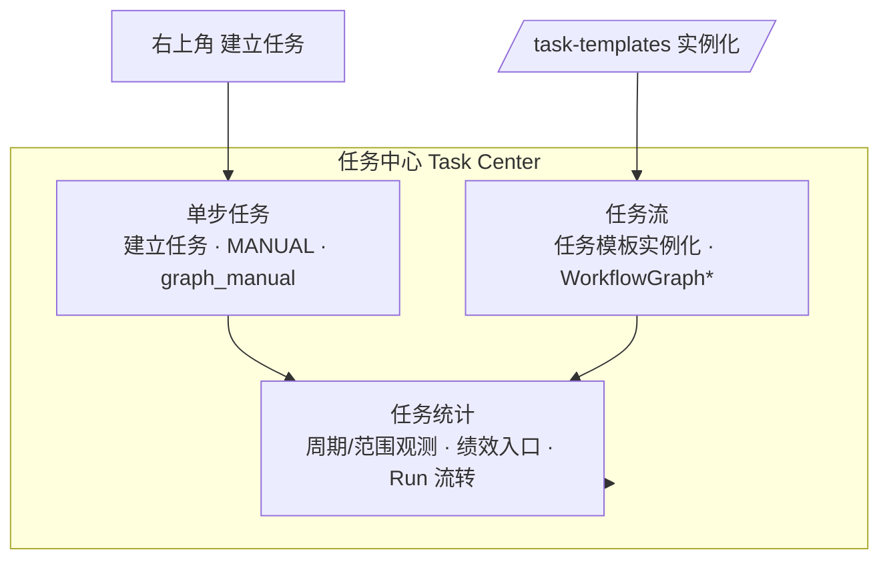
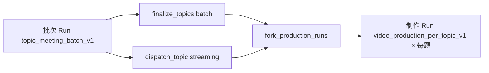
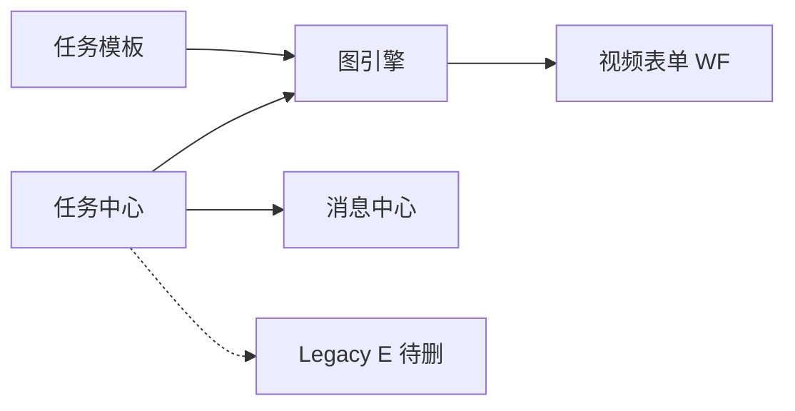

# 领域：任务中心 (Task Center)

> 🌡️ WARM — 任务协同全貌：**产品架构 · 单步/任务流/统计 · 实现与差距 · 改造跟踪**。  
> **最后同步**：2026-07-18 @ **0.92.1** · Task Center P0–P2 审计修复完成
> **排期**：[`roadmap.md`](../roadmap.md) · **决策**：[`decisions.md`](../decisions.md) ADR-009 · ADR-010  
> **契约**：[`data-contracts.md`](../data-contracts.md) §10.14–10.18B · **交互基准**：[`demos/workflow-task-center-v2.1-demo.html`](../demos/workflow-task-center-v2.1-demo.html)

---

## 0. 产品架构：三大模块

任务中心在产品和工程上分为 **三个并列能力域**（备忘 `task_memos` 不属于任务中心，见 ADR-009 G-03）。



| 模块 | 用户入口 | 运行时 | 列表/详情 |
|------|----------|--------|-----------|
| **单步任务** | `TaskCenterView` → **建立任务** | `POST /tasks` · `source_type=MANUAL` · 单节点 graph dual-write | Profile `graph_manual` |
| **任务流** | `/task-templates` → **实例化** | `POST .../workflow-graph/templates/{id}/runs` · 多节点图实例 | 视频 v1 等 Action Profile |
| **任务统计** | 任务中心 **统计** Tab（`filter=stats`） | `stats/summary` · `stats/workload` · `workflow-graph/runs` · `run_events` | 含单步 + 图投影任务；Run 时间线 |

**不在范围**：个人备忘（`GlobalMemoFloat` / `task_memos`）；Legacy E UI（已删，后端 **B-12** 待删）。

**读路径共性**：`TASK_CENTER_V2_ENABLED=true` 时 inbox/tracking/history **graph-first**；统计 API 经 `list_tasks` 聚合可见任务。

---

## 1. 完成度总览

| 模块 | 成熟度 | 摘要 |
|------|--------|------|
| **壳层**（inbox/tracking/history + 三视图 + Shell） | ✅ 生产可用 | TCE Phase 1–5 @ `0.89.0` |
| **单步任务** | ⚠️ 基本可用 | 权限/握手可用；**F-22 抄送 ✅** · **F-21 跨部门 ✅** |
| **任务流** | ⚠️ 视频 v1 可用 | fork/制作链 ✅ · **F-28 ✅** · **F-23 模板链 ✅** · **W-08 streaming N2 ✅** |
| **任务统计** | ✅ 待验收 | S-01 周期/权限/DB 聚合/负载/明细；Run 事件保留 |
| **设计器** | ✅ D1–D3 | JSON 编辑为主 → **F-26** 表单化 |
| **架构债** | ⏳ | Legacy E 历史表族清理；**F-05** Shell 拆分（当前 1841 行） |

---

## 2. 信息架构与路由

### 2.1 页面入口

| 路由 | 组件 | 模块 |
|------|------|------|
| `/task-center` | `TaskCenterView.vue` | 单步 + 列表 + **统计 Tab** + 详情 |
| `/task-templates` | `TaskTemplatesView` → `GraphTemplatesPanel` | **任务流** 列表 + 实例化 |
| `/task-templates/:id/edit` | `GraphTemplateDesignerView.vue` | 任务流模板 authoring |

### 2.2 URL Query

| Query | 取值 | 含义 |
|-------|------|------|
| `filter` / `tab` | `inbox` \| `tracking` \| `history` \| `stats` | 主 Tab（**stats = 任务统计**） |
| `view` | `list` \| `board` \| `gantt` | 工作区视图（stats 下忽略） |
| `selected` | task UUID | Master-Detail 选中 |

### 2.3 布局

- **Master-Detail**：列表/看板/甘特 + 右侧 `TaskDetailShell`。
- **stats Tab**：`TaskCenterStatsView` 全宽；可选 Run → deep-link `selected`。
- **备忘**：全局浮窗，非任务中心任务实体。

---

## 3. 端到端数据流（摘要）

1. **首屏**：`GET /task-center` → snapshot（三列表 + permissions + memos + 图模板摘要）。
2. **Hydration**：`GET /tasks?ids=` batch（看板/甘特/列表 v2）。
3. **详情**：`GET /tasks/{id}` + 图任务 `GET /workflow-graph/instances/...`。
4. **graph-first 列表**：`_graph_task_projection_map` → `run_label` / `user_facing_state`（B-05/B-15）；按 `source_id` 回退解析实例时同时限定 `source_type="task"`，防止跨来源 UUID 碰撞。
5. **批次 ROOT 投影**（`0.91.1`）：`workflow_graph_root_task` + 实例 `context.run_kind=batch`（**legacy**，见 §7.7 / ADR-017）时，列表 `status` 以 **`WorkflowGraphInstance.status`** 为准，不因 N2 engine-skip 的节点 `COMPLETED` 提前进历史；实例 `ACTIVE` 阶段标签「汇总派发：待确认派发」。

图锚点：`extra_metadata.workflow_graph_instance_id`。

---

## 4. 后端模块地图（摘要）

| 域 | 关键服务 |
|----|----------|
| 聚合 | `TaskCenterService` · `TaskMemoService` |
| 单步 | `TaskService.create_task_record` · `AccessControl` |
| 任务流 | `WorkflowVideoInstantiationService` · `WorkflowVideoForkService` · `WorkflowVideoFormService` · `WorkflowGraphService` · `ParticipantResolutionService` |
| 统计 | `TaskService.get_task_stats_summary` · `get_task_workload` · `WorkflowGraphService.list_department_runs` |
| 设计器 | `WorkflowGraphTemplateAdminService` |

Legacy（待删）：`TaskTemplateService` · `TaskAutomationService` · `/api/v1/task-templates/*`。

Feature flags：`TASK_CENTER_V2_ENABLED` · `WORKFLOW_GRAPH_ENGINE_ENABLED` · `WORKFLOW_STANDALONE_MANUAL_TASKS_ENABLED`（默认 `true`）· `WORKFLOW_GRAPH_TEMPLATE_ENGINE_ENABLED`（图模板实例化 API，默认 `false`）。

---

## 5. 前端模块地图（摘要）

| 模块 | 路径 |
|------|------|
| 壳层 | `TaskCenterView` · `TaskCenterFilterCards` · `TaskCenterList/Board/GanttView` |
| 统计 | `TaskCenterStatsView` |
| 单步发布 | `PublishTaskDialog`（由 `TaskCenterView` 打开） |
| 任务流 | `TemplateInstantiateDialog` · `GraphTemplatesPanel` · `GraphTemplateDesignerView` |
| 详情 | `TaskDetailShell` + 视频/采集面板（§9 Profile） |

---

## 6. 单步任务

> 决策：**ADR-009**（G-01–G-06）

### 6.1 设计意图

- 部门树 **`manager_id` 管辖子树**内点对点派活（Admin/HR 全员；或部门 `PUBLISH_ORG_TASK` 仅本部门）。
- **不**用 `ReportingLine` 派活；远期跨部门编组走 **项目组 P4**。
- 跨部门单步：路径路由 + **组织树 manager 链式 CC**（F-21）。
- 创建时须支持 **抄送人**（F-22）。
- 自派待办 → **备忘**，非「建立任务」。

### 6.2 当前实现

| 能力 | 实现 |
|------|------|
| 入口 | `POST /api/v1/tasks` · `source_type=MANUAL` |
| 运行时 | 新建普通任务默认 standalone Work Item；关闭 standalone 开关时才走 `_create_single_node_workflow_projection` 兼容路径 |
| 发布权限 | `can_publish_org_tasks` + `can_manage_assignee`（`access_control.py`） |
| 选人 UI | `publish_department_options` + 按部门过滤 `publish_user_options` |
| 抄送 | 创建 API `watcher_user_ids` + `TaskWatcher`；跨部门路径经理自动 CC |
| 跨部门 | `scope_department_ids` / 组织树权限范围内可路由；越权仍由服务层拒绝 |

### 6.3 差距

| ID | 差距 | 决策/工程项 | 优先级 |
|----|------|-------------|--------|
| G-04 | 创建无抄送 | **F-22** ✅ | — |
| G-01 | 跨部门路由 + 路径 CC | **F-21** ✅ | — |
| G-02 | 汇报线派活 | 不做；**P4 项目组** | 中长期 |
| G-03 | 自派任务 | 备忘 | — |
| G-05 | Legacy E 产品入口 | **B-12 已移除**；仅历史表族清理待定 | — |

---

## 7. 任务流

> 决策：**ADR-010** · **ADR-017**（模板引擎解耦）· 对照视频 v1 为当前参考实现

### 7.1 设计意图（产品）

| # | 意图 |
|---|------|
| 1 | **统一入口**：任务模板 → 实例化（`POST .../runs`） |
| 2 | **多部门共用模板**：如文案 A/B 共用同一模板，批次在各自部门 fan-out，制作链可流向 **固定目标部门 C** |
| 3 | **结束时触发另一模板**：Run/节点完成可配置触发下一图模板；**禁止循环** A→B→A |
| 4 | **部门定时任务** | **F-24 ✅** — schedulable 模板 · 建立任务「定时派发」Tab · manager actor · 防重叠 |
| 5 | **附件增强**：md/docx/xlsx/wav/图片预览试听 — **F-25 ✅** |
| 6 | **设计器去 JSON**：launch_schema、routing、cron 等改 dropdown/checkbox — **F-26** |
| 7 | **跨部门跳转**：任务 **不经部门负责人门控** 直达执行人；边界 **抄送组织树 manager**（与 F-21 同思路） |

### 7.2 当前实现：统一入口与实例化

```
/task-templates → TemplateInstantiateDialog
  → POST /api/v1/workflow-graph/templates/{id}/runs
  → WorkflowVideoInstantiationService.instantiate_graph_template
  → WorkflowGraphInstance + fan-out 节点 + Task 投影 → inbox/tracking
```

- 产品 UI **单轨**图模板；Legacy `TaskTemplateService.instantiate_template` 仍存（定时调度等），**B-12** 删除目标。
- 图模板 API 需 `WORKFLOW_GRAPH_TEMPLATE_ENGINE_ENABLED=true`。

**批次 Run 创建要点**

- `department_id`：发起部门（Dialog 可选，B-16/F-17）。
- `participant_policies` + `participants_snapshot`：N1 `multi_instance` 按人展开。
- `aggregate_mode`：`batch` | `streaming`（默认 seed 为 streaming）。

### 7.3 多部门共用模板（现状 + 举例）

**两层机制**

| 机制 | 作用 | 配置 |
|------|------|------|
| **`participant_policies.scope = instance_department`** | 批次 N1 参与人 = **本次发起部门** 成员 | 批次模板 `config` |
| **`department_pools`** | 制作链节点 `pool_key` → **固定部门 UUID** | **制作模板 `config`**（存 DB，非运行时算 seed） |

**举例：文案 A / 文案 B 共用 `topic_meeting_batch_v1`**

1. **李明（文案 A 经理）** 实例化：发起部门 = A → N1 fan-out 小张、小李 → Run `department_id=A`。
2. **王芳（文案 B 经理）** 同一模板：发起部门 = B → N1 fan-out 小赵 → 独立 Run `department_id=B`。
3. 两 Run 在列表用 `run_label`、统计用部门筛选区分。

**举例：制作链流向后期部 C**

- 制作模板 `config.department_pools.post_production` = **后期部 UUID**（可在模板 config 定死，seed 只是写入方式之一）。
- N7/N11/N12 等 `assignee_rule: { type: department_pool, pool_key: post_production, assignee_role: manager }` → **后期经理**接单，**无需**文案经理审批放行。

**已知缺陷（必须修）— W-09 / F-28**

- `copywriters` 池在制作模板 config 里常为 **单一 UUID**（seed 绑 `video-copywriting`）。
- N4 脚本审核、N12 会签使用 `pool_key: copywriters` + `manager` → 解析到 **该固定部门经理**。
- **B 部发起的 Run，N4/N12 可能仍落到 A 部经理** ❌

**已定改造方向（F-28）**：fork 子 Run 时用 **父批次 `department_id`（发起部门）** 覆盖动态池，保留固定池：

```text
context.department_pools = {
  ...template.department_pools,              // post_production 仍 → C
  copywriters: parent_instance.department_id // A 发起 → A；B 发起 → B
}
```

或 pools 支持语义 `"copywriters": "instance_department"`。

**与「模板定死部门 ID」**：`department_pools` **已在** `WorkflowGraphTemplate.config`；缺口是 **设计器无 pools 表单**（F-26）及 **copywriters 动态解析**（F-28）。

### 7.4 Fork：批次 → 制作子 Run（现状）

**不是** Run `COMPLETED` 通用触发；是 **视频 v1 专用 fork**。



| 入口 | 用户操作 | API |
|------|----------|-----|
| **batch** | N2 `TemplateAggregatePanel` 确认矩阵 | `finalize_topics` → `fork_production_runs` |
| **streaming** | ROOT `VideoTrackingPanel` 逐题指派 | `dispatch_topic` → `fork_production_runs` |

**`fork_production_runs` 步骤**

1. 锁定批次实例；读取 `approved_topics`（含 `script_author_id`）。
2. 解析子模板 code：`config.child_template_code` 或 N2 `aggregate_schema.on_confirm`。
3. 按 `topic_id` **幂等**：已 fork 则 skip（`forked_topics`）。
4. `instantiate_production_child_run`：新建 `WorkflowGraphInstance`（`parent_instance_id`、继承 `department_id`）、context 写入 `script_author_id`、复制 `department_pools`。
5. 激活 **N3_SCRIPT_WRITE**，assignee = `script_author_id`；投影 Task → 脚本作者 **待办**。
6. 回写批次 `forked_topics` / `fork_status`；事件 `production_run_forked` / `topic_dispatched`。

**脚本作者流转（已验证 ✅）**

| 节点 | 规则 | 说明 |
|------|------|------|
| N3 | fork 时指定 | 脚本作者待办 |
| N5 配音 | `context_var: script_author_id` | N4 审核通过后激活 |
| N9 粗剪审核 | `context_var: script_author_id` | 上游完成后解析 |

回归：`test_workflow_video_w4_production_progression` · `test_workflow_video_wfk_fork` · Live E2E A–F。

**子 Run 完成**：`_maybe_complete_instance` 置 `COMPLETED`；**F-23** 可触发 `on_complete` 下一模板。

### 7.5 任务流差距总表

| ID | 设计意图 | 现状 | 工程项 | 优先级 |
|----|----------|------|--------|--------|
| W-01 | 仅图引擎 runtime | Legacy E + 定时仍用 E | **B-12** | P0 |
| W-02 | 多部门 → 固定 C | pools 在模板 config ✅；authoring UI ❌ | **F-26** pools 表单 | P2 |
| W-09 | A/B 制作链经理不串 | **F-28** ✅ | — |
| W-03 | 通用「完成后触发模板」+ 防环 | **F-23** ✅ | — |
| W-07 | 跨部门边界 CC（组织树） | **F-27** ✅ | — |
| W-08 | streaming N2 双入口 | **engine skip** ✅ | — |
| W-02/W-06 | 模板定 pools · 去 JSON | **F-26** pools 表单 ✅ | P2–3 |
| W-04 | 部门定时图模板 | **F-24** ✅ | — |

---

### 7.6 部门周期调度（F-24 ✅ · ADR-011）

| 项 | 规则 |
|----|------|
| 模板准入 | `config.schedulable=true` · ~~`run_kind=batch`~~（**deprecated**，改由 §7.7 capabilities）· 非 streaming · 含 multi_instance 采集 |
| 作用域 | `self` 或 `subtree`（递归 active 子部门）；可排除部门/人员 |
| 参与人 | `all` / `subset`；运行时以部门 manager 为 actor |
| 重叠 | 发布/启用时校验：同模板+部门无 ACTIVE Run；tick 时 skip |
| 入口 | **建立任务** Dialog → Tab「定时派发」 |
| API | `GET/POST/PATCH /workflow-graph/schedules` · `POST .../run-now` |
| 通知 | 创建/启用 → manager「下一次开始于 …」 |
| Worker | `run_due_task_schedules_job` · cron 每 5 分钟 |

### 7.7 Template Engine Decouple（ADR-017 · Phase 0 设计）

> Spec：[`docs/superpowers/specs/2026-07-22-template-engine-decouple-design.md`](../../../docs/superpowers/specs/2026-07-22-template-engine-decouple-design.md)  
> 目标：图模板引擎保持 **垂直无关的通用 DAG**；视频选题会（batch / production）是产品 profile，不再是引擎类型系统。

| 轴 | 现状（系统类型） | 目标（引擎原生） |
|----|------------------|------------------|
| 分类 | `config.run_kind ∈ {batch, production}` 作 authoring 类型 | **User tags**（`tags: string[]`）— 纯标签，**零行为影响** |
| 运行门控 | 分支读 `run_kind` | **`TemplateCapabilities`** — 从图谱结构 + 显式 opt-in 派生 |
| 节点 UI | 埋在 raw JSON | **`ui_profile`** 保持节点级 **内部运行时机制**；不升格为「模板类型」 |
| 遗留视频 v1 | 每次保存写 `run_kind` | 旧 seed **只读保留**；**新模板永不写 `run_kind`** |

**Tags（用户分类）**

- 存列 `workflow_graph_templates.tags JSONB NOT NULL DEFAULT '[]'`（非 `config` 内嵌，便于 ACTIVE 元数据编辑）。
- 自由词汇（如 `视频`、`选题会`、`制作链`）；引擎 **从不** 按 tag 值分支。
- DRAFT/ACTIVE 可改 tags；ARCHIVED 只读。列表 chips / 搜索 / 过滤可用。

**Capabilities（图结构派生）**

服务端计算并返回于 list/detail/designer：

| 字段 | 含义（摘要） |
|------|----------------|
| `can_instantiate_directly` | ACTIVE + 有拓扑起点 + 非「仅 fork 子流程」 |
| `can_schedule` | `schedulable` + multi_instance + 可直接发起 + 非 streaming（**无** `run_kind` 检查） |
| `is_fork_target` | 被其他模板 `child_template_code` / `on_confirm` 引用 |
| `has_multi_instance` / `has_launch_entry` | 结构事实 |
| `derived_hints` | UX 文案（可发起 / 可调度 / 仅子流程…），不作门控枚举 |

**`ui_profile`**

- 仍在节点 `config.ui_profile`，实例化写入 Task metadata。
- 设计器可结构化选择（Phase 2），文案为「节点运行时外观 / Action Profile」，**不是**模板类型。

**Legacy 兼容（dual-read）**

| 层 | 规则 |
|----|------|
| `config.run_kind` | **Deprecated**。旧 seed（`topic_meeting_batch_v1` / `video_production_per_topic_v1`）保留只读；新 blank / 新 save **不写** |
| 直接发起 / 调度 | 优先 `capabilities.*`；计算不可用时回退 legacy `run_kind` |
| API `run_kind` | 有则继续投影；OpenAPI 标 deprecated；同时返回 `tags` + `capabilities` |
| 实例 `context.run_kind` | 过渡期可为视频 v1 面板兼容标签；长期改 key `ui_profile` / 图形状 |

**归档（UI 可用）**

- 后端 `PATCH .../templates/{id}/status` → `archived` **已存在**。
- Phase 1：列表行 + 设计器工具栏补 Archive；状态筛选含「已归档」；草稿仍用 Delete。
- 无 unarchive（M-09 可选后期）。

---

## 8. 任务统计

> S-01 最小范围已实施；不含排名、评分、导出和复杂图表。

### 8.1 设计意图

- 按 **周期**（周/月/季）、按 **范围**（部门/子树）提取 **单步 + 任务流** 任务实例信息。
- 为 **绩效考核** 等提供入口；方便员工/管理者观察 **任务流 Run 流转**。

### 8.2 当前实现

| 能力 | 实现 |
|------|------|
| UI | `TaskCenterStatsView`（`filter=stats`） |
| 范围 | `GET /tasks/stats/scopes` — Employee 本人；经理/数据代理授权子树；Admin/HR 全局 |
| 汇总 | `GET /tasks/stats/summary` — 新增/完成/到期/逾期/按期完成率，DB 侧聚合 |
| 负载 | `GET /tasks/stats/workload` — 同口径按 assignee 聚合 |
| 明细 | `GET /tasks/stats/details` — metric + assignee + UUID cursor，下钻现有任务详情 |
| Run | `GET /workflow-graph/runs?department_id=` + `instances/{id}/events` |
| 时间 | Asia/Shanghai；本周/本月/上月/自定义，最长 366 天 |
| 数据范围 | 唯一 Task；排除 admin archived 与 graph ROOT；无 due 不进按期率 |

### 8.3 后续可选（不在 S-01 首版）

| 缺口 | 说明 |
|------|------|
| 趋势/季度 rollup | 当前按任意日期区间即时聚合，无趋势图或持久化 rollup |
| 绩效模块 | 明确未做 KPI、排名与评分 |
| 导出/定时报表 | 明确未做 |
| 数据源统一 | 搜索与 Task Center row 读模型仍可继续收敛 |

**架构备注**：统计现为任务中心 **第四 Tab**；远期可独立模块/路由（产品再定）。

---

## 9. Action Profile（详情行为）

| Profile ID | 来源 | 主交互 |
|------------|------|--------|
| `graph_manual` | 单步 MANUAL | 接单 → 交付 → 验收 |
| `video_batch_root` | 批次 ROOT | streaming：`VideoTrackingPanel`；batch：结束采集 |
| `video_n1_capture` | N1 fan-out | 选题表单 |
| `video_n2_aggregate` | N2 | batch：`TemplateAggregatePanel` |
| `video_production_step` | N3–N11 | 上传/验收 |
| `video_capture_assign` / `video_capture_schedule` | N7/N11 等 | 表格采集 |

**aggregate_mode**

| 模式 | ROOT | N2 |
|------|------|-----|
| `batch` | 结束采集 | 批量 finalize → fork |
| `streaming` | 增量 dispatch | N2 engine skip（W-08 ✅） |

---

## 10. 典型场景（索引）

| 场景 | 模块 | 说明 |
|------|------|------|
| A | 单步 | 经理建立任务 → graph_manual 握手 |
| B | 任务流 batch | 选题会 → N2 finalize → fork |
| C | 任务流 streaming | ROOT 逐题 dispatch_topic |
| D | 任务流 | 制作子 Run N3→N12 |
| E | 统计 | 部门 summary + Run events |
| F | 任务流 | 文案 A/B 共用模板（B-16） |
| G | 通用 | 跟踪催办 |
| H | 备忘/搜索 | 非任务中心任务 |

---

## 11. 与周边系统



---

## 12. 测试锚点

| 层 | 范围 |
|----|------|
| pytest | 2026-07-18 全量：393 passed / 10 skipped；含 P0–P2 Task Center 审计修复与 P1-10 防自审 |
| vitest | 2026-07-18 全量：57 files / 158 tests；`TaskCenterView` 有壳层回归，`TaskCenterStatsView` 尚无直接组件测试 |
| Playwright | 2026-07-10 default mock：35/35；live/docker-gui 未在本轮执行 |

---

## 13. 差距总表（跨模块）

| ID | 模块 | 说明 | 工程项 | 优先级 |
|----|------|------|--------|--------|
| G-05 / W-01 | 架构 | Legacy E 产品入口已删；历史表族迁移/清理 | B-12 follow-up | 待策略 |
| G-04 | 单步 | 创建抄送 | **F-22 ✅** | — |
| W-09 | 任务流 | copywriters 池不串部门 | **F-28 ✅** | — |
| F-05 | 壳层 | Shell 拆分 | **F-05** | P0 |
| G-01 / W-07 | 单步/流 | 组织树路径 CC | **F-21** · **F-27** ✅ | — |
| W-03 | 任务流 | 通用模板链 + 防环 | **F-23** ✅ | — |
| W-08 | 任务流 | streaming/N2 UX | **engine skip** ✅ | — |
| W-02 / W-06 | 任务流 | pools 表单已落地；launch/routing 仍需去 JSON | **F-26 follow-up** | P2–P3 |
| W-04 | 任务流 | 部门定时 | **F-24** ✅ | — |
| W-05 | 共用 | 附件预览 | **F-25** ✅ | — |
| **W-10** | 运维 | 管理员单条任务归档/作废 | **F-29** ✅ | — |
| S-01 | 统计 | 最小周期统计 | implemented · pending UAT | — |
| G-02 | 单步 | 项目组 | **P4** | 中长期 |

---

## 15. 管理员能力（@ `0.91.0`）

### 15.1 已有（`admin` / 部分 `hr`）

| 能力 | 入口 / API | 说明 |
|------|------------|------|
| 全量任务可见 | `GET /tasks` | `MANAGEMENT_ROLES` 不按部门过滤 `_build_visible_task_statement` |
| **跟踪督办** | 任务中心 **跟踪** Tab | Admin/HR 见全量未完成任务；无个人关联时标 **督办** |
| 任务字段编辑 / 延期 | `PATCH /tasks/{id}` | admin/hr 或创建人/执行人/部门经理；已逾期须设更晚 `due_date` |
| **单条任务归档** | `POST /tasks/{id}/archive` · 详情「更多 → 归档任务…」 | **仅 admin**；软归档 + 终止图 Run；inbox/tracking/history 排除 |
| 内部评论 | 任务评论 `is_internal` | 仅 admin/hr 可读可写 |
| **图节点接管** | `POST /workflow-graph/node-instances/{id}/takeover` | **仅 admin** |
| **模板验收人改派** | `PUT /tasks/{id}/reassign-reviewer` | **仅 admin**；仅模板图任务，解除 `no_eligible_reviewer` 阻塞并完整留痕 |
| 批次采集收口 | `POST .../instances/{id}/close-capture` | 关闭 N1 采集 |
| 组织/账号 | 人员 · 部门 · 邀请 | HR 无部门树；admin 全平台 |
| 看板/公告归档 | 总览 widget | 与任务无关的快照归档 |

### 15.2 逾期与督办 UX

| 项 | 行为 |
|----|------|
| 逾期标签 | 跟踪列表 `due_date < now && status != done` |
| 催办 | 跟踪 Tab「催办」→ 写入 `【催办】` 评论 |
| 延期 | Admin/HR 跟踪/详情「延期…」→ `PATCH due_date` |
| 推进 | **逾期不阻断**状态流转、交付提交、图节点完成 |

### 15.3 仍待（二期）

| 缺口 | 说明 |
|------|------|
| 物理删除任务 | 无 `DELETE /tasks/{id}`；误建单步且无图引用时可二期 hard delete |

**归档语义**：`extra_metadata.admin_archived*` + `status=done`；图 instance `CANCELLED`、未完成节点 `TERMINATED`；批次 ROOT 归档时取消 ACTIVE/PENDING 子 Run。

**P1-10 防自审**：模板图任务执行人不显示且不能调用通过/打回；评审激活按直属上级 → 部门负责人 → 工作流管理员 → 系统管理员兜底。候选耗尽时任务进入 `blocked`，`blocked_reason=no_eligible_reviewer`，不得自动降级为自审。

历史上模板图投影曾允许执行人通过验收权限检查，以保证早期 review 节点可操作；P1-10 已用明确验收人链与管理员审计改派取代该隐式自审兼容分支。

---

## 14. 修订记录

| 日期 | 说明 |
|------|------|
| 2026-07-22 | §7.7 Template Engine Decouple（ADR-017）：tags 替代 `run_kind`、capabilities 图派生、归档 UI、dual-read |
| 2026-07-18 | `0.92.1` Task Center P0–P2 审计修复收口：并发锁/校验、分页/附件/时间归一化、防自审与图实例来源过滤 |
| 2026-07-11 | S-01 权限、上海周期、DB 聚合、摘要/负载/明细 implemented · pending UAT |
| 2026-07-11 | 对齐 F-22/F-28/B-12/F-26 当前事实、测试基线与 S-01 聚合缺口 |
| 2026-06-23 | §15 **F-29 落地** · Admin 跟踪督办 · 逾期延期 · W-10 done |
| 2026-06-23 | **全文重组**：§0 三大模块 · §6–8 单步/任务流/统计实现与差距 · fork/多部门/F-28 · §13 总表 |
| 2026-06-23 | §6.0–6.1 ADR-009 单步决策 |
| 2026-06-21 | TCE + 设计器 D1–D3 落地 |

---

## 附录 A. 图模板设计器（D1–D3 ✅）

- 路由：`/task-templates/:id/edit` · `WorkflowGraphTemplateAdminService`
- 能力：clone/draft/publish/validate · 边表/routing · DAG/dry-run/import/export/stats
- 缺口：`department_pools` 已有结构化 UI；`launch_schema`/routing 仍为 JSON textarea → **F-26 follow-up**
- 详细 API：见 [`plans/task-center-enhance.md`](../plans/task-center-enhance.md) · 历史 §12 契约仍有效
