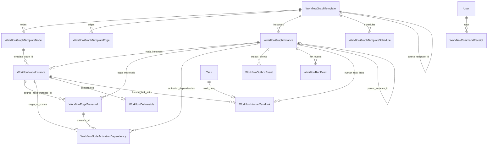
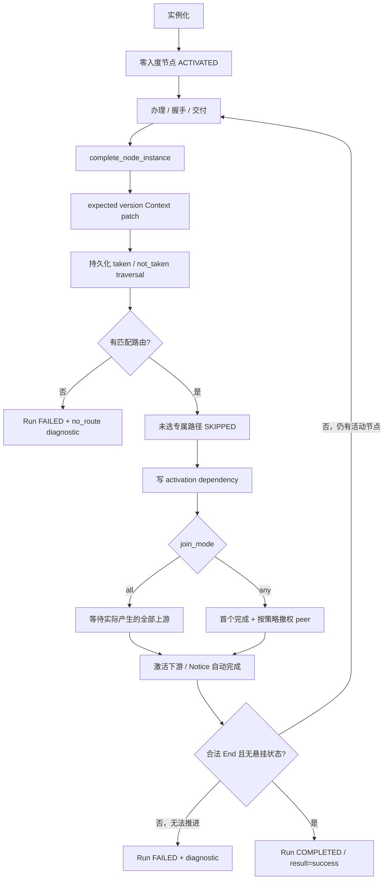

# 领域：工作流图引擎 (Workflow Graph Engine)

> 🌡️ WARM — **现行 as-built 总览**（非历史提案）。涉及模板、实例化、节点推进、Task 投影、详情页布局时优先读本文件。  
> **最后同步**：2026-07-15 · 对照代码：`backend/app/models/workflow_graph.py`、`WorkflowGraphService`、`TaskDetailShell.vue`
> **计划**：[`plans/workflow-refactor-implementation-plan.md`](../plans/workflow-refactor-implementation-plan.md) · **ADR**：[`decisions/adr-005-dual-track-workflow.md`](../decisions/adr-005-dual-track-workflow.md) · [`adr-008-graph-template-designer.md`](../decisions/adr-008-graph-template-designer.md)  
> **契约**：[`contracts/database/graph-engine-schema.md`](../contracts/database/graph-engine-schema.md) · **视频增量**：[`workflow-video-v1.md`](./workflow-video-v1.md) · **运行时链路**：[`architecture/core-workflows.md`](./architecture/core-workflows.md) §6.13B

---

## 1. 定位与边界

| 维度 | 现行事实 |
|------|----------|
| **是什么** | DAG 模板 → 图实例 → 节点实例的执行内核；条件边、fan-out / join、Notice 自动完成、深度打回（append-only 迭代）、outbox 通知、run event 审计 |
| **用户可见入口** | `/task-templates`（列表 + 设计器）· 任务中心详情 `TaskDetailShell` · 统计 Tab 的 Run 事件 |
| **读载体** | 任务中心仍以兼容 `Task` 行为列表/详情载体；有图锚点时 **graph-first** 解析状态（`TASK_CENTER_V2_ENABLED`） |
| **写真相** | 图实例 / 节点引擎态为运行真相；新写以 `WorkflowHumanTaskLink` 为正式关系并兼容双写 JSON，读取 Link-first；存量仍允许 JSON fallback |
| **不是** | Legacy E 产品入口（B-12 已移除对外 API；`task_templates` 表族仅历史兼容）· 轻量审批 `WorkflowDefinition`（`/workflows`）· Phase 10 完整「节点级评论/交付/日志时间线」（尚未落地） |

两条主实例化路径：

1. **手动单节点** — `WORKFLOW_GRAPH_ENGINE_ENABLED` 下 `TaskService.create_task_record` → `create_single_node_instance`
2. **图模板 Run** — `POST /workflow-graph/templates/{id}/runs`（需 `WORKFLOW_GRAPH_TEMPLATE_ENGINE_ENABLED`）→ 视频/通用模板实例化 + 编排投影 Task

---

## 2. 实体关系（十三表）



| 表 | 模型 | 职责 |
|----|------|------|
| `workflow_graph_templates` | `WorkflowGraphTemplate` | DAG 蓝图：版本链、`context_schema`、`config`、部门作用域 |
| `workflow_graph_template_nodes` | `WorkflowGraphTemplateNode` | 模板节点：`node_key`、类型、指派/汇聚模式、规则与 config |
| `workflow_graph_template_edges` | `WorkflowGraphTemplateEdge` | 条件边：`condition`、`priority`、`is_reject_path` |
| `workflow_graph_instances` | `WorkflowGraphInstance` | 运行实例：context、当前节点、父子 Run、来源锚点 |
| `workflow_node_instances` | `WorkflowNodeInstance` | 节点运行态：引擎态/业务态、迭代、办理人 |
| `workflow_edge_traversals` | `WorkflowEdgeTraversal` | 每次实际出边求值：taken/not_taken/invalidated 与 Context 证据 |
| `workflow_node_activation_dependencies` | `WorkflowNodeActivationDependency` | 目标节点由哪条 traversal/哪个上游产生，供 Join 判定 |
| `workflow_human_task_links` | `WorkflowHumanTaskLink` | Work Item 与 NodeExecution 正式关系、角色与生命周期；取代 JSON 作为新写真相 |
| `workflow_command_receipts` | `WorkflowCommandReceipt` | actor/type/id 幂等身份、payload hash 与首次结果 |
| `workflow_deliverables` | `WorkflowDeliverable` | 节点交付快照（1:1） |
| `workflow_outbox_events` | `WorkflowOutboxEvent` | 事务内可靠投递队列 |
| `workflow_run_events` | `WorkflowRunEvent` | Append-only 运行审计（与 outbox 分离） |
| `workflow_graph_template_schedules` | `WorkflowGraphTemplateSchedule` | 图模板周期调度（F-24 / ADR-011） |

> 旧文档「九表/十一表」已过时：Iteration 2 增加路径账本，Iteration 3-A 增加 HumanTask Link 与 command receipt。字段权威见 ORM 与 [`graph-engine-schema.md`](../contracts/database/graph-engine-schema.md)。

---

## 3. 后端数据结构

### 3.1 枚举（`backend/app/core/enums.py`）

| 枚举 | 值 |
|------|-----|
| `WorkflowGraphTemplateStatus` | `draft` · `active` · `archived` |
| `WorkflowGraphNodeType` | `task` · `approval` · `notice` |
| `WorkflowGraphInstanceStatus` | `pending` · `active` · `completed` · `cancelled` · `terminated` · `failed` |
| `WorkflowNodeEngineState` | `pending` · `activated` · `acknowledged` · `completed` · `terminated` · `skipped` · `failed` · `suspended` |
| `WorkflowNodeBusinessState` | `draft` · `assigned` · `accepted` · `rejected` · `delegated` · `doing` · `pending_review` · `done` · `returned_for_rework` · `cancelled` |
| `WorkflowOutboxEventStatus` | `pending` · `retrying` · `dispatched` · `failed` |

模板节点 DB 约束：`assignment_mode ∈ {single, fan_out}` · `join_mode ∈ {all, any}` · `routing_mode ∈ {exclusive, inclusive, parallel, first_match}`。

### 3.2 模板层字段要点

**Template**

- 身份：`code`（唯一）· `base_code` + `version`（版本链）· `source_template_id`
- 结构元数据：`context_schema` · `config`（JSON：`run_kind`、`launch_schema`、`participant_policies`、`on_complete`、`aggregate_mode` 等）
- 作用域：显式 `scope_mode=global|departments`；`global` 禁止非空部门列表，`departments` 至少一个部门。创建 Run 解析最终部门后再校验 scope
- 生命周期：仅 `DRAFT` 可编辑；`ACTIVE` 只能归档或派生新 draft；`ARCHIVED` 不可恢复/编辑。内置 seed 升级同样派生新版本

**Node**

- `node_key`（模板内唯一）· `title` · `node_type`
- `assignment_mode` / `join_mode` / `routing_mode` · `assignee_rule` · `config`（可含 `ui_profile`、`routing_rules` 设计时校验）· `sort_order`

**Edge**

- `from_node_id` → `to_node_id` · `condition`（JSON）· `priority` · `is_reject_path`
- **运行时前进路由只用非 reject 边的 `condition`**；`is_reject_path` 服务深度打回可达性与 acceptance 校验，不参与 `_activate_downstream` 入度

### 3.3 运行层字段要点

**Instance**

- 锚点：`source_type` / `source_id`（常指向 ROOT 或手动 Task）
- 状态：`status` · `result` · `diagnostics` · `current_node_key`（仅展示投影）· `context` + `context_version` · `max_iterations`（默认 5）
- 视频/批次：`run_label` · `parent_instance_id`（fork 子 Run）
- 定义冻结：新 Run 写 snapshot format v2 + canonical SHA-256 hash，标记 `snapshot/graph-v3`；快照兼容派生 Start/End 集合
- 兼容路由：既有 `snapshot/graph-v2` 与 `legacy/legacy-v1` 保持原 executor，不补写推测性 traversal

**NodeInstance**

- 唯一键：`(instance_id, node_key, instance_key, iteration)`
- `instance_key`：默认 `"singleton"`；新 `multi_instance` fan-out 为不可变 `branch:NNNN`，初始办理人单独记录，takeover 不改变分支身份
- 双态：`engine_state`（引擎）· `business_state`（握手/交付投影）
- 乐观控制：`node_instance_version`
- 时间戳：`activated_at` / `acknowledged_at` / `completed_at` / `terminated_at`
- `human_task_links`：新写正式关系；`config.task_id` 仅在 I3 兼容期继续双写

**HumanTask Link / Command Receipt（Iteration 3-A）**

- `HumanTaskCoordinator.ensure_link/resolve_for_task/backfill_existing_links` 负责 Link 幂等创建、Link-first 解析与只对三锚点一致的数据生成回填报告。
- 一个 Task 最多一个 Link；一个 Node 最多一个 active primary，可有多个 supporting/observer；完成/失效保留历史行。
- `WorkflowCommandReceiptService` 以 canonical JSON SHA-256 判定 payload；同 command 同 payload 重放首次结果，异 payload 冲突。I3-A 仅提供服务基座，create run/complete/deep-reject/takeover/schedule 的 API 接入尚未完成。

**Deliverable / Outbox / RunEvent / Schedule** — 见契约摘要；run_event 已知类型含：`run_instantiated`、`node_completed`、`capture_submitted`、`aggregate_confirmed`、`capture_closed`、`topic_dispatched`、`capture_rejected`、`production_deep_reject`、`admin_cancelled` 等。

### 3.4 条件表达式（运行时）

模块：`backend/app/services/condition_evaluator.py`

- 边条件：`{"field","operator","value"}` · `all`/`any` 嵌套 · `{"else": true}`
- 运算符：`eq/neq/gt/gte/lt/lte/in/not_in/contains/exists`
- **注意**：模板节点 `config.routing_rules` 仅设计时拓扑校验；**图运行时不走 `evaluate_routing_rules`**（该函数服务 Legacy E 步骤激活）。memory-bank 旧述「routing_rules 运行时桥接」易误导。

---

## 4. 运行时推进（引擎）

核心服务：`WorkflowGraphService`（`backend/app/services/workflow_graph_service.py`）。



| 能力 | 实现要点 |
|------|----------|
| **实例化** | 单节点：`create_single_node_instance` · 多节点：`create_multi_node_instance` / 视频 `WorkflowVideoInstantiationService` |
| **定义选择** | 新模板 Run 全程从创建时 snapshot 读取模板 config、节点、边、链式配置与投影编排；执行前校验 snapshot hash；legacy Run 继续读实时模板 |
| **完成** | graph-v3 到达合法 End、无 active/pending/failed/suspended/等待 dependency 才成功；no-route/死 Join 写 `failed` 诊断 |
| **Join** | graph-v3 只等待本 iteration 实际产生且未 skipped/terminated 的 activation；Wait-Any 记录 cancel policy 并撤权 peer |
| **深度打回** | 克隆新 iteration，旧节点终止，相关 traversal/dependency invalidated；旧 iteration 永不再推进 |
| **Context** | graph-v3 patch 要求 `expected_context_version`，受控 merge 并写 `context_patched` diff event |
| **并发** | 所有节点命令统一先锁 Run、再锁 NodeInstance；唯一约束保证 traversal/dependency 不重复 |
| **接管** | `takeover_node_instance`：改办理人 + outbox + 同步手动 Task 投影 |
| **编排钩子** | `WorkflowOrchestrationService`：模板投影 Task 的 ensure / after_node_completed / handshake → engine_state |
| **通知** | `_write_outbox_event` → ARQ `workflow_outbox_worker`（非同步强依赖触达） |
| **审计** | `WorkflowRunEventService.append`（与 outbox 分离） |

视频批次约定（简）：`context.run_kind`（`batch`/`production`…）· `parent_instance_id` fork · `instance_key` 多人扇出 · 详情见 [`workflow-video-v1.md`](./workflow-video-v1.md)。

---

## 5. Task 投影契约（Dual-Write）

### 5.1 写路径（`WORKFLOW_GRAPH_ENGINE_ENABLED`，默认 true）

| 路径 | 锚点 |
|------|------|
| 手动任务 | `Task.extra_metadata`：`workflow_graph_instance_id`、`workflow_node_instance_id`、`workflow_node_iteration`、握手字段；Instance `source_type=manual`、`source_id=task.id`；Node `config.task_id` |
| 模板 Run | 每激活节点投影 Task + 可选 ROOT shell（`workflow_graph_root_task`）；metadata 含 `template_id`/`template_code`/`run_kind`/`ui_profile` 等 |

`TaskService` 在 accept / reject / delegate / 状态流转 / 交付验收时双向同步 graph 节点态与 `WorkflowDeliverable`。

### 5.2 读路径（`TASK_CENTER_V2_ENABLED`，默认 true）

`list_task_inbox` / `tracking` / `history` → `_graph_task_projection_map`：

1. 按 `Instance.source_id` 或 `extra_metadata.workflow_node_instance_id` 解析
2. 用图态生成 `GraphTaskProjection`（覆盖裸 `Task.status`）
3. 与无锚点 legacy 任务合并排序

批次 ROOT（`run_kind=batch` + ROOT shell）：完成态跟 **实例生命周期**，避免 streaming 跳过导致误入历史。

---

## 6. Feature Flags

配置：`backend/app/core/config.py` · 策略：`workflow_video_policy.py` · 快照：`GET /workflow-graph/feature-flags`

| 开关 | 默认 | 实际约束 |
|------|------|----------|
| `WORKFLOW_GRAPH_ENGINE_ENABLED` | `true` | 手动任务 dual-write |
| `TASK_CENTER_V2_ENABLED` | `true` | 任务中心 graph-first 读 |
| `WORKFLOW_GRAPH_TEMPLATE_ENGINE_ENABLED` | `false` | **阻断** `POST .../templates/{id}/runs` |
| `WORKFLOW_WAIT_ANY_ENABLED` | `false` | 仅暴露给前端；**服务端 join_mode=any 仍按模板执行** |
| `WORKFLOW_DEEP_REJECTION_ENABLED` | `false` | 仅暴露给前端；**deep-reject API 无服务端门闩** |

---

## 7. API 表面（`/api/v1/workflow-graph`）

路由：`backend/app/api/routes/workflow_graph_engine.py`

| 分组 | 代表端点 |
|------|----------|
| Flags / 人选 | `GET /feature-flags` · department-pool / managed-member options |
| Authoring | templates CRUD · `GET .../designer` · `PUT .../draft` · versions · status · validate · import/export · dry-run · stats |
| Runs | `POST .../templates/{id}/runs` · preview-participants · list instances · `GET /runs` |
| Instance | `GET /instances/{id}` · children · events · submissions |
| Node | `POST /node-instances/{id}/complete|deep-reject|takeover` |
| Video 动作 | submit-capture · finalize-topics · close-capture · fork/dispatch/reject… |
| Schedules | `GET/POST /schedules` · `PATCH` · `run-now` |
| 其他 | `POST /smart-notice-candidates` |

握手、评论、通用交付/验收仍走 **`/tasks`** / **`/task-center`**，不在本前缀。

Schema：`backend/app/schemas/workflow_graph.py`（+ `workflow_graph_schedule.py`、`workflow_video.py`）。

---

## 8. 前端设计

### 8.1 模块地图

| 区域 | 路径 | 职责 |
|------|------|------|
| API | `frontend/src/api/workflow-graph.ts` | 全部 `/workflow-graph/*` 客户端；列表摘要映射、`active_task_id` |
| 类型 | `types/api.ts` · `types/workflowVideo.ts` | 实例/节点枚举与视频/设计器类型 |
| 布局开关 | `domain/task-detail/profile.ts` | `ui_profile` → `TaskDetailProfile` 标志位 |
| 辅助 | `domain/workflow-graph/activeStepTask.ts` · `utils/graphTemplateTopology.ts` · `utils/workflowVideoSchema.ts` · `run-label.ts` | 当前步骤 Task、拓扑预览、schema、Run 名 |
| Authoring | `GraphTemplatesPanel` · `GraphTemplateDesignerView` · `GraphTemplateDagPreview` · `TemplateInstantiateDialog` | `/task-templates` · `/task-templates/:id/edit` |
| Runtime | `TaskDetailShell` + `components/workflow/*` | 详情面板、视频专用面板、节点卡片、运行事件 |
| 任务中心 | `TaskCenterView` / List / Stats · `useTaskCenterWorkspace` | 列表投影 `run_label` / stage / handler；统计拉部门 Run + events |

前端常量 `TASK_CENTER_V2_UI_ENABLED = true`（与后端读路径开关独立，控制详情紧凑遥测）。

### 8.2 Authoring UX

```
/task-templates → GraphTemplatesPanel
  ├─ 新建/克隆 → /task-templates/:id/edit（GraphTemplateDesignerView）
  ├─ 元数据编辑 → GraphTemplateEditDialog
  └─ 实例化 → TemplateInstantiateDialog → createGraphTemplateRun
       └─ /task-center?filter=tracking&selected={rootTaskId}
```

设计器能力：模板 `config`（含 `run_kind`、launch_schema JSON、participant_policies…）· 节点/边表 · 选中节点 raw `config` + `routing_rules` JSON（**无可视化规则构造器**）· DAG 预览 · validate / save draft / publish / fork / import-export / dry-run。发布后定义与设置均不可原地修改，须派生 draft 新版本。

### 8.3 Runtime UX 与 `ui_profile`

打开带 `extra_metadata.workflow_graph_instance_id` 的任务时：

1. `getWorkflowGraphInstance` + `listInstanceEvents(limit:50)`
2. `resolveTaskDetailProfile(task)` 决定布局

**解析顺序**：显式 `metadata.ui_profile` → 按 `run_kind` / 节点键推断视频剖面 → `graph_manual`（手动握手图任务）→ `legacy_task`。

| Profile 族 | 详情表现 |
|------------|----------|
| `video_*` | 隐藏通用交付/握手/关注人；评论折叠；**不渲染节点板块时间线**；改用 Capture / Aggregate / Batch / Production 等专用面板 |
| `graph_manual` / `legacy_task` | 完整交付与评论；展示「工作流节点追踪」卡片列表 |

`ui_profile` 由模板节点 `config.ui_profile` 写入 Task metadata；设计器无独立表单字段，需写在节点 JSON 内。

### 8.4 时间线 / 追踪的三层现状

| 层 | 数据 | UI | 完整度 |
|----|------|-----|--------|
| **运行事件** | `workflow_run_events` | `el-timeline`（详情；V2/视频紧凑最近 3 条 + 链到统计）· BatchRunDashboard · Stats | 实例级 append-only，已落地 |
| **节点板块** | `node_instances[]` | 非视频：标题 / engine_state / V{n} / 耗时卡片（可折叠） | **摘要级**；无节点交付物、节点评论、节点系统日志 |
| **活动时间线** | Task 评论 + 审计日志 | 非视频布局的 `el-timeline` | **Task 级**，未绑 Node Instance |

Phase 10 目标「按节点板块聚合交付/评论/日志」**尚未实现**；视频布局用专用面板替代节点板块。后端已有 takeover；前端未见接管按钮。

### 8.5 任务中心集成

图任务不是独立 Inbox 类型：走 snapshot 的 inbox/tracking/history，行上展示 `run_label`、当前步骤、处理人、用户态；跟踪列表有逾期标签与催办（写系统评论）。统计 Tab：`listDepartmentRuns` + 完整 events 时间线。

---

## 9. 关键服务与文件索引

### Backend

| 路径 | 作用 |
|------|------|
| `models/workflow_graph.py` | 九表 ORM |
| `services/workflow_graph_service.py` | 实例化、完成、路由、join、打回、接管 |
| `services/workflow_graph_template_admin_service.py` | 设计器 CRUD / 校验 / dry-run |
| `services/workflow_graph_template_topology.py` | 设计时拓扑校验 |
| `services/workflow_orchestration_service.py` | 模板投影 Task 编排钩子 |
| `services/condition_evaluator.py` | 条件求值 |
| `services/workflow_run_event_service.py` | Run EventLog |
| `services/workflow_graph_template_schedule_service.py` | 周期调度 |
| `services/workflow_graph_template_chain_service.py` | `on_complete` 链式触发 |
| `services/workflow_assignee_resolver.py` | 办理人解析 |
| `services/workflow_video_*` | 视频实例化 / 表单 / fork / 返工 |
| `services/task_service.py` | dual-write 与 graph-first 列表 |
| `workers/workflow_outbox_worker.py` | outbox 消费 |
| `api/routes/workflow_graph_engine.py` | REST |

### Frontend

| 路径 | 作用 |
|------|------|
| `api/workflow-graph.ts` | HTTP 客户端 |
| `domain/task-detail/profile.ts` | ui_profile 布局 |
| `components/task-detail/TaskDetailShell.vue` | 详情编排中枢 |
| `components/workflow/GraphTemplate*.vue` | 列表 / 设计器 / DAG |
| `components/workflow/{Capture,TemplateAggregate,VideoProduction,BatchRun,VideoTracking}*.vue` | 视频运行面板 |
| `views/TaskTemplatesView.vue` · `GraphTemplateDesignerView.vue` | Authoring 路由页 |
| `views/TaskCenterView.vue` | 运行时主壳 |

---

## 10. 已知差距（相对目标设计）

| 项 | 状态 |
|----|------|
| 节点级时间线（交付物 + 评论 + 系统日志按板块） | 未做；仅状态摘要卡片 |
| 可视化 routing_rules / Context 白名单 UI | 未做；JSON 编辑 + 服务端 validate |
| Wait-Any / Deep-Reject 前端 flag 与后端门闩 | Flag 未真正闸住服务端 |
| Admin takeover UI | 后端有、前端无 |
| Legacy E 历史数据清理 | 对外 API 已移除；表族/ORM 仍保留兼容 |
| 视频与通用图详情的时间线统一 | 视频隐藏节点板块，靠专用面板 + run events |

调试提示：写路径须 `commit` 后跨请求可见；详情避免对 `node_instances` 懒加载；见 [`known-issues/ki-005-graph-engine-issues.md`](../known-issues/ki-005-graph-engine-issues.md)。
