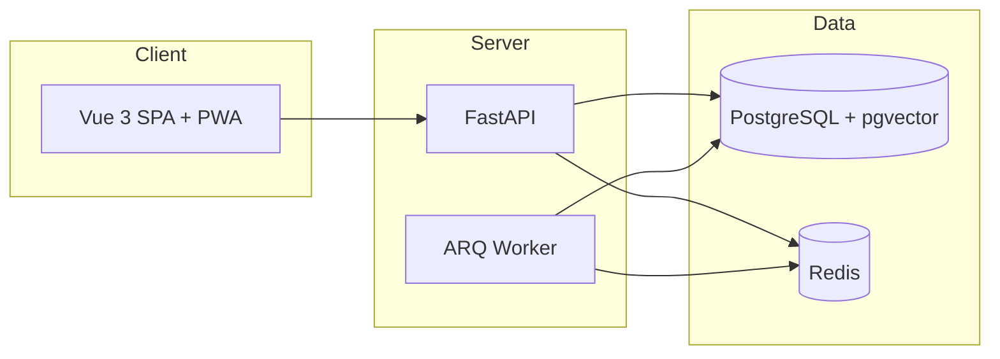

# Project Filum 讲解说明书

**版本**: v1.0 @ `0.91.2`  
**用途**: 按模块与功能顺序讲解项目，适合内测演示、客户介绍、团队 onboarding  
**读者**: 讲解人（你）；听众可为业务负责人、HR、部门经理或技术同事  

**配套文档**  
- 用户操作细节 → [`user-manual.md`](./user-manual.md)  
- 任务中心全貌 → [`../domains/task-center.md`](../domains/task-center.md)  
- 视频工作流 → [`../domains/workflow-video-v1.md`](../domains/workflow-video-v1.md)  
- 部署运维 → [`deployment-runbook-ubuntu-2404.md`](./deployment-runbook-ubuntu-2404.md)

---

## 如何使用本手册

| 讲解时长 | 建议路径 |
|----------|----------|
| **15 分钟** | §1 总览 → §3.4 任务中心（三 Tab）→ §5 Demo 剧本（压缩版） |
| **30 分钟** | §1 → §3.1–3.5（登录、总览、任务中心、模板）→ §5 完整 Demo |
| **45–60 分钟** | 全文 §1–§6；技术听众加 §2；管理员听众加 §4 |
| **HR 专场** | §1 → §3.3 人事 → §3.4 单步任务 → §3.7 汇报 → §3.8 消息 |
| **研发专场** | §2 → §3.4–3.5 任务流/图引擎 → §5 Demo → §7 边界 |

每节结构：**讲什么 → 入口在哪 → 关键能力 → 讲解要点 → 可演示动作**。

---

## §1 项目总览（建议 5 分钟）

### 1.1 一句话

**Project Filum** 是面向 **50–100 人企业** 的内部管理平台：在一个系统里完成 **人事档案、任务协同、流程/汇报、消息通知、知识库与 AI 查询**。

### 1.2 解决什么问题

| 痛点 | Filum 的做法 |
|------|----------------|
| OA、HR、协作工具分散 | **模块化单体**：一个登录入口、统一组织与权限 |
| 聊天里派活，事后难追溯 | **任务绑定上下文**：评论、附件、活动流在任务详情；消息只做通知 |
| HR 数据敏感 | **字段级权限** + 组织关系，离职停用不删档 |
| 流程僵化 | **图引擎工作流**：可配置模板、按题 fork、增量派发 |
| 制度文档找不到 | **知识库 + RAG**；顶栏 `@系统` 快速查 |

### 1.3 明确不做

- 独立 IM / 工作群聊  
- 公开自助注册（当前为 **邀请制**）  
- 标准离职流程中的「物理删除员工」  

### 1.4 三类角色（界面层）

| 角色 | 典型能力 |
|------|----------|
| **管理员** | 部门树、全员账号、系统兜底、任务归档、全量跟踪督办 |
| **HR** | 人员档案、邀请注册、字段权限；**无**部门树维护 |
| **员工** | 待办、跟踪、汇报、消息、知识库 |

> **讲解要点**：部门负责人、汇报上级等 **数据范围** 由组织关系推导，不是第四种全局角色标签。

---

## §2 技术架构速览（技术听众，可选 5 分钟）

### 2.1 形态

**模块化单体**（Modular Monolith）：一个仓库、一个部署单元，模块边界清晰，不拆微服务。



### 2.2 技术栈（一句话带过）

| 层 | 选型 |
|----|------|
| 前端 | Vue 3 · TypeScript · Element Plus · Pinia |
| 后端 | FastAPI · SQLAlchemy 2 Async · Pydantic v2 |
| 数据 | PostgreSQL 15+ · JSONB · pgvector |
| 队列 | Redis + **ARQ**（非 Celery） |
| AI | 官方 OpenAI SDK + Tool Calling（**非** LangChain） |
| 部署 | Docker Compose + Nginx |

### 2.3 核心设计原则（可强调差异化）

1. **抽象先于直连** — 通知、存储、LLM 经 Service/Adapter/Worker  
2. **工作沟通可追溯** — `task_comments` 在任务内；消息中心不做聊天  
3. **AI 是路由器** — 业务真相在数据库与服务层  
4. **图引擎 + Task 投影** — 复杂流程用 `WorkflowGraph*`，列表仍用统一任务中心  

---

## §3 按导航顺序的功能讲解（主流程）

登录后左侧导航即讲解顺序。顶栏全局：**AI 命令 · 消息铃铛 · 用户信息**。

```
通用：总览 → 任务中心 → 知识库 → 汇报中心 → 设置
特殊：人员管理 · 部门管理（按角色显示）
独立：任务模板（/task-templates，管理员/HR）
```

---

### §3.1 登录与账号（3 分钟）

| 项目 | 内容 |
|------|------|
| **入口** | `/login` |
| **开通方式** | 邀请链接激活 **或** Admin/HR 直接创建 |
| **空库首次** | 系统初始化向导 → 创建第一个管理员 |

**讲解要点**

- 无公开注册，符合内网企业管控  
- JWT + HttpOnly Refresh Cookie，会话可轮换撤销  

**可演示**：登录 → 进入总览；或展示邀请链接激活页（如有测试账号）。

---

### §3.2 总览（2 分钟）

| 项目 | 内容 |
|------|------|
| **入口** | `/overview`（登录默认首页） |
| **作用** | 工作台仪表盘：待办摘要、公告/白板、快捷入口 |

**讲解要点**

- 数字来自任务中心聚合，**操作仍回任务中心**  
- 管理员可发布公告、看板卡片  

**可演示**：看一眼待办数字 → 点击跳转任务中心。

---

### §3.3 人事与组织（管理员/HR，8 分钟）

#### 3.3.1 部门管理（仅管理员）

| 项目 | 内容 |
|------|------|
| **入口** | `/departments` |
| **能力** | 部门树、负责人、部门 capabilities（如是否可发布组织任务） |

#### 3.3.2 人员管理（管理员 + HR）

| 项目 | 内容 |
|------|------|
| **入口** | `/people` |
| **能力** | 账号、一人一档、多岗位、直属/虚线汇报、生命周期事件、字段权限、邀请注册 |

**子能力清单**

| 子模块 | 说明 |
|--------|------|
| IAM | 角色 admin / hr / employee |
| 档案 | `custom_fields` JSONB，字段定义 + 字段级可见/可编辑策略 |
| 岗位 | 岗位目录、一人多岗、主岗 |
| 生命周期 | 入 / 转 / 升 / 奖惩 / 离 / 返聘；可挂接模板或审批（异步 worker） |
| 代理授权 | 时间窗内代行权限 |

**讲解要点**

- HR **不能**改部门树，职责分离  
- 离职 = 停用账号，**档案保留**  
- 后续任务/汇报的「谁能看谁」都从这里来  

**可演示**：打开某员工档案 → 展示自定义字段与权限裁剪（如有 demo 数据）。

---

### §3.4 任务中心（核心，15–20 分钟）

> 产品上分 **三大模块**：单步任务 · 任务流 · 任务统计。入口都在 `/task-center`，但任务流实例化在 `/task-templates`。

#### 3.4.1 信息架构

| 元素 | 说明 |
|------|------|
| **路径** | `/task-center` |
| **布局** | Quick Chips 筛选 + Master-Detail（左列表 ~35% · 右详情 ~65%） |
| **视图** | 列表 / 看板 / 甘特（`view=list|board|gantt`） |
| **全局备忘** | 右下角浮窗（**不是**任务实体，个人用） |

#### 3.4.2 三个主 Tab（必讲）

| Tab | URL | 含义 | 谁关心 |
|-----|-----|------|--------|
| **需要我处理的** | `filter=inbox` | 当前执行人待办 | 全员 |
| **我参与的/跟踪** | `filter=tracking` | 发起、执行、关注、流程相关进行中 | 经理、发起人 |
| **已完成/历史** | `filter=history` | 已结束任务 | 查档、复盘 |

Admin/HR 额外能力（`0.91.0+`）：

- **跟踪 Tab** 可见全量未完成任务，关联方式显示 **「督办」**  
- **延期**：已逾期任务可设更晚截止时间（不阻断正常推进）  
- **归档任务**（F-29）：详情「更多 → 归档任务…」，软作废并终止图 Run  

#### 3.4.3 单步任务（建立任务）

| 项目 | 内容 |
|------|------|
| **入口** | 任务中心页头 **建立任务** |
| **适用** | 点对点派活：写报告、修 bug、临时事项 |
| **流程** | 创建 → 执行人接单/开工 → 提交交付 → 发起人验收 → 完成 |
| **扩展** | 抄送人（F-22）、跨部门指派与边界 CC（F-21）、附件预览（F-25） |

**讲解要点**

- 自派待办 → 用 **个人备忘**，不走建立任务  
- 单步任务在引擎层也是 **单节点图**（graph dual-write），列表体验与流程任务统一  

**可演示**：建立任务 → 切到执行人账号看 inbox → 提交交付 → 发起人验收。

#### 3.4.4 任务流（Workflow Graph）

| 项目 | 内容 |
|------|------|
| **模板入口** | `/task-templates` → 选模板 → **实例化** |
| **运行时** | `WorkflowGraphInstance` + 多 `WorkflowNodeInstance` → 投影为多条 `Task` |
| **列表读法** | graph-first：状态来自图节点/实例，非简单 DB 字段 |
| **设计器** | `/task-templates/:id/edit`（管理员维护拓扑） |

**讲解要点**

- Legacy「工作流 E」UI 已移除；**图模板是唯一产品入口**  
- 每条可见任务可能是：节点任务、批次 ROOT 壳层、制作子 Run ROOT  
- **批次 ROOT** 在 inbox 不出现，在 **跟踪** 里看整体进度  

#### 3.4.5 任务统计（第四 Tab）

| 项目 | 内容 |
|------|------|
| **入口** | `/task-center?filter=stats` |
| **能力** | 部门完成率/逾期率、人员负载、图 Run 列表与时间线 |
| **边界** | 基础可用；**无**完整绩效 KPI 模块（S-01 暂缓） |

**可演示**：stats Tab → 点某个 Run 看 event 时间线。

#### 3.4.6 任务详情里有什么（通用）

- 基本信息、握手（接单确认）、交付与验收  
- 关注人、任务资料附件（可预览）  
- 评论与活动时间线  
- 图任务：**工作流节点追踪**、按 Profile 渲染不同面板  

---

### §3.5 任务模板与视频工作流 v1（ flagship Demo，15 分钟）

> 这是 Filum **任务流能力** 的完整样板，建议作为讲解高潮。

#### 3.5.1 产品口径

```
选题会（批次 Run）
  → 各编辑 N1 提交选题
  → 负责人汇总 / 增量派发
  → 按题 fork 制作子 Run（10 节点制作链）
  → 脚本 → 审核 → 配音 → 剪辑 → … → 归档
```

| 模板 | 作用 |
|------|------|
| `topic_meeting_batch_v1` | 批次选题会 |
| `video_production_per_topic_v1` | 单题制作链（由批次 fork，不直接实例化） |

#### 3.5.2 关键概念（讲解时用口语）

| 术语 | 口语解释 |
|------|----------|
| **Run** | 右上/列表里的「一次流程实例」，如「第 12 周选题会」 |
| **批次 ROOT** | 选题会整体壳任务，看板在这里 |
| **N1 采集** | 每个编辑各领一条「提交选题」待办 |
| **streaming 派发** | 采一条、派一条，不必等全员交完 |
| **fork** | 选中题 → 自动 spawn 一条独立制作流程 |
| **Action Profile** | 详情页根据节点类型切换 UI（表单 / 上传 / 看板） |

#### 3.5.3 多部门场景（F-28，加分项）

- 文案部 A、文案部 B **共用同一套模板**  
- 各自发起批次，N1 参与人 = **本次发起部门** 成员  
- 制作链后期环节可固定指向 **后期部**  

#### 3.5.4 定时派发（F-24，加分项）

- 批次类模板可设 **cron 周期**  
- 任务中心 → 建立任务区域 **定时派发** Tab  
- Worker 每 5 分钟扫描到期 schedule  

#### 3.5.5 表单引擎三 Schema

| Schema | 阶段 |
|--------|------|
| `launch_schema` | 实例化时填（主题、负责人等） |
| `capture_schema` | 节点采集（选题表、发布信息等） |
| `aggregate_schema` | 汇总定稿（批量模式） |

---

### §3.6 汇报中心（5 分钟）

| 项目 | 内容 |
|------|------|
| **入口** | `/reports` |
| **布局** | 邮件客户端式：左列表 + 右阅读区 |
| **Tab** | 待处理 · 我发起 · 历史归档 |
| **发起** | 统一 **撰写汇报** Drawer；收件人下拉隐式决定向上/向下 |

**讲解要点**

- **向上汇报**：沿汇报线逐级提交  
- **向下传达**：管理者向下发布信息/任务性传达  
- 可挂接审批流；与任务中心分离但权限同源  

**可演示**：撰写一条向上汇报 → 切换上级账号在待处理中操作。

---

### §3.7 消息与通知（3 分钟）

| 项目 | 内容 |
|------|------|
| **入口** | 顶栏铃铛（抽屉）或 `/messages` |
| **职责** | 通知、审批提醒、系统消息、**回执** |
| **不是** | 任务评论、群聊 |

**技术要点（可选）**

- `NotificationService.send()` 统一总线 → ARQ → Email / WebSocket / Web Push  
- 设置页可订阅浏览器 Push、安装 PWA  

**讲解要点**

- 点击通知应 **跳回业务来源**（任务/汇报详情）  
- 任务里讨论请用 **任务评论**  

---

### §3.8 知识库与 AI（5 分钟）

#### 知识库

| 项目 | 内容 |
|------|------|
| **入口** | `/knowledge-base` |
| **能力** | Markdown 文档、分类、发布/归档、附件、语义检索 |

#### AI 命令

| 项目 | 内容 |
|------|------|
| **入口** | 顶栏 **AI 命令** |
| **用法** | `@系统 …` 或 `/…` 自然语言 |
| **原理** | LLM 选 Tool → 后端查知识库/服务 → 返回答案 |

**讲解要点**

- AI **不能替代**正式提交（派活、汇报仍走对应页面）  
- 适合查制度、SOP、 onboarding 问题  

**可演示**：`@系统 入职需要准备什么？` 或知识库语义检索。

---

### §3.9 设置（2 分钟）

| 项目 | 内容 |
|------|------|
| **入口** | `/settings` |
| **分区** | 个人资料 · 安全（改密） · 通知（Push/PWA） |

---

## §4 管理员治理能力（Admin/HR，5 分钟）

| 能力 | 入口 | 说明 |
|------|------|------|
| 全量跟踪督办 | 任务中心 → 跟踪 | 看见组织内所有进行中任务 |
| 逾期延期 | 跟踪 / 详情 | 延长截止时间，不阻断业务 |
| 任务归档 F-29 | 详情 → 更多 | 软归档 + 终止图 Run + 子 Run 取消 |
| 图模板设计 | `/task-templates/:id/edit` | 节点、边、参与人策略、周期 schedule |
| 人员/部门 | `/people` · `/departments` | 组织与账号源头 |

---

## §5 推荐 Demo 剧本：选题会全流程（30 分钟版）

### 5.1 角色准备

| 账号类型 | 演示职责 |
|----------|----------|
| 文案负责人 / 经理 | 实例化批次、跟踪、增量派发 |
| 编辑 A、B | N1 提交选题 |
| 脚本撰写人 | 制作子 Run N3 写脚本 |
| 管理员（可选） | 展示督办、归档 |

Demo 账号见 [`workflow-video-v1-multi-account-e2e-guide.md`](./workflow-video-v1-multi-account-e2e-guide.md)（密码通常 `FilumTest123!`）。

### 5.2 步骤脚本

| 步骤 | 操作 | 讲解一句话 |
|------|------|------------|
| 1 | `/task-templates` → 选题会（批次）→ 实例化 | 「流程不是写死的代码，是可配置模板。」 |
| 2 | 填写 launch（主题、负责人、参与编辑） | 「发起时就锁定参与人快照。」 |
| 3 | 编辑 A/B 登录 → inbox 提交选题 | 「多人并行采集，各干各的节点。」 |
| 4 | 经理 → **跟踪** 看批次 ROOT | 「整体进度在 ROOT 壳层，不在个人待办。」 |
| 5 | ROOT 详情 → 增量派发 1 条 | 「streaming：不必等全员交完。」 |
| 6 | 看板出现子 Run → 点开 N3 | 「一题一流，fork 出独立制作链。」 |
| 7 | 撰写人提交脚本 → 审核人验收 | 「节点 Profile 自动换 UI。」 |
| 8 | stats Tab 看 Run 事件 | 「统计与时间线可观测。」 |
| 9（可选） | Admin 跟踪督办 / 归档 | 「治理手段不影响业务数据结构。」 |

### 5.3 15 分钟压缩版

步骤 1 → 2 → 3（只一人提交）→ 4 → 5 → 6 → 7（只到脚本提交）。

### 5.4 常见 Demo 坑

| 现象 | 处理 |
|------|------|
| 批次 ROOT 只在跟踪、不在待办 | **正常**；ROOT 不是执行节点 |
| 点 URL `?selected=` 没反应 | 须先切 Tab 并 **点击列表行** |
| 制作模板不能直接实例化 | **正常**；必须由批次 fork |
| 图引擎 API 404 | 生产须 `WORKFLOW_GRAPH_TEMPLATE_ENGINE_ENABLED=true` |

---

## §6 设计差异化总结（收尾 3 分钟）

1. **一个系统三类事**：人（HR）、事（任务/流程）、信息（消息/知识/AI）  
2. **任务中心三模块**：单步 + 任务流 + 统计，列表统一、运行时分离  
3. **图引擎 + 投影**：复杂流程可配置，用户仍看到「任务」  
4. **安全与合规**：字段权限、邀请制、离职不删档  
5. **可验证**：pytest + 前端单测 + Playwright E2E（任务中心 / 视频流多账号）  

---

## §7 已知边界与路线图（诚实收尾，3 分钟）

| 状态 | 项 |
|------|-----|
| ✅ 已交付 | 邀请制、任务中心 v2、图模板、视频 v1、F-24 定时、F-25 预览、F-29 归档 |
| ⏳ 基础可用 | 任务统计（无完整绩效 S-01）、Email/WS 外部通知 |
| 📋 待产品决策 | 公开/审批式注册 |
| 🚫 不做 | 独立 IM、LangChain、微服务拆分 |

详情见 [`../project-brief.md`](../project-brief.md) · [`../roadmap.md`](../roadmap.md) · [`../known-issues.md`](../known-issues.md)。

---

## 附录 A · 路由速查

| 路径 | 模块 |
|------|------|
| `/login` | 登录 / 激活 |
| `/overview` | 总览 |
| `/task-center` | 任务中心 |
| `/task-center?filter=stats` | 任务统计 |
| `/task-templates` | 图模板列表 / 实例化 |
| `/task-templates/:id/edit` | 模板设计器 |
| `/reports` | 汇报中心 |
| `/messages` | 消息中心 |
| `/knowledge-base` | 知识库 |
| `/people` | 人员管理 |
| `/departments` | 部门管理 |
| `/settings` | 设置 |

---

## 附录 B · 角色与菜单可见性

| 菜单 | Admin | HR | Employee |
|------|:-----:|:--:|:--------:|
| 总览 / 任务 / 知识 / 汇报 / 设置 | ✅ | ✅ | ✅ |
| 人员管理 | ✅ | ✅ | ❌ |
| 部门管理 | ✅ | ❌ | ❌ |
| 任务模板（侧栏） | ✅ | ✅ | ❌* |

\* 具备 `can_manage_templates` 的用户可从任务中心页头进入。

---

## 附录 C · 术语对照

| 术语 | 含义 |
|------|------|
| Task | 用户可见的「一条任务」 |
| WorkflowGraphInstance | 一次流程运行（Run） |
| WorkflowNodeInstance | Run 内一个节点实例 |
| Projection Task | 图节点投影到任务表的壳记录 |
| batch / production | 批次 Run / 制作子 Run |
| graph-first | 列表优先读图状态，再回退 legacy |
| Action Profile | 详情 UI 行为配置（`ui_profile`） |
| Run label | 列表上区分同名任务的运行标题 |

完整 glossary → [`../glossary.md`](../glossary.md)

---

## 附录 D · 讲解检查清单

讲解前确认：

- [ ] 演示环境已 seed 视频模板（`seed_workflow_video_templates`）  
- [ ] 图引擎开关已开启  
- [ ] 至少 3 个 demo 账号可切换（经理 + 2 编辑）  
- [ ] 浏览器已登录经理账号，任务中心跟踪 Tab 可用  

讲解后 Q&A 常见方向：

- **和钉钉/飞书区别？** → 不做 IM；任务+HR+流程一体；字段级权限  
- **流程能否自己配？** → 图模板设计器 + 表单 Schema；视频 v1 是样板  
- **能否对接现有 AD/OAuth？** → 当前 JWT 自建；集成在 roadmap 外  
- **数据在哪？** → PostgreSQL 单库；附件走统一 Attachment 策略  

---

*文档维护：功能变更时同步 `user-manual.md` 与 `domains/*`；版本号跟随根目录 `VERSION`。*
