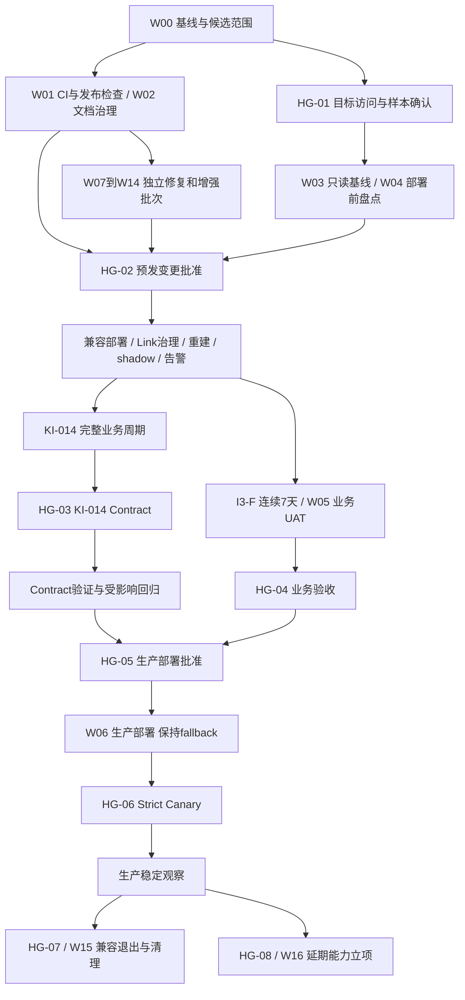

# Filum 下一阶段开发与 Human Gates 整合方案

> **2026-09-12 基线更新**：本地方案与远端 Phase C 清单已合并，原有 Phase C 代码/测试已单独保存为 `8f98dd4`，详见 [统一开发基线](../manuals/2026-09-12-development-baseline.md)。下方 09-10 HEAD、未提交路径和测试数字保留为历史快照；当前 KI-014 总任务因目标观察/contract 待完成而 blocked。本次同步授权不等于批准实施全部 W00～W16 或关闭任何目标/发布 Gate。

## 1. 文档用途与范围

本方案将 2026-09-06 项目审查的 12 类问题、当前计划目录、实施计划 A–F 工作流和路线图积压整合为一个执行入口。用户本次授权是编写方案；本文件不代表代码修复、目标数据库写入、外部通知、业务签字或生产部署已经获批或完成。

本方案负责跨计划的顺序、责任、证据和 Human Gates；各专题计划继续负责精确契约。旧计划中的历史未勾选项不自动恢复排期。具体工程顺序为建议基线，既有数据安全、对象授权、人工验收和破坏性变更边界继续有效。

优先级口径：P0 是本轮发布阻断项，不等同于线上事故严重级别；P1 是下一轮优先修复/补全；P2 是稳定性、体验和维护专项；Deferred 是需单独决定是否启动的已知方向。

### 1.1 已核对的当前基线

| 项目 | 2026-09-10 核对结果 | 本方案处理 |
|---|---|---|
| Git | HEAD 为 `61ea3d3`；KI-014 Phase C 代码、测试、文档仍有原有未提交改动 | W00 先复核并分批固定；本次不提交 |
| F-05 / I4 / I5-A～E / KI-015 | 工程已完成；包含隔离 PostgreSQL、shadow、strict UAT 的历史证据 | 保留成果，补目标环境与业务签字，不重做整套实现 |
| KI-014 | A/B 已提交；C 工具完成；代表性数据观察、D contract 待执行 | W03 |
| RC | 路线图记录 RC3 固定 `21975a6`，早于 KI-014 A/B | 候选须重新核对标签、SHA、迁移版本；旧 RC 证据不能自动覆盖新候选 |
| 2026-09-06 本地回归 | 后端非 PG 478 passed / 10 Legacy E skipped / 22 PG deselected；前端 75 files / 217 tests；类型、构建、只读 lint 通过 | 历史基线，不称为 09-10 重跑，也不称为目标 PG 通过 |
| 前端入口 | 09-06 构建入口 JS 809.57 kB / gzip 255.70 kB；存在 Vue 测试警告 | W13 |
| 生产与业务验收 | 仓库未记录完整批准；目标连接、流量、签字需重新确认 | HG-01～HG-07 保持 OPEN |

保持模块化单体、Vue/FastAPI/SQLAlchemy/Alembic/ARQ 既有技术路线。通知统一走 NotificationService，业务讨论绑定 Task，AI 不替代权限或业务事实。公开自助注册、审批式注册、独立聊天不纳入本方案。

### 1.2 证据层级

| 级别 | 能证明什么 | 不能替代什么 |
|---|---|---|
| L0 静态审查 | 代码、契约、迁移 SQL、配置结构 | 运行行为、真实数据 |
| L1 本地回归 | 单元、组件、SQLite、类型、构建 | PG 并发/锁、真实外部渠道 |
| L2 隔离生产方言 | 独立 PostgreSQL/Redis、迁移往返、故障注入、浏览器联动 | 目标数据分布、持续业务周期、业务签字 |
| L3 目标预发 | 经批准的数据、真实代理/worker、完整周期、业务账号 | 生产部署授权 |
| L4 生产观察 | 获批版本和范围内的生产行为、SLO、恢复演练记录 | 另一次 contract、扩大切流或删除授权 |

报告分别填写 engineering_status、target_evidence_status、business_acceptance_status、release_approval_status。禁止用一个 done 或一个绿色截图覆盖四者。

## 2. 总体顺序与依赖



W07～W14 可独立开发和本地验证；只有被纳入同一候选的改动才进入该候选的 E 路径。不把所有 P2 做完设为首次发布条件，不在观察中的部署上持续叠加无关功能。

### 2.1 建议里程碑

| 阶段 | 工作包 | 退出条件 | 可并行推进 |
|---|---|---|---|
| M0 基线整理 | W00、W02 首批 | 变更归属、计划映射、责任角色清楚 | 申请目标访问，准备样本 |
| M1 工程 P0 | W01、W03 工具复核、W02 门禁修复 | 检查失败不放行；隔离 PG 严格测试可复现 | W07/W08 状态修复、W09 |
| M2 目标预发 | W03-C、W04、W05 | 完整业务周期；I3-F 7 天；UAT；告警可达 | 未入候选的功能在独立开发环境继续 |
| M3 Contract 与发布准备 | W03-D、W06 准备 | HG-03 后验证 clean；业务与发布材料齐全 | W10～W14 设计或独立批次 |
| M4 生产灰度 | W06 | HG-05 部署、HG-06 切流、稳定观察 | 保持候选稳定，仅必要热修 |
| M5 后续治理 | W10～W16 | 各批验收；W15 必须通过 HG-07 | 可按负责人容量分批 |

时间以依赖满足为起点，不把环境等待计成工程工时。W00/W02 首批约 1–2 人日；W01 约 3–5 人日；W07、W08 状态修正、W09 各约 2–4 人日；W03-D 约 2–4 人日加观察；W04/W05/W06 准备约 4–8 人日加验收窗口。它们是排期估算，不是承诺日期，开工拆任务后重估。

I3-F 的连续 7 天是既有硬条件；KI-014 的完整业务周期由业务负责人定义，可与同环境 I3-F 观察重叠，但不能缩短任一要求。生产 strict 稳定观察时长在 HG-06 写明，建议覆盖至少一个业务周期；这项建议不能伪装成既有固定天数。

## 3. Human Gates

Human Gate 是对具体业务结论或变更范围的人工批准，不是每一步都询问。脚本、Agent 可以准备证据、执行已授权检查、提出结论，不能代签。已有明确授权在原范围内持续有效，不重复索要。

角色可由同一人兼任，但必须记录实际姓名/身份：产品负责人负责范围与语义；技术负责人负责实现与证据；数据库/环境负责人负责目标资源、备份和迁移；业务验收人必须使用真实业务角色；发布负责人批准变更窗口和回滚。系统 Admin 的技术身份不自动等于业务验收人。

### 3.1 Gate 清单

| ID | 批准内容与责任人 | 提交前必须准备的材料 | 通过后允许做什么 | 当前状态 |
|---|---|---|---|---|
| HG-00 | 产品/技术负责人确认实施批次与候选范围 | W00 清单、优先级、估算、人员与范围 | 开始指定工程批次；用户后续明确要求开工即可记录范围授权，无需重复确认 | APPROVED（限定 W01/W02）：用户于本任务 2026-09-13 明确开工；其余批次另列范围 |
| HG-01 | 环境/数据负责人确认目标、样本和访问范围 | 环境标识、只读账号权限、样本代表性、敏感数据处理、证据保存位置 | 在指定环境只读取证；允许的数据准备范围另列 | OPEN |
| HG-02 | 环境/数据库负责人批准预发写入和试用部署 | 精确 SHA、当前/目标 revision、逐段迁移顺序、Link dry-run、备份恢复、锁预算、回退预案 | 指定预发兼容部署、expand、Link 回填/其 contract、投影 rebuild；每个写操作列入范围 | OPEN |
| HG-03 | 数据库/技术负责人批准 KI-014 Phase D | 完整周期、旧写入方清单、新写入小写/无 NULL、应用 UAT、精确 SQL、恢复兼容表 | 在明确环境执行该 contract；预发通过不自动授权生产执行 | OPEN |
| HG-04 | 业务负责人验收本候选 | W05 用例、账号/部门/Run/Task、预期实际、证据、残余缺陷 | 标记该候选业务验收通过；技术完成不代签 | OPEN |
| HG-05 | 发布负责人批准生产部署 | W01～W06 必需证据、I3-F 31/31 和 7 天、HG-04、schema clean、告警、TLS/secret、RPO/RTO、值班与回滚 | 部署所列 SHA/revision，默认保持 fallback；不授权删除旧结构或关闭 fallback | OPEN |
| HG-06 | 发布/业务负责人批准 strict canary 及扩围 | 生产 rebuild/full shadow、实时流量样本、告警演练、灰度范围、观察时间、回开 fallback 条件 | 按已批范围关闭 fallback；超出范围或版本需重新评估 | OPEN |
| HG-07 | 数据库/产品/技术负责人批准兼容退出 | W15 对象清单、历史/活动 Run、稳定窗口、零 fallback/零新增 ROOT shell、归档恢复、调用方盘点 | 逐批停写、收窄和删除；批准精确对象，不做“所有旧东西”概括授权 | OPEN |
| HG-08 | 产品负责人选择延期方向和业务语义 | W16 各项方案、影响、数据迁移、验收样本、成本 | 仅启动被选中的专项；KI-011 和 M-09 未选中继续 Deferred | OPEN |

HG-02 的 I3-F Link contract 与 HG-03 的 KI-014 contract 是两件事，必须分列 revision 和允许动作；不能以都叫 contract 为由合并批准。生产执行过的旧步骤先盘点，禁止重放整条迁移链覆盖现状。

HG-08 的产品决策可在相关批次准备时提前完成；决策不等于已取得目标环境或真实外发授权。W16 的实施仍按稳定后的排期推进，W08/W10 中已被选入近期范围的能力按对应候选独立验证。

### 3.2 每次 Gate 使用同一证据模板

将下列字段填入正式 gate report；业务资料放受控存储，仓库只保存必要引用。初始状态必须为 OPEN，下面不是批准记录。

```yaml
gate_id: HG-XX
decision: OPEN  # READY_FOR_REVIEW / APPROVED / REJECTED / EXPIRED
work_packages: []
environment_id: null
release_tag: null
commit_sha: null
database_revision_before: null
database_revision_after: null
config_fingerprint: null  # 脱敏指纹，不保存 secret
evidence_scope: null      # L0 / L1 / L2 / L3 / L4
observation_start: null
observation_end: null
sample_summary: null
evidence_refs: []
known_failures: []
approved_actions: []
excluded_actions: []
rollback_trigger: null
rollback_owner: null
approver: null
approved_at: null
expires_when: null
```

候选 SHA、migration、关键配置、授权语义或样本范围变化时，先记录影响分析；依赖这些事实的 Gate 回到 READY_FOR_REVIEW/OPEN，不能沿用旧签字。失败修复后重新计相关连续窗口；无业务写入、采集停顿、指标缺口不记为“连续正常”。同一环境稳定不变时，一份证据可被多个 Gate 引用，不重复制造报告。

## 4. P0 实施步骤

### W00 — 基线、Phase C 改动与候选身份

**负责人：技术负责人；优先级 P0；依赖：无。**

1. 保存当前 HEAD、dirty paths、各文件差异与已有 Phase C checkpoint；把原有代码改动与本次计划文档分开。
2. 复核 Phase C 的只读事务、DSN 仅走环境变量、输出脱敏、`--since` 时区、空库标识和失败退出码；补发现的缺口及定向测试。
3. 在隔离 PostgreSQL 上复跑 Phase C/迁移专项；本地绿灯与目标兼容观察分开记录。
4. 后续获提交授权时，分别固定已验证的 Phase C、工程修复和文档批次；不使用一次全量暂存混入其他改动。
5. 核对 RC3 标签实际 SHA、产品 VERSION、health version 和迁移链；包含 `61ea3d3` 之后改动的新候选使用新的不可变标签，不移动 RC3。新版本号由发布负责人确认，不在本方案虚构。

**出口：**可审阅差异、候选清单、可复现命令与责任人齐全。**回退：**保留原有工作区内容；不为规划执行迁移或重置工作树。

> **W01/W02 实施记录（2026-09-13）**：用户已授权本批工程开发。入口、实现、验证与未完成的 hosted CI/目标门禁见 [W01/W02 检查手册](../manuals/2026-09-13-w01-w02-checks.md)。

### W01 — CI 与不会误放行的发布检查

**负责人：技术/测试负责人；优先级 P0；依赖：W00，HG-00 开工范围。**

1. 改造 `scripts/check-release.sh`：所有必需工具不存在、必测用例缺失/跳过、构建或迁移失败均返回非零；lint 按退出码判断，使用不带 `--fix` 的命令；修正环境检查范围和配置解析，禁止打印 DSN/secret。
2. 区分 developer、isolated-CI、release 三种检查结果。开发模式可以明确跳过外部环境，但最终输出不得叫“生产 READY”；release 必需项不可静默跳过。
3. 增加 `.github/workflows/check.yml`：Linux 原生环境、受控 Python/Node 版本、后端依赖约束/锁定、前端 `npm ci`、最小权限、超时和缓存键；保存 JUnit、构建摘要、迁移报告与 SHA。
4. 隔离 PG/Redis job 只使用测试实例；PG 镜像须满足当前迁移的 pgvector 扩展要求，固定版本而非浮动 latest。显式设置 `POSTGRES_TEST_ADMIN_DSN` 与 `FILUM_REQUIRE_POSTGRES_TESTS=true`，避免回落到默认本地 5432。测试账号可建临时数据库，绝不使用生产或只读审计账号。
5. jobs 覆盖后端回归、PG 并发/事务/迁移、前端 unit/type/lint/build、Playwright 核心 smoke、文档治理。live/docker-gui 使用发布候选专项，不以 mock 替代。
6. 给发布检查做失败注入：缺 pytest、缺 Alembic、PG 不可达、PG skip、lint 非零、多个 head、新增 schema diff、前端构建失败，逐项确认流水线失败。
7. KI-014 A/B/C 阶段仅允许经版本绑定审核的三个 nullable 预期差异；任何额外 diff 失败，输出“兼容阶段未 clean”。Phase D 后预期列表清空，必须真正 `alembic check` clean。不能 `|| true` 或把所有 drift 归类为旧债。
8. W02 修复治理错误；若上游 KI-013 阻塞，只有明确错误代码、责任人、期限和适用范围的书面例外可讨论，不能删除治理 job。其他新失败不得被该例外覆盖。

**出口：**干净 runner 可复现；必需失败注入全部阻断；无隐式 PG skip；commit/status checks 与发布脚本口径一致。配置仓库远端分支保护若超出当前授权，在已完成可审阅 workflow 后交由仓库负责人处理。

**边界：**服务容器属于测试基础设施；参考 [GitHub PostgreSQL service containers](https://docs.github.com/en/actions/tutorials/use-containerized-services/create-postgresql-service-containers)。CI 全绿只证明对应 jobs，生产批准另走 HG-05。

### W02 — 计划、版本与证据治理

**负责人：技术负责人；优先级 P0 支撑；依赖：W00。**

1. 以本方案附录为计划覆盖表，统一 README、Memory-Bank 入口、主计划、路线图、RC 和上线清单的“当前执行”段。
2. 保留历史阶段记录，将 F-05/S-01/I5 已完成实现与待验收清楚分离；纠正“生产 canary 后才申请生产窗口”的倒置顺序。
3. 修复 KI-013：先在隔离样本验证协议版本路径适配或受支持上游修复，再固定工具版本与来源；根 VERSION 继续属于 Filum，不为通过 pd 修改成 `0.7.0`。
4. 修复 progress log 的 type/layer/lifecycle/update_policy 元数据，按 CLI 重建摘要；不改写历史测试结果，不编辑冻结 legacy 日志。
5. 补真实 relations；通过 `pd index/context/runtime/catalog` 与 adapter 检查。新日志证据引用 checkpoint，不能手写生成状态。
6. 把本轮新问题登记为独立 Known Issue 或已存在条目的补充，保持“风险、修复、验证、目标环境状态”可追踪；新 KI 编号先查占用，不在方案中抢占。

**出口：**入口一致、计划覆盖无遗漏、新文档有效；原有治理失败逐项关闭或明确保留。**回退：**按文档批次恢复 source 后用 CLI 重建，不回写投影冒充 source。

### W03 — KI-014 完整收尾

**负责人：后端/数据库负责人；优先级 P0；依据：[KI-014 专项](./2026-08-26-ki014-schema-drift-remediation-plan.md)。**

1. **部署前盘点（HG-01）：**读取当前 revision、列宽、大小写分布、workflow NULL、约束和邀请索引；记录所有写入方，包括旧 web、worker、脚本与定时任务，确认是否仍存大写写入者。
2. **区分旧库与 expand 后的审计：**现有 Phase C 工具默认期望 `20260827_01` 和 expand 后六个约束。在更早 revision 上使用专项的部署前只读查询；工具可收集基线，但缺失 expand 约束导致失败是预期证据，不能用 `--no-fail` 或改 `--expected-revision` 将它宣布为兼容门禁通过。
3. **兼容部署（HG-02）：**在备份还原样本上验证现有 revision 到 expand 的顺序、锁预算和旧/新应用兼容；再执行目标预发已批变更。保持兼容读取与 canonical 小写写入，不提前归一化历史状态。
4. **Phase C：**记录带时区的部署时间，以 `--since` 观察至少一个完整业务周期；覆盖 BLOCKED 创建/读取/日志回放、模板/实例新建、邀请接受/过期/撤销与代表性查询负载。
5. **证据审阅：**未知状态为 0，新写入大写为 0，三个 workflow 字段 NULL 为 0，六个约束 validated，邀请索引 valid/ready；索引“可被 planner 使用”与“代表性认证流量计划合理”分别取证。空库、无新写入或只有一个状态不能自动证明代表性。
6. **准备 Phase D：**在隔离环境形成独立 migration、离线 SQL、metadata 更新和回退兼容表。精确列出状态归一化、小写 check、物理 NOT NULL、临时 check 移除及双读收窄；审计工具需要同时识别阶段，不能 contract 后仍硬要求已删除的临时约束。
7. **HG-03 后执行：**先预发。未知值或锁预算超限立即停止；不自动猜测业务数据。contract 后禁止回滚到仅识别大写 enum 的旧二进制，恢复基线至少为 Phase C 兼容应用；优先向前修复。
8. **关闭条件：**备份恢复→head、fresh→head、隔离 downgrade/再升级、BLOCKED/邀请/工作流回归、严格 PG 和 `alembic check` clean 全部通过。生产执行范围仍由 HG-05 指定。

**停止条件：**任何未知状态、无法解释 NULL、未退役旧写入方、样本不足、原始数据归属不明、恢复未验证。准备材料可继续，目标变更保持阻断。

### W04 — I3-F 与 I5 目标环境证据

**负责人：后端/运维/测试负责人；优先级 P0；依赖：W01，HG-01/02；可与 W03-C、W05 并行。**

1. 盘点环境已执行 revision；只补缺失步骤。按 I3-F 手册执行 Expand → 所有权/Coordinator 兼容应用 → Link dry-run → 歧义处置 → 分批 apply → 全量 reconciliation → 获批的 Link contract，保存每批 checkpoint。
2. 用独立 PG Session 验证唯一约束、重复 command、副作用计数、六个事务断点、Receipt/Outbox 原子性；保留 OWN/LINK/TX/IDEM/COMP/OBS 31 项逐项证据。
3. 依序运行 I5-A schema 核验、I5-B 全量 rebuild、I5-C full shadow、I5-D 运维动作与 trace。rebuild 会写投影，虽然不改源业务表，仍属 HG-02 明确的目标变更。
4. 在代表性数据规模测量全量重建耗时、事务/锁、WAL、连接压力与增量追赶。当前全量重建使用大事务；若超预算，先设计分批/切换方案并验证高水位，不直接上目标大库。
5. 验证 worker 停止/恢复、重放幂等、failed 流隔离、增量追赶和单 Task/Run 修复；源事实不得因重建改变。
6. 接入持久日志/指标：projection gap、lag/backlog、shadow 差异、Link fallback、Outbox retry/failure、incident、Receipt conflict。日志遵守 ID/聚合脱敏，跨 worker 汇总，告警通知实际到达值班人。
7. 在隔离或明确获批预发样本上制造一次缺投影/失败流并恢复，验证“检测→告警→定位→重建→恢复通知”；不能为演练任意破坏真实业务行。
8. I3-F 连续 7 天 reconciliation 100%、runtime JSON fallback 新增 0、open P0/P1 incident 0；结合全量扫描和实际流量。采集断档、故障或影响相关指标的部署变更后重新评估并重启相关连续窗口。

**出口：**31/31 PASS、0 PARTIAL/FAIL，PG 必测 0 skip；full shadow 无 critical/error、missing/orphan 或超容忍窗差异；当前默认 lag 容忍 60 秒，若改变须说明测量和批准。不要把历史 407/407 的样本数量设为未来固定目标，应覆盖当前全量对象并报告分母。

### W05 — RC、业务 UAT 与反馈闭环

**负责人：测试负责人组织，业务负责人签字；优先级 P0；依赖：候选部署与样本可用。**

1. 固定候选 SHA/tag/revision；独立数据库、Redis、附件目录，不跟随 main 自动更新，不复用开发数据卷。
2. 从“数据检查→验收准备”开始，解决 error；intentional global、部门范围、子模板依赖的 warning/review 逐项由业务负责人决定，不把自动 preflight 视为验收。
3. 使用部门经理 A、执行员工 B/C、独立验收人及非关联账号；Admin 仅承担技术准备。按现有 UAT 清单顺序执行设计器 D、领域中立 N、运行时 R、视频黄金路径、S-01 统计。
4. 重点矩阵：贡献者可集合推进；同版本提交者不能唯一独立验收；正式审批不可自批；无合法候选保持 BLOCKED；返工重新判定版本贡献者；非关联读取拒绝且不生成敏感遥测。
5. 补 KI-009 三身份动作、RC 模板可见性/可管理性、ACTIVE 范围扩展/缩小约束、邀请、附件/内部评论、换号与权限缓存回归。
6. S-01 使用人工可复算样本核对上海时区首尾边界、本人/部门子树、归档和 ROOT 排除、摘要/负载/明细一致；现有统计已实现，不重启立项，也不自动扩成绩效排名。
7. 将 core mock、multi-account mock、live、docker-gui 的命令、环境和 SHA 分别留证；修测试 fixture 缺失插件产生的噪声，不用静默 console 掩盖真实错误。
8. 反馈记录复现步骤、角色、对象、预期实际、严重级别和证据。P0 事故停止试用；P1 核心流转/授权问题暂停受影响流程；热修从固定候选产生新标签并回流主线，重跑受影响 Gate。

**出口：**必过用例全部签字；“不适用”必须说明模板能力/样本原因并由业务验收人确认。HG-04 不代替 HG-05；KI-011 兼容行为按原决定另记，不能偷偷改变本轮验收标准。

### W06 — 生产准备、灰度与稳定观察

**负责人：发布/环境负责人；优先级 P0；依赖：W01～W05 必需项、HG-04/05。**

1. 在预发验证 Linux 部署、systemd/Compose 启停、可信代理、域名/TLS 续期、CORS、Secure refresh cookie、生产 secret 注入与最小访问权限。
2. 备份必须覆盖数据库和附件，并在独立恢复环境验证一致性、数量/校验、关键业务读取；记录 RPO/RTO 与实际恢复时长。以前“上线前再练”的 Ubuntu 最小回滚在此完成。
3. 形成版本/revision/配置/应用回退兼容矩阵，说明何时可代码回退、何时必须向前修复或停写恢复；数据库 downgrade 不作为默认生产应急动作。
4. 提交 HG-05 的完整变更包后，在批准窗口部署候选；初始 `TASK_CENTER_PROJECTION_READS_ENABLED=true`、`TASK_CENTER_PROJECTION_FALLBACK_ENABLED=true`。
5. 执行获批生产 rebuild/full shadow、登录/刷新/登出、任务/审批/邀请/附件 smoke；持续核对 worker、数据库、真实日志采集与告警。
6. HG-06 明确 strict 的范围：现有开关是配置级开关，不能假设已有按用户百分比灰度。优先采用隔离 canary 实例加受控路由；若设施不具备，则先实现并验证灰度机制，或明确批准整体窗口，不能虚称 1% 灰度。
7. strict 前再次 full shadow；按已批范围推进并记录 p95 延迟、错误率、missing、lag、fallback 与业务投诉。接口 200 不代表列表完整。
8. 任一可见任务异常缺失、授权偏差、关键影子差异或业务流转损坏立即按预案回开 fallback；必要时关闭 projection reads 恢复动态路径。随后定点重建与调查，不删除源数据。
9. 达到 HG-06 约定稳定窗口后保存结论，再准备 W15。需要扩围时只在原批准明确包含的步骤内执行；其他范围重新评估。

**出口：**获批部署与回滚演练完成，观测窗口有真实流量且数据完整；没有签字不得写“生产就绪/正式切流完成”。

## 5. 下一轮 P1 与 P2 实施步骤

以下工作不自动成为同一个发布包。每批仍走“契约/最小实现→回归→文档→可审阅交付→阶段验收”，同一批准范围内不逐命令请求确认。

### W07 — 会话和任务中心请求竞态（P1）

**依赖：W00；负责人：前端；验收：测试负责人。**

1. 在 `api/session`/HTTP/store 定义 session epoch、退出状态和 cancellation 所有权；refresh promise 绑定发起 epoch，旧 refresh 不可覆盖新 token 或清空新会话。
2. `useTaskCenterWorkspace` 的筛选/账号/快照刷新各取递增请求号，只应用最新响应；禁用、卸载、登出时取消旧请求和 polling，loading/error 同样受代次保护。
3. 捕获 watcher Promise rejection；预期取消静默，仍处于当前会话的真实 401/网络失败继续报告。不能全局吞掉 401。
4. 测慢 A/快 B、筛选来回、退出后登录另一人、旧 refresh 晚到、上传中退出及组件卸载；Playwright 断言无旧账号数据闪现、无非预期 rejection。

**出口/回退：**KI-016 噪声和旧响应覆盖风险消除；HTTP API 不变，失败可按前端批次回退。其“下一轮 P1”是本方案建议排序，原 KI 的 P2 历史记录不改写。

### W08 — 通知真实状态、Email/邀请和渠道深化（P1，扩展部分 P2）

**依赖：W00；负责人：后端/前端；真实外发范围需 HG-08 或已有明确授权。**

1. 先修 `email.py`、`websocket.py` 返回本地 ID 却被 worker 标为 SENT 的行为。区分未配置、入队、适配器受理、送达、失败；新增状态若涉及 enum/check 必须加兼容迁移，不能只改 Python 枚举。
2. 在未接渠道前使用显式禁用/不可用能力。同步 Notification Handler 的 completion policy，明确 enqueued 与 delivered 门槛，避免误成功或让原本可完成的工作流无期限卡住。
3. 测 adapter 不可用、Redis 入队失败、重复消费、并发消费、部分渠道成功、崩溃后恢复；只在事实足够时写 SENT。外部调用与数据库无法单事务时采用幂等键/可对账状态，不宣称 exactly-once。
4. 先接 Email 的测试网关/白名单，再获批真实外发；保存供应商 message ID，分类暂时失败/永久失败、退避上限和人工重试，校验回执来源与幂等。
5. 邀请邮件继续复用现有一次性 token/有效期/撤销语义，发送失败不生成重复账号或替换有效邀请；不得在日志和常规事件中暴露 token。保留管理端复制链接兜底。
6. 再完善消息中心渠道状态、失败原因、重试和过滤；复用已有附件与已读/确认能力。Web Push 测过期订阅处理；WebSocket 经产品确认需要实时到达后再接，明确断线/重连、跨进程路由与授权。

**出口：**未配置渠道不会伪造送达；通知失败与业务拒绝有区别；真实渠道验收包含指定收件人收到、回执/重试一致性。旧 mock SENT 不可伪造补成真实回执，历史纠偏单列评审。

### W09 — 跨 worker 认证限流（P1）

**依赖：W01 测试 Redis；负责人：后端/运维。**

1. 保留可信代理后的 client identity，定义 scope、窗口、阈值、key 前缀与 TTL；不读取未校验 XFF。
2. 用 Redis 原子脚本/事务保证计数与 TTL 不分离，返回一致 Retry-After；不让历史客户端桶永久占用内存。参考 [Redis INCR 限流模式](https://redis.io/docs/latest/commands/incr/)。
3. 明确 Redis 故障策略：认证入口是暂拒还是受限本地兜底，由负责人按可用性要求选定并在部署 Gate 记录；不能静默无限放行。
4. 测多 worker 共享额度、并发阈值、窗口过期、大量唯一客户端、Redis 重连、可信代理与伪造头；比较限流前后 p95。
5. 灰度监控真实 429 和误伤，保留明确回退开关及风险说明，完成后更新部署配置和操作手册。

### W10 — HR 生命周期接图模板，再做规则 UI（P1/P2）

**依赖：W03 schema 基线稳定、W04 图命令验证；负责人：后端/前端/HR；HG-08 确认规则。**

1. 固定事件到图模板的契约：模板版本、发起部门、参与人、发起主体、payload schema、权限、幂等键和结果 Run ID；旧 `task_template_id` 明确废弃，旧审批绑定继续兼容。
2. 加法迁移事件触发目标/结果与状态，API 暴露图模板字段；版本不可变，在途事件不随模板最新版本漂移。
3. 事件主记录与异步触发分离，通过既有队列/outbox 与 receipt 保证可重试；同事件/规则版本重复处理只生成一个 Run，不改变原事件成功记录。
4. 先做显式绑定最小链路：入职、离职、转岗各一条；测跨部门权限、无合法参与人、模板归档、队列失败和部分成功恢复。
5. 再做规则匹配/优先级/生效区间、dry-run 预览、启停、冲突提示和审计；规则默认映射由 HR 确认，不自动猜测离职回收或权限变动。
6. 前端提供模板/审批选择、部门与角色映射、触发状态及重试入口；对权限/岗位的实际变更单独呈现并授权。

**出口：**事件→唯一 Run/审批→任务协作→结果可追溯；HR 验收三类场景；历史事件不被自动重放。参考现有 `hr_lifecycle_service.py` 与 profiles schema。

### W11 — 岗位工作台、结构化配置与模板体验（P2）

**依赖：W05 现有 authoring 验收；负责人：前端/后端/产品。**

1. 岗位工作台复用 positions/profile_positions/reporting_lines，先做读模型和引用预览，再做经权限校验的编辑；展示影响人员、汇报链、代理与生效范围。
2. 人员/档案治理页逐项替代原始 JSON 编辑，保留高级入口；未知字段 round-trip 不丢失，非法输入给可操作提示。
3. 模板页按清单、基本信息、步骤、运行态、调度、高级配置组织；复用现有草稿/发布/版本锁定/导入导出/dry-run，不重建 M-06～M-08。
4. 对复杂 routing/context/launch 扩结构化能力前先列可无损表达范围；复合 all/any 不支持时继续高级 JSON，不能静默降级。
5. 测 ACTIVE 定义只读、部门范围单调扩展、新版本缩权、父子范围诊断、调度时区/重复执行和保存再打开一致性。

**出口：**产品用户可完成常见操作，复杂数据不损坏，权限继续由后端决定；默认规则与权限变更需明确业务验收。

### W12 — 模块职责、组织树性能与关键链路回归（P2）

**依赖：W01；负责人：后端/前端；拆分不等待 I6 删除。**

1. 以调用图和修改频率拆 TaskService/WorkflowGraphService：查询、动作授权、用例编排、兼容适配。已有 WorkItem/Runtime write owner 与 UoW 保持权威，不能因抽文件重新允许跨域写。
2. 每批先固定行为回归，再迁移一类职责；保留公共 API、锁、flush/commit 和 receipt/outbox 边界。模块行数是定位线索，不作为质量 KPI。
3. 人员工作台、设计器按数据加载/编辑会话/权限/独立板块抽 composable 与组件；F-05 已完成，不重复立项。
4. 对深组织树与跨部门 CC 建立现实规模样本，测查询次数、内存、p95；按证据选择批量加载/递归查询/受控缓存，保留部门和代理变更的失效机制，先测后优化。
5. 统一 notification/worker/HR/知识库/AI Router 的集成回归。知识与 AI 先补受控样本、检索可见性、超时/重试、重复 tool command 的幂等和审计；不在没有质量证据时宣称 RAG 或模型效果已达标，不扩大工具写权限。

**出口：**架构守卫、关键并发/权限/故障测试通过；报告实际性能前后数据；持续保持模块化单体。

### W13 — 前端体积和测试质量（P2）

**依赖：W01/W07；负责人：前端/测试。**

1. 记录当前入口及常用 Task Center 路径的 gzip/brotli、请求数、首屏和运行时开销，分析 Element Plus 与共享组件实际占比。
2. 按需引入 UI 能力、路由/重型组件 lazy load、文档解析器延迟加载；用安装版本支持的配置拆包，不只上调 warning limit。
3. 初步目标：入口 JS gzip 较 255.70 kB 基线下降至少 20%，或提交测量充分的替代预算；首屏 p95 不回退。该数字为建议目标，HG-00/产品性能评审可调整，非现有承诺。
4. 统一测试 mount helper、router/Pinia/Element Plus/stub 和 required props；清理已有 Vue 警告，新增非预期 warn/error 失败，必要白名单按具体消息与理由维护。
5. 固定浏览器/依赖和测试环境，发布候选刷新 mock/live/docker-gui；大包预算及控制台错误加入 CI。

### W14 — 有业务指向的活动时间线（P2 / KI-010）

**依赖：W05 现行行为验收、W11 体验范围；负责人：产品/前端/后端。**

1. 定义事件词典：指派、转办、开工、提交、验收、打回、取消、系统修复；每类显示操作人、对象版本、结果和下一责任人。
2. 默认展示关键里程碑，详细日志折叠；评论和内部备注继续按原权限过滤，标签使用服务端授权范围内的显示值。
3. 稳定排序/分页，复用现有 source 与 projection，避免前端时间推断业务顺序；历史事件缺字段保持可解释降级。
4. 保持“主操作成功但活动加载失败”独立反馈；任务切换和增量加载不得重复、乱序或泄露内部条目。
5. 业务用户完成“是谁做了什么/下一步谁做”的可用性验收，保留紧凑展示或回退开关。

### W15 — Iteration 6 与兼容退出（P2，破坏性专项）

**依赖：W06 稳定观察、HG-07；负责人：架构/数据库/业务负责人。**

1. 可提前准备只读清单：Legacy E 表/服务/脚本、Task/Node JSON 锚点、Link fallback、动态 graph-first、ROOT shell、feature flags、`run_kind` dual-read、调用方与数据保留要求。
2. 区分活动、历史、孤儿和已归档实例；对每类决定继续兼容、迁移或只读归档，验证数量/关系/附件引用和可恢复性。歧义保持待处理，不推断关联。
3. I6 进入前仍要求 Link fallback、graph-first fallback、ROOT shell 新增量为零。若当前仍新增 ROOT shell，不能声称门禁通过：先提出独立的非破坏性过渡方案，在正式投影稳定后获得精确授权并观察；历史 ROOT 存量不等于新增量。
4. HG-07 按批批准：先停兼容写入并观察，再收窄读取/删除未挂载代码，最后在归档恢复验证后收缩列/表。整个过程与 I5 稳定观察分开。
5. 每批列出不能回退的旧二进制范围；保留恢复工具与审计，不让在途 Run 改 executor，不恢复 Legacy E 产品入口。
6. 移除已失效 feature flags、别名和测试 skip；保留覆盖历史读取/归档的回归。六模块依赖/表所有权 guard、全量 PG、E2E 和恢复演练为出口。

**门禁冲突处理：**前置不满足时可以继续清单/方案/隔离验证，但不以“清理本身会让指标归零”为理由执行删除。M-09 恢复归档是产品能力，不混进技术清理。

### W16 — 已规划但延期的专项

下表覆盖现行主线引用的中长期方向；均需 HG-08 选中后才转为独立 ACTIVE 计划。各项开工仍按模型/服务/执行器/API/前端/验证顺序，不用一个笼统“以后再做”代替步骤。

| 子项 | 进入条件 | 实施步骤 | 验收与停止条件 |
|---|---|---|---|
| D01 KI-011 管理员业务边界 | 用户解除延期，产品确认治理与业务能力矩阵 | 盘点 MANAGEMENT_ROLES/override/候选→定义治理端口和审计→迁移候选与历史在途责任→后端策略→前端动作→测试数据 | Admin 不经普通业务端口交付/验收/审批；技术救援有原因和审计；未知历史责任阻断迁移 |
| D02 M-09 unarchive | 确认 sibling ACTIVE 冲突、版本和权限策略 | 策略 ADR→数据库/服务不变量→恢复 API→冲突预览和确认→审计→并发恢复测试 | 不覆盖已有 ACTIVE，不改变在途快照；未决定策略继续 Deferred |
| D03 项目组 | 确认跨部门协作需求与组织权限关系 | 成员/角色/有效期模型→对象授权→派活/CC 规则→成员工作台→撤权/离组与历史访问测试 | 不用项目组绕过组织/档案权限；试点真实跨部门场景 |
| D04 拖拽设计器 | W11 结构化语义稳定且产品确有需求 | 统一中间模型→拖拽/连线/撤销→拓扑与 schema 校验→无损导入导出→大图/键盘操作与运行对照 | 现有高级配置 round-trip 无损，图形位置不改变执行语义 |
| D05 S3 对象存储 | 规模、可用性或部署需求成立 | 复用 storage adapter→bucket/访问/签名策略→上传/下载/预览→校验和迁移与双读→备份恢复→获批后停止本地写 | 对象级授权、链接期限、附件完整性、恢复与成本可测；不批量删除旧文件作为首步 |
| D06 i18n | 产品确认目标语言与区域 | 文案键→日期/时区/数字→错误码展示映射→模板业务文案策略→fallback→语言切换/布局回归 | 不改变统计时区、枚举/API 稳定值；缺翻译可回退 |
| D07 Timer/Webhook/Signal/Subprocess | 正确性、投影和运维主线稳定，逐种节点立项 | 每种单独定义 Handler 契约→幂等/取消/超时→持久事件/安全边界→重放/恢复→设计器→黄金样本 | Webhook 另审目标访问/签名；定时与信号重复不重复推进；不一次性引入四种能力 |

原 Stage 2 中“公开/审批式注册”已被现行决策否定，明确排除；“工作流 E 深化/统一”被图模板主线、W10/W11/W15 吸收，不复活旧运行时。知识库/AI 治理与回归由 W12 承接，更大模型/工具产品扩展须另行立项。

## 6. 批次、测试与交付规则

### 6.1 每批交付单

| 字段 | 要求 |
|---|---|
| 范围 | W 编号、触及文件/契约、明确不包含的相邻改造 |
| 前置 | 依赖批次、所需环境、Human Gate 与现有授权引用 |
| 工程证据 | 命令、退出码、报告路径、SHA、数据集/环境、passed/failed/skipped |
| 回退 | 开关/兼容版本/向前修复或恢复边界；负责人 |
| 文档 | 受影响 contract/architecture/known issue/manual、计划状态、CLI checkpoint |
| 验收 | 工程完成与业务/目标/生产状态分列；一次提交完整审阅材料 |

### 6.2 可复用命令与执行边界

以下命令为执行阶段模板，本次写方案不运行数据库变更，也不重跑整套应用测试。根据环境选择一组，先确认 DSN 指向；敏感值由受控环境注入，不写进终端历史、报告或仓库。

```powershell
# 仓库根：本地快速回归，不含 PostgreSQL 结论
backend\.venv\Scripts\python.exe -m pytest backend\tests -m "not postgres" -ra

# frontend 目录：均为只读检查；不调用带 --fix 的 npm run lint
node node_modules\vitest\vitest.mjs run
node node_modules\vue-tsc\bin\vue-tsc.js --build
node node_modules\oxlint\bin\oxlint .
node node_modules\eslint\bin\eslint.js .
node node_modules\vite\bin\vite.js build
```

```powershell
# backend 目录，独立测试 PostgreSQL/Redis；先由环境注入 POSTGRES_TEST_ADMIN_DSN
$env:FILUM_REQUIRE_POSTGRES_TESTS = 'true'
.venv\Scripts\python.exe -m pytest -m postgres -ra
.venv\Scripts\python.exe -m pytest -m "workflow_i4_gate and postgres" -ra

# backend 目录，HG-01 指定目标只读 POSTGRES_DSN；仅 expand 后用于完整 C 门禁
.venv\Scripts\python.exe -m app.scripts.audit_ki014_schema_compatibility
# 观察时另加 --since，值为实际部署时间的带时区 ISO8601，不填虚构日期

# backend 目录，以下两个会写投影/观测表，必须使用 HG-02/HG-05 授权范围
.venv\Scripts\python.exe -m app.scripts.rebuild_workflow_projections --all
.venv\Scripts\python.exe -m app.scripts.scan_workflow_projection_shadow --full
.venv\Scripts\python.exe -m app.scripts.verify_workflow_iteration4_readiness --format json --fail-on-open
```

PostgreSQL marker job 只执行相关专项；发布候选另跑完整后端和浏览器套件。10 个 Legacy E skip 可按既有清单标注，不能允许新增不明 skip；PG 严格 job 的 skip 一律失败。记录每组环境，不把一次测试命令的结果套到另一 DSN。

Alembic autogenerate 只提供候选差异，SQL 必须人工复核；`alembic check` 不是迁移往返测试，二者分别验收。参考 [Alembic autogenerate / check 文档](https://alembic.sqlalchemy.org/en/latest/autogenerate.html)。目标生产不复制粘贴全链 `downgrade base`。

### 6.3 P0 关闭总清单

- [ ] W00：候选和原有改动归属固定，Phase C 已经独立复核。
- [ ] W01：CI/发布脚本不误放行，必测 PG 0 skip，失败注入验证完成。
- [ ] W02：入口与候选一致；治理错误逐项解决或有精确限时例外，未吞掉新错误。
- [ ] W03：目标代表性完整周期 + HG-03 + contract 回归 + schema clean。
- [ ] W04：I3-F 31/31、连续 7 天、当前全量 rebuild/shadow 和跨 worker 告警验证。
- [ ] W05：HG-04 的真实业务 UAT；标签/SHA/对象/角色证据完整。
- [ ] W06：TLS/secret/代理/数据库与附件恢复/回滚材料，HG-05 生产批准。
- [ ] HG-06：只有进入 strict 生产范围时才要求该独立批准和相应稳定观察；保持 fallback 的已批部署不得被误称 strict 切流完成。

这是未来关闭清单，编写方案不勾选。HG-07 只阻断兼容清理，不要求为了发布先删旧表；P2/Deferred 不绑架 P0 发布。

## 7. 计划覆盖与去重映射

本表逐一映射现有 `knowledge/plans/` 的非 index 文档；本方案为新增统筹入口。Completed 表示工程记录保留，Residual 表示只继承尚未完成的验收/治理部分。历史 Phase/RC 编号保留在来源中，当前排期以本表和对应专题的有效契约为准。

| 原方案 | 处理方式 | 对应工作包 / 剩余实施步骤 |
|---|---|---|
| [implementation-plan.md](./implementation-plan.md) | 主线保留，路由本方案 | A→W01/02/07/09/12/13；B→W08 邀请邮件；C→W10；D→W08；E→W05/11/16；F→W04/06/15 |
| [plan-status-catalog.md](./plan-status-catalog.md) | 目录保留 | W02 状态与覆盖维护 |
| [workflow-graph-engine-upgrade-iteration-plan.md](./workflow-graph-engine-upgrade-iteration-plan.md) | Active | I0–I4 工程保留；I3-F→W04；I5→W04/06；I6→W15 |
| [2026-08-11-f05-iteration5-6-sequencing-plan.md](./2026-08-11-f05-iteration5-6-sequencing-plan.md) | Active | W04→W06 稳定观察→HG-07/W15 |
| [2026-08-12-iteration5a-projection-contract-plan.md](./2026-08-12-iteration5a-projection-contract-plan.md) | 工程完成，Residual | W04 目标 schema/严格 PG 核验 |
| [2026-08-12-iteration5b-projector-rebuild-plan.md](./2026-08-12-iteration5b-projector-rebuild-plan.md) | 工程完成，Residual | W04 重建规模/幂等/高水位/追赶 |
| [2026-08-12-iteration5c-shadow-comparison-plan.md](./2026-08-12-iteration5c-shadow-comparison-plan.md) | 工程完成，Residual | W04/W06 全量对照、连续样本 |
| [2026-08-12-iteration5d-operations-observability-plan.md](./2026-08-12-iteration5d-operations-observability-plan.md) | 工程完成，Residual | W04 告警/重试/incident/trace；W06 值班恢复 |
| [workflow-graph-engine-iteration3f-readiness-gate-plan.md](./workflow-graph-engine-iteration3f-readiness-gate-plan.md) | Active | W04 31 项、7 天、HG-05 |
| [2026-08-09-rc-employee-trial-plan.md](./2026-08-09-rc-employee-trial-plan.md) | Active | W00 新候选身份、W05 隔离试用/热修/签字 |
| [2026-08-26-ki014-schema-drift-remediation-plan.md](./2026-08-26-ki014-schema-drift-remediation-plan.md) | Active | W03-C/D、HG-01/02/03/05 |
| [2026-07-21-template-self-review-fix-plan.md](./2026-07-21-template-self-review-fix-plan.md) | Completed | W05 按 ADR-019 回归，不恢复旧宽松自审策略 |
| [2026-07-22-template-decouple-phase1-plan.md](./2026-07-22-template-decouple-phase1-plan.md) | Completed | W05 领域中立回归 |
| [2026-07-28-template-decouple-phase2-plan.md](./2026-07-28-template-decouple-phase2-plan.md) | Completed + Residual | W05 M-06～08 UAT；M-09→W16-D02；dual-read→W15 |
| [2026-07-29-iteration4-preflight-alignment-plan.md](./2026-07-29-iteration4-preflight-alignment-plan.md) | Completed | W05 preflight/角色准备 |
| [2026-07-29-video-domain-neutral-migration-inventory.md](./2026-07-29-video-domain-neutral-migration-inventory.md) | Completed + Residual | W05 视频黄金路径；W15 兼容清理 |
| [2026-07-30-template-availability-paradigma-upgrade-plan.md](./2026-07-30-template-availability-paradigma-upgrade-plan.md) | Completed + Residual | W05 ACTIVE 范围；W02 当前工具治理，不重做旧升级 |
| [2026-08-09-security-release-readiness-plan.md](./2026-08-09-security-release-readiness-plan.md) | Completed + Residual | W01 安全回归；W06 外部门禁 |
| [2026-08-10-iteration4-uat-preflight-plan.md](./2026-08-10-iteration4-uat-preflight-plan.md) | Completed | W05 工具准备不代签 |
| [2026-08-10-template-governance-audit-plan.md](./2026-08-10-template-governance-audit-plan.md) | Completed + Residual | W05 数据错误处置与负责人确认 |
| [2026-08-10-f05-task-detail-data-coordination-plan.md](./2026-08-10-f05-task-detail-data-coordination-plan.md) | Completed | 保留数据协调回归；W07 处理另一 workspace 的竞态 |
| [2026-08-11-f05-task-detail-action-coordination-plan.md](./2026-08-11-f05-task-detail-action-coordination-plan.md) | Completed | W05 动作授权回归 |
| [2026-08-11-f05-task-detail-materials-comments-plan.md](./2026-08-11-f05-task-detail-materials-comments-plan.md) | Completed | W05 附件/内部备注回归 |
| [2026-08-12-f05-task-detail-activity-timeline-plan.md](./2026-08-12-f05-task-detail-activity-timeline-plan.md) | Completed | 结构拆分保留；KI-010 产品重做→W14 |
| [2026-08-12-f05-task-detail-workflow-presentation-plan.md](./2026-08-12-f05-task-detail-workflow-presentation-plan.md) | Completed | W05 profile/capability/telemetry 回归 |
| [paradigma-memory-bank-refactor-plan.md](./paradigma-memory-bank-refactor-plan.md) | Completed | W02 维护当前协议，不重做三态迁移 |
| [s01-task-statistics-plan.md](./s01-task-statistics-plan.md) | Completed + Residual | W05 上海周期/范围/人工复算/明细 UAT |
| [task-center-enhance.md](./task-center-enhance.md) | Completed + Residual | W05 现行协作回归；深树→W12；新体验→W14 |
| [task-center-v2-implementation-plan.md](./task-center-v2-implementation-plan.md) | Completed | W05 三视图/详情回归，不再实施 TC-P0～P2 |
| [tc-p2-views-stats-plan.md](./tc-p2-views-stats-plan.md) | Completed | W05 视图统计回归 |
| [ui-information-architecture-plan.md](./ui-information-architecture-plan.md) | Completed | W11 新工作台遵循现有导航 |
| [ui-refactor-spec-v2.md](./ui-refactor-spec-v2.md) | Completed | 保留已交付交互；W11/W14 只做新增明确范围 |
| [workflow-graph-engine-iteration1-implementation-plan.md](./workflow-graph-engine-iteration1-implementation-plan.md) | Completed | W04 executor/snapshot 安全回归 |
| [workflow-graph-engine-iteration2-implementation-plan.md](./workflow-graph-engine-iteration2-implementation-plan.md) | Completed | W04 完成语义/路径/并发回归 |
| [workflow-graph-engine-iteration3-implementation-plan.md](./workflow-graph-engine-iteration3-implementation-plan.md) | Completed + Residual | A～E 保留；F→W04 |
| [workflow-graph-engine-iteration4-handler-plan.md](./workflow-graph-engine-iteration4-handler-plan.md) | Completed + Residual | W05 Handler/决策语义验收；不恢复先前未实施状态 |
| [workflow-refactor-implementation-plan.md](./workflow-refactor-implementation-plan.md) | Completed + Residual | 历史主干保留；迁移/归档→W15 |
| [workflow-video-v1-w0-adr.md](./workflow-video-v1-w0-adr.md) | Completed | 视频作为 W05 黄金样本，现行边界用 ADR-018/019 |
| [improvements-stage2-implementation-plan.md](./improvements-stage2-implementation-plan.md) | Legacy | 回滚→W06；生命周期→W10；通知/邀请→W08；E→W11/W15；公开注册排除 |
| [workflow-video-v1-implementation-plan.md](./workflow-video-v1-implementation-plan.md) | Legacy | 领域中立主线取代；只保留 W05 兼容验证 |
| [workflow-video-v1-ui-simplification-design.md](./workflow-video-v1-ui-simplification-design.md) | Legacy | 不复活视频特例 UI；W11/W14 按通用能力演进 |

### 7.1 上次 12 类问题的对应关系

| 审查问题 | 本方案 |
|---|---|
| 1 CI/发布误放行 | W01 |
| 2 KI-014 未闭环 | W00/W03 |
| 3 生产投影切流/告警 | W04/W06 |
| 4 通知伪 SENT | W08 |
| 5 请求竞态/换号 | W07 |
| 6 单进程认证限流 | W09 |
| 7 HR 图模板替代缺口 | W10 |
| 8 文档/版本/治理漂移 | W02 |
| 9 大模块维护成本 | W11/W12 |
| 10 Legacy/双写退出 | W15 |
| 11 包体/测试警告 | W13 |
| 12 时间线/管理员边界 | W14/W16-D01 |

## 8. 本方案交付后的第一批任务

| 顺序 | 可拆出的任务 | 完成产物 | 依赖人工事项 |
|---|---|---|---|
| 1 | 复核 Phase C 原有 diff，固定候选范围 | diff 审查、定向测试、提交建议 | HG-00；提交仍按明确授权 |
| 2 | 发布脚本失败语义与 CI | workflow、负向验证、隔离 PG 报告 | 远端仓库设置需相应权限 |
| 3 | 关闭文档/日志/版本工具漂移 | 一致入口、有效投影、已知失败清单 | KI-013 如需上游方案选择则一次评审 |
| 4 | 目标只读访问与样本盘点 | 部署前聚合报告、写入方清单 | HG-01 |
| 5 | 预发兼容部署和观察准备 | 迁移/备份/Link/rebuild/shadow 变更包 | HG-02 |
| 6 | 会话竞态、通知状态、共享限流分批修复 | 每项独立行为回归与文档 | 纳入哪个 RC 由 HG-00 范围决定 |
| 7 | 执行观察/UAT，提交 contract 与发布评审 | HG-03/04/05 的完整证据包 | 人工评审放在材料准备完成之后 |

遇到目标环境阻断时，继续已授权的工程修复、隔离验证、迁移 SQL 和报告准备；受阻动作明确保持 OPEN。不得以缺 DSN 为由停止全部工作，也不得用空库或自动化代替真实观察与人工签字。

# Status

Machine status: proposed.

方案文档已编写；实施范围、负责人、目标环境和各 Human Gates 的实际批准仍待执行阶段记录。2026-09-10 未执行任何 P0 代码修复、数据迁移或生产变更。
