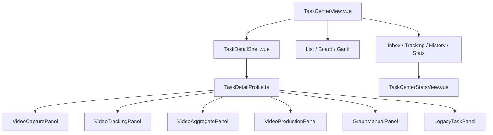

# 任务中心 v2 实施计划

> 🌡️ WARM — 可排期、可验收的工程清单。  
> **产品规格**: [`workflow-video-v1-ui-simplification-design.md`](./workflow-video-v1-ui-simplification-design.md) v2.1  
> **交互基准**: [`../demos/workflow-task-center-v2.1-demo.html`](../demos/workflow-task-center-v2.1-demo.html)（产品已评审通过行为）  
> **状态**: ✅ **TC-P0–P2 已完成** @ `0.88.0`–`0.89.0` · **日期**: 2026-06-18 · **路线图**: [`roadmap.md`](../roadmap.md) → **TCE Phase 1**（[`task-center-enhance.md`](./task-center-enhance.md)）

---

## 0. 文档定位

本计划将 **任务协同 UI 简化设计** 落地为分阶段 PR，范围不限于视频 v1，但以 **选题会批次 Run** 为第一验收模板；手动 graph / Legacy E 任务在 P0 做 **Profile 隔离**，不删除能力。

**原则**

- **Demo 即验收基准**：P0/P1 交互与 v2.1 Demo 一致处必须可截图对比。  
- **先减法后扩展**：P0 只改 UI 裁剪与列表列；P1 增 API；P2 拆组件与统计入口。  
- **不大改图引擎 join**：增量派发采用设计 §9.3 **方案 A**（ROOT 跟踪 + `dispatch_topic`）。  
- 每阶段结束：约定测试绿 + 更新 `progress.md`；有 schema/API 变更时同步 `data-contracts.md`。

**非目标（本计划不做）**

- 合并 `task_templates` 与 `WorkflowGraphTemplate` 运行时（见 ADR-005，单列 P3 决策）。  
- 看板拖拽改任务状态（除非产品单独立项）。  
- 重写 `TaskCenterService` 读路径或 graph-first 投影架构。

---

## 1. 目标摘要

| 场景 | 用户价值 | 阶段 |
|------|----------|------|
| S1 | 选模板 → 填信息 → 派发 → 进跟踪 | P0–P1 |
| S2 | 跟踪页 x/y 进度 + **逐题指派制作**（不等全员交齐） | P1 |
| S3 | 一步一主按钮、多 `submit_mode`、精简详情、更多退回 | P0–P1 |
| S4 | 列表/看板/甘特重做 + **任务统计** 入口 | P2 |

---

## 2. 现状与差距

| 区域 | 现状 | 目标 |
|------|------|------|
| `TasksView.vue` | ~2000 行；graph 通用 UI + 视频面板垂直堆叠 | `TaskDetailShell` + Profile 路由 |
| 详情按钮 | 交付物 / 采集 / 评论 并列 | 每 Profile **0–1** 主 CTA |
| N1 | `TemplateCapturePanel` 表格多行 | 单表单；后端 P1 强制 1 条 |
| N2 / ROOT | N2 未激活时「暂无待汇总」；ROOT 缺增量派发 | 进度来自 submissions；`VideoTrackingPanel` |
| 列表 | 缺 Run 列；引擎态外露 | `run_label` + 用户态 4–5 种 |
| 视图 | 看板/甘特绑旧 `TaskStatus` | 按 **用户态 × Run**（P2） |
| 统计 | 事件/引擎态在详情 | `/task-center/stats`（P2） |
| 实例化 | 易选部门全员 | 默认指定成员 + 派发后进跟踪 |

**关键代码锚点**

| 路径 | 说明 |
|------|------|
| `frontend/src/views/TaskCenterView.vue` | 壳层：Tab、视图切换、创建任务 Dialog |
| `frontend/src/views/TasksView.vue` | Master-Detail + 详情巨石 |
| `frontend/src/components/workflow/TemplateCapturePanel.vue` | N1 采集 |
| `frontend/src/components/workflow/TemplateAggregatePanel.vue` | N2 汇总 |
| `frontend/src/components/workflow/BatchRunDashboard.vue` | ROOT 子 Run |
| `frontend/src/components/workflow/TemplateInstantiateDialog.vue` | 模板实例化 |
| `backend/app/services/workflow_video_form_service.py` | capture / finalize |
| `backend/app/services/workflow_video_fork_service.py` | 按题 fork（P1 复用） |

---

## 3. 目标架构（前端）



**数据流（不变）**

`TaskCenterService` → Inbox/Tracking/History API → 选中 task → `TasksView`/`Shell` 按 `extra_metadata` 解析 Profile → 调 workflow-graph / tasks API。

**新增共享模块**

| 模块 | 职责 |
|------|------|
| `frontend/src/domain/task-detail/profile.ts` | Profile 判定、用户态映射、`submit_mode` |
| `frontend/src/domain/task-detail/user-state.ts` | TaskStatus + graph 元数据 → 用户态 |
| `frontend/src/components/task-detail/TaskDetailShell.vue` | Header、主按钮、更多菜单、折叠区 |

---

## 4. 阶段实施

### TC-P0 · 详情减法 + 列表列（≈1–2 周）

**范围**：S1 部分、S3 基础；**无**新后端 API（只读 submissions 已有）。

| # | 工作项 | 说明 |
|---|--------|------|
| P0-1 | `TaskDetailProfile` | 实现 6 种 Profile 判定（与设计 §5 一致） |
| P0-2 | `TaskDetailShell` 骨架 | 从 `TasksView` 抽出 header / actions / meta-compact |
| P0-3 | N1 单表单 | 新 `VideoCapturePanel` 替换表格 UI；隐藏交付/握手/验收 |
| P0-4 | ROOT / N2 进度 | ROOT 与 N2 顶栏读 submissions 展示 x/y + 待交人 |
| P0-5 | ROOT 裁剪 | 批次 ROOT 隐藏评论编辑、交付主表单 |
| P0-6 | 列表列 | Master 增 Run 列；用户态用 Profile 映射 |
| P0-7 | 实例化 UX | 默认指定成员文案；成功后路由 `tracking` + 选中 root task |
| P0-8 | 测试 | vitest Profile 单测；Playwright：N1 仅 1 个提交按钮 |

**交付 PR 建议**

1. `feat(task-center): add TaskDetailProfile and user-state mapping`  
2. `feat(task-center): VideoCapturePanel single-row N1`  
3. `feat(task-center): capture progress on ROOT and N2`  
4. `feat(task-center): master list run column and shell header`

**验收**（= 设计 §11.1）— **2026-06-18 完成** @ TC-P0

- [x] N1 详情仅 1 主按钮，无「提交交付物」  
- [x] ROOT/N2 显示 x/y 与待交人  
- [x] ROOT 无交付/评论主表单  
- [x] 列表有 Run 列  
- [x] 详情首屏仅 deadline / 部门 / 用户态 + 更多  

**测试命令**

```bash
cd frontend && npm run type-check && npm run test:unit && npm run build
cd frontend && npx playwright test e2e/task-center.spec.ts e2e/workflow-video-uat/workflow-video-multi-account-mock.spec.ts
cd backend && pytest -q tests/test_workflow_video_wf_form_engine.py tests/test_api.py::test_wf_submit_capture_and_finalize_topics_api
```

---

### TC-P1 · 增量派发 + 后端收口（≈1.5–2 周）

**范围**：S2 完整、S3 完整；**新增** `dispatch_topic` API。

| # | 工作项 | 说明 |
|---|--------|------|
| P1-1 | `dispatch_topic` API | `POST .../instances/{id}/dispatch-topic`；见设计 §9.1 |
| P1-2 | `WorkflowVideoFormService` | 封装 `dispatch_approved_topic()`，复用 fork_service |
| P1-3 | `VideoTrackingPanel` | ROOT 已交列表 + 行级「指派并启动制作」+ fork 态 |
| P1-4 | N1 校验 | `submit_capture` 强制 `len(topics)==1` |
| P1-5 | 用户态对齐 | form 完成后 Task → done/用户态「已完成」（非 review 挂起） |
| P1-6 | `submit_mode=file` | 制作 N3：`VideoProductionPanel` 上传主按钮 |
| P1-7 | 更多 · 退回 | N1 打回、制作步骤 rework；菜单进 Shell |
| P1-8 | 实例化默认 | 后端 participant 校验；排除发起人 fan-out（可配置） |
| P1-9 | E2E | 多账号：2/3 时 dispatch 一题 → 文案编辑收到脚本任务 |

**API 契约（写入 `data-contracts.md` §10.x 新小节）**

```
POST /api/v1/workflow-graph/instances/{instance_id}/dispatch-topic
→ 201 { child_instance_id, fork_status, message }
→ 409 重复 topic_id
→ 403 非 initiator/管理
```

**交付 PR 建议**

1. `feat(workflow): dispatch-topic API and service`  
2. `feat(task-center): VideoTrackingPanel incremental dispatch`  
3. `fix(workflow): N1 single-topic validation and task status projection`  
4. `feat(task-center): production file submit and more-menu reject`

**验收**（= 设计 §11.2）— **2026-06-18 完成**

- [x] 2/3 时可 dispatch，子 Run 与待办出现  
- [x] 重复 dispatch 409 + UI 禁用  
- [x] 文件节点「上传并提交」  
- [x] 更多退回 → 用户态「已退回」  
- [x] 实例化后进入跟踪 Tab（`TaskTemplatesView` → `filter=tracking`）

**实现分支**: `feat/task-center-p0-profile` @ `578c149`（已合并 main）

**测试命令**

```bash
cd backend && pytest -q tests/test_workflow_video_wfk_fork.py tests/test_workflow_video_w4_orchestration.py -k dispatch
# 新增 tests/test_workflow_video_dispatch_topic.py
cd frontend && npx playwright test e2e/live/workflow-video-multi-account-live.spec.ts  # 可选 live
```

---

### TC-P2 · 视图重做 + 任务统计（≈2–3 周）

**范围**：S4；`TasksView` 瘦身完成。

| # | 工作项 | 说明 |
|---|--------|------|
| P2-1 | 路由 | `/task-center/stats` 或 Tab「统计」 |
| P2-2 | `TaskCenterStatsView` | 部门 Run 汇总、全量 run_events、积压指标 |
| P2-3 | 列表组件 | `TaskCenterListView.vue` 独立 |
| P2-4 | 看板 | `TaskCenterBoardView.vue` — 列=用户态，卡片含 Run |
| P2-5 | 甘特 | `TaskCenterGanttView.vue` — 仅 `due_at` 任务，Run 色条 |
| P2-6 | 详情迁出 | 引擎追踪、全量事件默认仅在统计页 |
| P2-7 | `config.ui_profile` | 模板节点可选固化 Profile（后端 JSON，前端优先读） |
| P2-8 | 删除 dead code | `TasksView` 降至壳层 + 委托 Shell |

**验收**（= 设计 §11.3）

- [x] 三视图独立组件且与 Demo §7.2 一致  
- [x] 统计入口可看全量事件与部门汇总  
- [x] 详情仅保留最近 3 条事件摘要  

---

### TC-P3 · 后续（已并入 TCE Phase 5）

> 细项见 [`task-center-enhance.md`](./task-center-enhance.md) **B-12–B-15 / F-13–F-16**；路线图不再单独列为 P0。

| 项 | 说明 | TCE ID |
|----|------|--------|
| 工作流 E 与图引擎统一 | ADR-005 产品决策后执行 | B-12 |
| N2 批量模式产品开关 | 模板级 `aggregate_mode: batch \| streaming` | B-13 / F-14 |
| 「结束采集」| P2 设计预留，关闭 N1 入口 | B-14 / F-15 |
| 用户态统一模块 | 后端 `user_facing_state` 与前端 `user-state.ts` 对齐 | B-15 |

---

## 5. PR 与分支策略

| 顺序 | 分支前缀 | 合并条件 |
|------|----------|----------|
| 1 | `feat/task-center-p0-profile` | P0 验收 + CI 绿 |
| 2 | `feat/task-center-p1-dispatch` | P1 API + E2E 绿 |
| 3 | `feat/task-center-p2-views-stats` | P2 验收 + 文档 |

**每 PR 限制**：≤500 行净增优先；P0-2 Shell 可拆 2 个 PR。

---

## 6. 风险与缓解

| 风险 | 缓解 |
|------|------|
| `TasksView` 回归面大 | Profile 单测 + 保留 manual/legacy 快照 E2E |
| dispatch 与 finalize 双路径 | `forked_topics` 幂等；文档区分 API |
| 用户态与 TaskStatus 不一致 | 单一 `user-state.ts` 映射；列表/详情共用 |
| P2 范围膨胀 | 统计页 MVP 仅事件+计数，图表后迭代 |

**回滚**：Feature flag `TASK_CENTER_V2_UI_ENABLED`（frontend env，默认 false → true 分阶段打开）。

---

## 7. 文档与 memory-bank 更新清单

| 阶段 | 更新 |
|------|------|
| P0 完成 | `progress.md`；`domains/task-center.md` Profile 段 | ✅ 2026-06-18 |
| P1 完成 | `data-contracts.md` dispatch-topic / reject / include_initiator；`domains/workflow-video-v1.md` | ✅ 2026-06-18 |
| P2 完成 | `architecture.md` §前端组件；`changelog.md` + `VERSION` → `0.88.0` | ✅ 2026-06-18 |
| 全程 | `active-task.md` 验收勾选；设计 §11 全勾选 | ✅ 2026-06-18 |

---

## 8. 里程碑时间表（建议）

| 里程碑 | 目标日期 | 标志 |
|--------|----------|------|
| TC-P0 开干 | 2026-06-19 | Profile + N1 单表单 PR 合并 |
| TC-P0 完成 | 2026-06-18 | §11.1 全勾选 @ `7bc242c` |
| TC-P1 完成 | 2026-06-18 | dispatch_topic + 多账号 mock E2E |
| TC-P2 完成 | 2026-06-18 | 统计入口 + 三视图 @ `0.88.0` |

*日期为排期建议，随 PR 速率调整。*

---

## 9. 关联文档

| 文档 | 关系 |
|------|------|
| [`workflow-video-v1-ui-simplification-design.md`](./workflow-video-v1-ui-simplification-design.md) | 产品/UX 规格 |
| [`../demos/workflow-task-center-v2.1-demo.html`](../demos/workflow-task-center-v2.1-demo.html) | 交互基准 |
| [`../domains/task-center.md`](../domains/task-center.md) | 领域边界 |
| [`../roadmap.md`](../roadmap.md) | 宏观优先级 |
| [`workflow-video-v1-implementation-plan.md`](./workflow-video-v1-implementation-plan.md) | 视频 v1 后端已完成能力 |

---

## 10. 修订记录

| 日期 | 说明 |
|------|------|
| 2026-06-18 | 初稿：Demo 评审通过后立项；TC-P0–P2 拆分与验收绑定设计 v2.1 |
| 2026-06-18 | TC-P0–P2 完成；§11 验收闭环；`VERSION` `0.88.0` |
