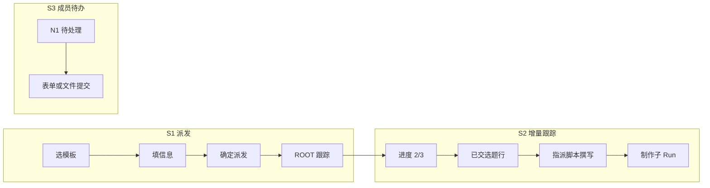

# 视频工作流 v1 · 任务协同 UI 简化设计（迭代 v2.1）

> 🌡️ WARM — 产品/UX 迭代规格。实现前与 [`domains/workflow-video-v1.md`](../domains/workflow-video-v1.md)、[`domains/task-center.md`](../domains/task-center.md) 对照。  
> **状态**: ✅ **P0–P2 已落地** @ `0.88.0`（`main`）· 设计 v2.1 · **日期**: 2026-06-18 · **实施**: TC-P0–P2 ✅ @ `0.89.0`；**下一排期**: [`task-center-enhance.md`](./task-center-enhance.md)（TC-P3 → Phase 5）  
> **交互 Demo**: [`../demos/workflow-task-center-v2.1-demo.html`](../demos/workflow-task-center-v2.1-demo.html)（v2.1 全流程 · 浏览器直接打开）· 详情对照 [`../demos/workflow-task-detail-v2.html`](../demos/workflow-task-detail-v2.html)

---

## 1. 背景与动机

视频工作流 v1（W0–W10）已在图引擎上跑通批次实例化 → N1 采集 → N2 汇总 → fork 制作子流。  
当前 **任务协同详情**（`TasksView.vue`）沿用图引擎通用能力（握手、交付物、验收、评论），并叠加视频表单引擎（表格采集、汇总矩阵），导致：

- 同一详情页出现 **多个「提交」类按钮**，用户不知点哪个；
- **表格采集** 与「一人一任务、一题一行」的产品模型冲突；
- **Task 投影态 + 图引擎态 + 业务态** 三层状态同时暴露，列表与节点追踪不一致；
- **列表 / 看板 / 甘特** 与详情耦合在同一巨型组件，统计与日志挤在任务主流程里。

本迭代目标：**在不大改图引擎核心的前提下，对视频 v1 场景做 UI/交互减法**，恢复「一步一按钮、状态可读」；并明确 **增量派发** 与 **任务中心 IA 2.0** 的后续路径。

---

## 2. 问题汇总（归类）

### 2.1 交互层 — 行动点过载（P0）

| ID | 现象 | 根因 | 影响 |
|----|------|------|------|
| UX-01 | 详情页同时出现「提交交付物」「提交采集」「提交评论」等 | 通用 graph 任务 UI 与视频节点面板 **垂直堆叠**，无互斥 | 误操作、学习成本高 |
| UX-02 | 视频 N1/N2 仍显示握手、返工、质量评分等空字段 | Task 作为兼容投影，**未按节点类型裁剪** descriptions | 首屏信息噪音 |
| UX-03 | 批次 ROOT 与节点任务共用同一详情模板 | 缺少 **Run 角色**（root / node / manual）区分 | ROOT 页不应出现交付/评论主流程 |

### 2.2 表单层 — 表格采集不成熟（P0）

| ID | 现象 | 根因 | 影响 |
|----|------|------|------|
| FM-01 | N1「表格采集」支持一人多行 | `TemplateCapturePanel` 多行 table + 后端允许多 `topics` | 与 fan-out「每人一任务」冲突 |
| FM-02 | Lead 待办出现多条「提交选题 / 评审中」且执行人为本人 | 实例化选「部门全员」含 lead；或 lead 自填多行采集 | N2 无法汇总或状态混乱 |
| FM-03 | N2「暂无待汇总提交」无进度解释 | 汇总 API 未把 **2/3 已交、待谁** 翻译为用户文案 | 用户以为系统故障 |

### 2.3 编排层 — 批量门控与产品期望错位（P1）

| ID | 现象 | 根因 | 影响 |
|----|------|------|------|
| OR-01 | 管理端须等 **全部** N1 完成才出现 N2 待办 | W4 `all-of` join：N2 仅在全部 multi_instance peer COMPLETED 后 ACTIVATED | 无法「收到 1 题就立刻指派脚本撰写」 |
| OR-02 | 汇总页与跟踪页职责混淆 | N2 Task 既是「进度展示」又是「批量确认入口」 | 增量派发无独立 UI 锚点 |

### 2.4 状态层 — 状态机对用户过复杂（P1）

| ID | 现象 | 根因 | 影响 |
|----|------|------|------|
| ST-01 | 列表「评审中」与节点追踪「已完成」并存 | `Task.status` 与 `engine_state` **完成路径不同**（form_submit vs deliverable） | 信任度下降 |
| ST-02 | 待办/跟踪/历史大量同名任务 | 列表缺 **run_label、步骤名、Run 类型** | 难以选中正确任务 |
| ST-03 | 引擎 `business_state` 暴露在详情 | 通用 graph 握手语义套用在模板节点 | 非技术用户不可读 |

### 2.5 结构层 — 可维护性与产品边界（P2）

| ID | 现象 | 根因 | 影响 |
|----|------|------|------|
| AR-01 | `TasksView.vue` 2000+ 行，职责过多 | 列表/详情/视频/看板/验收/评论未拆分 | 每次加能力都加剧按钮堆叠 |
| AR-02 | Legacy E 与图模板 Tab 并存 | 已知双轨架构（ADR-005） | **已收口** @ `0.89.0`：单入口「任务模板」；Legacy E UI 已删，后端待 TC-P3 删除 |
| AR-03 | 实例化 Dialog 易选「部门全员」 | 缺 **排除发起人 / 指定成员默认** 的产品规则 | 批次 Run 从第一步就错 |
| IA-01 | 看板 / 甘特与列表共用旧数据模型 | 视图未按 Profile / Run 维度设计 | 视图价值低、维护成本高 |
| IA-02 | 统计、运行日志散落在任务详情 | 无独立 **任务统计** 入口 | 详情页信息过载 |

---

## 3. 目标场景（产品期望）

以下四条为评审基准；**可实现性**见各节与 §9。

| # | 角色 | 场景 | 设计对应 | 阶段 |
|---|------|------|----------|------|
| **S1** | 用户 A（部门管理） | 从模板列表选模板 → 填 launch 信息 → **确定派发** | §5.0 实例化收口；派发成功后进入 **跟踪**（ROOT 看板） | P0–P1 |
| **S2** | 用户 A（部门管理） | **跟踪 Tab** 显示「已收到 2/3 份采集」进度；**不必等全部采集完成**即可对 **已提交** 的选题指定脚本撰写人并启动制作 | §5.2b 增量派发 + ROOT 跟踪页；§9 `dispatch_topic` API | **P1** |
| **S3** | 用户 B（部门成员） | 待办任务用户态 **待处理**；按模板 **不同提交类型**（表单 / 文件 / 审核）；详情只保留 deadline 等核心字段；**更多** 含退回 | §4 Action Profile + §5.1 / §5.6 | P0–P1 |
| **S4** | 全员 | **列表 / 看板 / 甘特** 全部重做；新增 **任务统计** 入口，集中非主流程的统计与日志 | §7 任务中心 IA 2.0 | P2 |



---

## 4. 设计原则

1. **一步一主按钮（One Primary Action）** — 每个详情上下文最多一个主 CTA，其余收入「更多操作」。  
2. **按节点类型裁剪 UI（Action Profile）** — 同一任务中心壳层，内嵌不同面板组合；禁止「全量字段 + 全量按钮」默认展开。  
3. **用户只看见一层状态** — 列表与详情统一为 4～5 个用户态；引擎态进「工作流节点追踪」或任务统计。  
4. **表单服从流程拓扑** — N1 一人一条选题，不用表格多行；跟踪/汇总必须显示 **采集进度**。  
5. **采集与制作解耦（Streaming Dispatch）** — 已提交的选题可 **异步** 启动制作子 Run，不阻塞未完成的采集。  
6. **主流程 vs 观测分离** — 详情服务「我现在要做什么」；汇总统计、运行日志、节点引擎态进 **任务统计** 或折叠区。  
7. **先减法后统一** — 本迭代聚焦视频 v1；手动 graph / Legacy E 仅做隔离，不强行合并后端。

---

## 5. Action Profile 模型

根据任务 metadata（及可选 `node.config.ui_profile`）解析 **行动配置**（前端 `TaskDetailProfile.ts` computed；P2 可后端固化）。

### 5.0 Profile 总表

| Profile | 判定条件（示例） | 主按钮 | 更多菜单 | 隐藏区块 |
|---------|------------------|--------|----------|----------|
| `video_n1_capture` | `template_node_key=N1_*` 且 assignee=当前用户 | 见 §5.0.1 | **退回**（打回重填，管理端） | 交付物、握手、验收、表格多行 |
| `video_n2_aggregate` | `template_node_key=N2_*` 且 assignee=当前用户 | **确认派发**（批量模式） | 打回采集 | 交付物、握手、评论主表单 |
| `video_batch_root` | `workflow_graph_root_task` + `run_kind=batch` | 无（跟踪看板） | — | 交付、验收、采集表单、评论编辑 |
| `video_production_step` | 制作 Run 各 N3+ 节点 | 见 §5.0.1 | 退回 / 转办（按节点） | 表格采集、批次看板 |
| `graph_manual` | 手动 dual-write 任务 | 接受/交付/验收链 | 转办、协商 | 视频表单面板 |
| `legacy_task` | 无 graph 锚点 | 现有 Todo→Done | — | 视频面板 |

**主按钮区**（详情 header 右侧）只渲染 Profile 定义的 0～1 个 primary；secondary 一律进「更多」。

### 5.0.1 提交模式（`submit_mode`）

模板节点 `config.capture_schema` / `completion_policy` 决定成员侧主按钮文案与面板：

| submit_mode | 典型节点 | 主按钮 | 面板 |
|-------------|----------|--------|------|
| `form` | N1 选题采集 | **提交选题** | 单表单（标题 + 说明） |
| `file` | N3 脚本、N5 成片等 | **上传并提交** | 文件上传 + 可选说明 |
| `form+file` | 需表单与附件 | **提交** | 表单 + 附件区 |
| `review` | N4 审核 | **通过** / **退回**（双 secondary，仅一项为主） | 只读预览 + 评语 |

解析优先级：`ui_profile.submit_mode` → `capture_schema.type` → `completion_policy` 启发式。

---

## 6. UI 减法规格

### 6.0 模板实例化（S1）

**入口**：任务协同 → 工作流 → 图模板列表 →「从模板创建」(`TemplateInstantiateDialog`)。

| 项 | 规格 |
|----|------|
| 必填 | 主题 / `run_label`、参与人（文案编辑 subset）、部门 |
| 默认 | 参与人 **指定成员**，非「部门全员」；**排除发起人** 参与 N1 fan-out（除非显式勾选） |
| 主按钮 | **确定派发** |
| 成功后 | Toast + 跳转 **跟踪 Tab** 并选中 ROOT 任务（非随机落在待办 N1） |
| P1 后端 | launch_schema 校验 + 默认 participant_policy |

### 6.1 N1 采集（S3 · 替代表格采集）

- 字段：**选题标题**（必填）、**说明**（可选）；**禁止增删行**。  
- 主按钮：**提交选题**（`submit_mode=form`）。  
- 提交后：节点 COMPLETED，Task 用户态 → **已完成**；从待办移除。  
- **更多**：成员侧通常为空；管理端在汇总/跟踪上下文可 **打回**（rework）。  
- 后端（P1）：`submit_capture` 在 N1 强制 `len(topics)==1` 且 `assignee==当前用户`。

### 6.2 N2 汇总 — 批量模式（兼容）

适用于「全员到齐后一次性确认」或 v1 现有 `finalize_topics` 路径。

- 顶部 **采集进度条**：「已收到 2/3 份 · 待 陆言 提交」。  
- 矩阵：勾选通过 + 指定脚本撰写人（部门范围内选人）。  
- 主按钮：**确认派发**（禁用直至 `submitted_count >= min_submissions`，默认 min=全部 fan-out 数）。  
- 隐藏：提交交付物、交付与验收 divider。

> **与现状差异**：进度条数据来自 `GET .../instances/{id}/submissions?node_key=N1_*`，**不依赖** N2 是否 ACTIVATED（修复 FM-03）。

### 6.2b 跟踪页增量派发（S2 · P1）

**动机**：W4 当前 `all-of` join 使 N2 待办仅在全部 N1 完成后出现；产品要求 **首条采集提交后即可指派制作**。

**UI 锚点**：**批次 ROOT 跟踪看板**（`video_batch_root`）+ 可选 N2 详情复用同一「已交选题」组件。

| 元素 | 行为 |
|------|------|
| 进度条 | 「已收到 2/3 份采集」+ 待交人名单 |
| 已交列表 | 每行：选题标题、提交人、提交时间、脚本撰写人（部门内 select） |
| 行级主操作 | **指派并启动制作** — 对该题 fork 制作子 Run；已 fork 行显示「制作中」并禁用重复派发 |
| 未交行 | 灰显「等待采集」，不可指派 |
| 底部（可选） | **结束采集** — deadline 或全员到齐后关闭 N1 入口（P2） |

**与批量模式关系**：

- **增量模式**（默认，S2）：逐行 `dispatch_topic`，N2 节点可保持 ACTIVATED 直至管理员标记汇总完成。  
- **批量模式**（§6.2）：保留「确认派发」一次性 fork 多题，用于迁移与简单模板。

**后端**：见 §9.1；复用 `WorkflowVideoForkService.fork_production_runs` 单题 + `forked_topics` 去重。

### 6.3 批次 ROOT 跟踪（S2 壳层）

- **采集进度** + **已交选题列表**（§6.2b）置顶。  
- **子制作 Run 列表**（已有 `BatchRunDashboard`）— 点击跳转制作详情。  
- **运行事件**时间线（只读，详细日志链到 §7 任务统计）。  
- 无：交付、验收、评论编辑、采集表单。

### 6.4 任务详情布局（S3 · 成员 / 通用）

**首屏（Header 下）**

| 区域 | 内容 |
|------|------|
| 标题 | 步骤名 + Run 短标签 |
| 用户态 Badge | 待处理 / 进行中 / 待确认 / 已完成 / 已退回 |
| 主按钮 | Profile 唯一 CTA |
| 更多 ▾ | 退回、转办（若允许）、打开任务统计 |

**次屏（折叠上方，仅核心元数据）**

| 显示 | 隐藏（进「更多信息」或统计） |
|------|-------------------------------|
| 截止时间 | 运行类型、引擎版本 |
| 所属部门（单行） | `business_state`、`engine_state` |
| 执行人（只读） | 握手历史、质量评分空字段 |

**默认折叠**：评论与留痕、工作流节点追踪（引擎态）。

### 6.5 列表（任务中心 Master 列 · P0 最小改）

| 列 | 说明 |
|----|------|
| 任务标题 | 步骤名 + Run 短标签 |
| Run | `run_label` 或 instance id 前 8 位 |
| 用户态 | 待处理 / 进行中 / 待确认 / 已完成 / 已退回 |
| 截止时间 | 可选 |

> 看板 / 甘特 **重做规格** 见 §7，不在 P0 范围。

### 6.6 评论与附件

- 视频 N1/N2/ROOT：**默认折叠**「评论与留痕」。  
- 制作审核节点、手动任务：保持协同能力；`submit_mode=file` 时附件即主交付物。

---

## 7. 任务中心 IA 2.0（S4 · P2）

### 7.1 信息架构

```
任务协同
├── 待办 / 跟踪 / 历史          ← 主工作流（Master-Detail，P0 重点）
├── 视图（重做）
│   ├── 列表（默认）
│   ├── 看板（按用户态 × Run 分组，可配置列）
│   └── 甘特（仅有 deadline 的任务；按 Run 着色）
└── 任务统计（新入口）
    ├── 部门 / Run 维度汇总
    ├── 节点耗时、积压、完成率
    └── 运行事件 / 审计日志（自详情迁出）
```

### 7.2 视图重做要点

| 视图 | 数据源 | 分组 / 轴 | 非目标 |
|------|--------|-----------|--------|
| 列表 | Inbox API + Profile 用户态 | — | 不再堆叠引擎字段列 |
| 看板 | 同上 | 默认按 **用户态**；可选按 **Run** | 不做全字段自定义 |
| 甘特 | 带 `due_at` 的任务 | 时间轴 + Run 色条 | 不含无 deadline 的 N1 |

### 7.3 任务统计入口

- **路由**：`/task-center/stats` 或任务协同子 Tab「统计」。  
- **权限**：部门管理可见本部门 Run；Admin 全量。  
- **从详情迁出**：运行事件全量、节点引擎态时间线、Workload 类图表。  
- **保留在详情**：与当前主行动相关的最近 3 条事件（只读摘要）。

### 7.4 组件拆分（AR-01）

| 新组件 | 职责 |
|--------|------|
| `TaskDetailShell.vue` | 布局、Profile 路由、更多菜单 |
| `TaskDetailProfile.ts` | Profile 解析与用户态映射 |
| `VideoCapturePanel.vue` | N1 单表单 |
| `VideoTrackingPanel.vue` | ROOT 进度 + 增量派发列表 |
| `VideoAggregatePanel.vue` | N2 批量矩阵（§6.2） |
| `TaskCenterStatsView.vue` | 统计与日志 |

`TasksView.vue` 逐步瘦身为壳层 + 视图切换。

---

## 8. 用户态映射

| 用户态 | 含义 | 典型来源 |
|--------|------|----------|
| 待处理 | 需你点击主按钮完成一步 | N1 待填、N2 可汇总、手动待接受 |
| 进行中 | 流程在进行，暂无你的主行动 | 跟踪 Tab、他人未交采集、已 fork 制作中 |
| 待确认 | 验收 / 审核 | 制作 N4 待 lead 审 |
| 已完成 | 该 Task 投影结束 | done / 节点 COMPLETED |
| 已退回 | 打回后需重办 | rework / deep_reject |

**映射规则**：前端 Profile 优先；列表与详情 **必须一致**。  
引擎 `engine_state` / `business_state` **不进入** descriptions 首屏。

---

## 9. 后端扩展（契约草案）

P0 **不要求** 改后端；P1 增量派发需下列扩展（写入 `data-contracts.md` 时对齐命名）。

### 9.1 `POST /api/v1/workflow-graph/instances/{instance_id}/dispatch-topic`（P1 新增）

**用途**：S2 行级「指派并启动制作」，不等全部 N1 完成。

**Request**

```json
{
  "topic_id": "uuid",
  "title": "选题标题",
  "script_writer_user_id": "uuid",
  "source_node_instance_id": "uuid"
}
```

**行为**

1. 校验 actor 为 initiator / 部门管理 / Admin。  
2. 校验该题已在 N1 deliverable 中存在且尚未在 `context.forked_topics` 中。  
3. 调用 `fork_production_runs(approved_topics=[one])`；写 `production_run_forked` 事件。  
4. **不** 完成 N2 节点（与 `finalize_topics` 批量路径区分）。

**Response**：`{ child_instance_id, fork_status, message }`

### 9.2 现有 API 复用（P0 前端即可接）

| API | 用途 |
|-----|------|
| `GET .../instances/{id}/submissions?node_key=N1_*` | 进度条 x/y、已交列表 |
| `POST .../instances/{id}/finalize-topics` | §6.2 批量确认派发 |
| `POST .../tasks/{id}/capture` | N1 提交 |
| rework / reject 既有路径 | §6.1 打回 |

### 9.3 可选编排变更（P2 评估）

| 方案 | 说明 | 风险 |
|------|------|------|
| A（推荐） | 跟踪页 + `dispatch_topic`，N2 join 不变 | 低；与 W4 测试兼容 |
| B | N2 模板 `join_mode=any`，首条 N1 完成即 ACTIVATED N2 | 改变门控语义，需回归 W4 |
| C | 提前 ACTIVATED N2 + `min_submissions=1` | 与 A 类似，但 N2 Task 过早进待办 |

**默认采用方案 A**；B/C 仅在产品明确要求「N2 也必须进待办」时评估。

---

## 10. 实施路线图

| 阶段 | 范围 | 交付 | 场景 |
|------|------|------|------|
| **P0** | Action Profile、`TaskDetailProfile.ts`、N1 单表单、详情一步一按钮、ROOT/N2 进度文案、实例化默认参与人 UI | Demo 对齐实现；`TasksView` 减法 | S1 部分、S3 基础 |
| **P1** | N1 单条校验；用户态与 form_complete 对齐；`dispatch_topic` API + `VideoTrackingPanel`；`submit_mode` 文件/审核；更多菜单退回 | pytest + 多账号 E2E | **S2**、S3 完整 |
| **P2** | `TaskDetailShell` 拆分；列表/看板/甘特重做；**任务统计**入口；template `config.ui_profile` | 重构 PR 系列 | **S4** |
| **P3** | Legacy E 与图模板产品统一评估（ADR-005） | 架构决策 | — |

> **工程排期**见 [`task-center-v2-implementation-plan.md`](./task-center-v2-implementation-plan.md)（TC-P0–P2、PR 切分、测试命令、里程碑）。

**非目标**

- 合并 `task_templates` 与 `WorkflowGraphTemplate` 后端运行时  
- 重写图引擎状态机（join / progress 核心）  
- 移除手动任务的握手/交付/验收能力  

---

## 11. 验收标准

> **闭环状态**（2026-06-18）：§11.1 P0 · §11.2 P1 · §11.3 P2 **均已勾选**；工程验收 = v2.1 Demo 评审通过 + vitest / mock-playwright E2E 绿 @ TC-P0–P2。正式截图归档与 Docker A–F 手工实测为**可选**后续项。

### 11.1 P0 — **2026-06-18 完成** @ TC-P0 (`7bc242c`)

- [x] N1 详情仅 **1 个主按钮**「提交选题」，无「提交交付物」  
- [x] N2 / ROOT 展示 **x/y 采集进度** 与待交人（不再仅「暂无待汇总提交」）  
- [x] 批次 ROOT 无交付/评论主表单  
- [x] 列表可区分 Run（`run_label` 或等价列）  
- [x] 详情首屏仅核心元数据 + **更多** 菜单  
- [x] Demo 与实现行为一致（v2.1 Demo 已评审；mock/playwright E2E 绿 @ TC-P0–P2；正式截图归档可选）  

### 11.2 P1 — **2026-06-18 完成**

- [x] 跟踪页对已提交选题可 **指派并启动制作**，无需等 3/3  
- [x] 同一选题不可重复 fork（UI 禁用 + API 409）  
- [x] `submit_mode=file` 节点主按钮为上传提交  
- [x] **更多 → 退回** 可用且用户态变为 **已退回**  
- [x] 实例化默认 **指定成员**，派发后进入跟踪 Tab  

### 11.3 P2 — **2026-06-18 完成** @ TC-P2 (`0.88.0`)

- [x] 列表 / 看板 / 甘特独立组件，按 §7.2 规格  
- [x] **任务统计** 入口可查看 Run 事件与部门汇总  
- [x] 详情内引擎态 / 全量日志已迁出或默认折叠  

---

## 12. 关联文档

| 文档 | 关系 |
|------|------|
| [`task-center-v2-implementation-plan.md`](./task-center-v2-implementation-plan.md) | **工程实施计划**（TC-P0–P2、PR、测试、里程碑） |
| [`workflow-video-v1-implementation-plan.md`](./workflow-video-v1-implementation-plan.md) | W7 表单引擎、WFK fork；本迭代为 W7+ UX 收口 |
| [`domains/workflow-video-v1.md`](../domains/workflow-video-v1.md) | 运行时与 API |
| [`domains/task-center.md`](../domains/task-center.md) | Inbox / Master-Detail |
| [`decisions.md`](../decisions.md) ADR-005/006 | 双轨工作流、图模板开关 |
| [`demos/workflow-task-center-v2.1-demo.html`](../demos/workflow-task-center-v2.1-demo.html) | **主 Demo**（S1–S4 交互模拟） |
| [`demos/workflow-task-detail-v2.html`](../demos/workflow-task-detail-v2.html) | 详情 Profile 静态对照 |

---

## 13. 修订记录

| 日期 | 版本 | 说明 |
|------|------|------|
| 2026-06-18 | v2.0 | 初稿：Docker 实测 + 浏览器排查结论汇总 |
| 2026-06-18 | v2.1 | 纳入产品四场景（S1–S4）；§6.2b 增量派发与 `dispatch_topic` 契约；Action Profile `submit_mode`；任务中心 IA 2.0；验收标准分 P0/P1/P2 |
| 2026-06-18 | v2.1-demo | 新增 [`workflow-task-center-v2.1-demo.html`](../demos/workflow-task-center-v2.1-demo.html) 交互 Demo |
| 2026-06-18 | v2.1-shipped | §11.1–§11.3 验收全勾选；P0–P2 工程落地 @ `0.88.0`；TC-P3 后置 |
