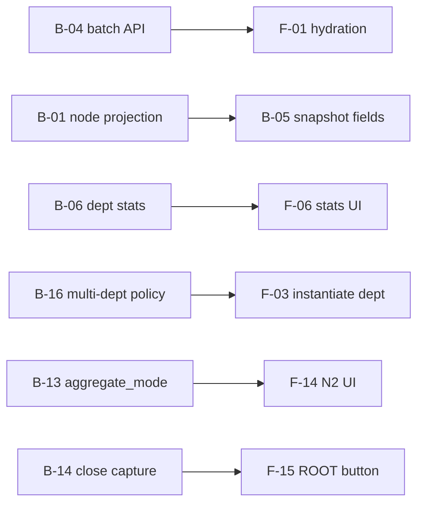
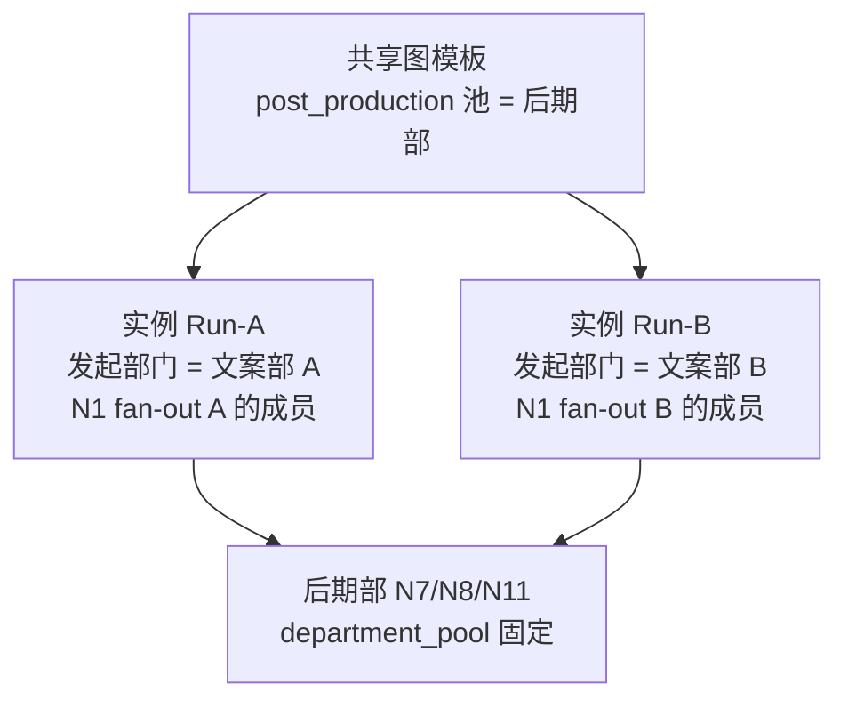

# 任务中心增强排期（Task Center Enhance）

> 🌡️ WARM — TC-P0–P2 完成后的下一工程排期。  
> **标尺**：当前版本内能做到的较好用户体验（含 TC-P3 backlog → **Phase 5**）。  
> **状态**：✅ **就绪 · Phase 1 待开 PR** · **日期**：2026-06-21  
> **实施入口**：[`active-task.md`](../active-task.md) · [`roadmap.md`](../roadmap.md)  
> **前置**：[`task-center-v2-implementation-plan.md`](./task-center-v2-implementation-plan.md) TC-P0–P2 ✅ @ `0.88.0`–`0.89.0`  
> **关联**：[`domains/task-center.md`](../domains/task-center.md)、[`workflow-video-v1-ui-simplification-design.md`](./workflow-video-v1-ui-simplification-design.md) v2.1

---

## 0. 文档定位

本计划在 **任务中心 v2 壳层与三视图已落地** 之后，补齐读模型、性能、统计与可维护性缺口；并单列 **多文案部门共用同一图模板** 的产品/技术方案（见 §6）。

**不在本计划范围（除非单独立项）**

- 看板拖拽改状态
- 重写图引擎 join / progress 核心
- Legacy E 与图引擎统一的产品决策本身（见 TC-P3 / ADR-005）— 仅列工程项 B-12

---

## 1. 体验路径 → 根因映射

| 用户路径 | 用户期望 | 当前根因 | 主要代码 |
|----------|----------|----------|----------|
| 待办 Tab | 状态与详情一致；只看到我该做的 | 节点任务不走 graph 投影；snapshot 用 `TaskStatus` | `task_service._graph_task_projection_map` |
| 跟踪 Tab | 不漏 Run；发起人能跟进度 | tracking 依赖 inbox(limit×2) 去重；硬 limit=50 | `list_task_tracking` |
| 详情 | 提交后列表更新 | 操作后缺 refresh；前后端用户态规则分裂 | `TaskDetailShell` / `user-state.ts` |
| 统计 Tab | 本部门 Run 汇总 | 统计扫全量 TaskStatus；无部门/Run API | `get_task_stats_summary` |
| 看板/搜索 | 可读、与列表一致 | 看板显示 UUID；搜索走 Legacy 列 | `TaskCenterBoardView` |
| 多部门实例化 | 文案 A/B 共用模板、下游同一后期 | 模板 seed 绑定单一 `department_id`；policy 优先读模板内 ID | `participant_policies` / seed 脚本 |

---

## 2. 后端待办（按优先级）

字段说明：**做什么** | **为什么（含举例）** | **改动面** | **验收** | **依赖**

### P0 — 错误、漏任务、明显性能

#### B-01 · 扩展 graph 读路径到节点投影任务

| | |
|---|---|
| **做什么** | 对带 `extra_metadata.workflow_node_instance_id` 的任务 join `WorkflowNodeInstance` 生成 `GraphTaskProjection`，纳入 inbox/tracking/history 的 graph-first 分支。 |
| **为什么** | 仅批次 ROOT 走图投影；N1/N3/N7 等仍用 DB `Task.status`，与详情用户态不一致。 |
| **举例** | 文案编辑提交选题后详情已是「已完成」，待办仍显示「进行中」，用户反复点开。 |
| **改动面** | [`backend/app/services/task_service.py`](../../backend/app/services/task_service.py) |
| **验收** | 节点任务 inbox 的 status/stage 与 `business_state` 一致；pytest 覆盖 N1 完成后 inbox。 |
| **依赖** | 无 |

#### B-02 · inbox/tracking DB 层 limit

| | |
|---|---|
| **做什么** | SQL WHERE + ORDER BY + LIMIT，替代「加载全部可见 Task → 内存 [:50]」。 |
| **为什么** | 任务上百时打开任务中心变慢。 |
| **举例** | 经理跟踪 200+ 子 Run，首屏只展示 50 条却扫描 200+ 行。 |
| **改动面** | `task_service.list_task_inbox` / `list_task_tracking` |
| **验收** | 200+ fixture 下 SQL 带 LIMIT；行为与改前一致。 |
| **依赖** | 宜与 B-07 同 PR |

#### B-03 · 历史任务 `department_id` 迁移

| | |
|---|---|
| **做什么** | 一次性脚本：图投影任务 `department_id` ← 受理人 Profile 部门。 |
| **为什么** | 跨部门制作流曾把后期任务挂在文案部；经理按部门看不见、无法督办。 |
| **举例** | 测试服 N7「指派剪辑」部门仍显示文案部。 |
| **改动面** | `backend/app/scripts/` + handbooks |
| **验收** | dry-run；迁移后后期经理 `_can_operate_task` 为 true。 |
| **依赖** | 与已合 main 的投影任务 department 修复配套 |

### P1 — 体验不一致、性能、管理端

#### B-04 · 批量任务查询 API

| | |
|---|---|
| **做什么** | `GET /api/v1/tasks?ids=`（或 POST batch），上限 ~100，校验可见性。 |
| **为什么** | v2 只需 snapshot ~50 个 ID，不应拉全量 `/tasks`。 |
| **举例** | 跟踪 20 条却下载 500 条 JSON。 |
| **改动面** | [`tasks.py`](../../backend/app/api/routes/tasks.py)、`task_service.py`、`data-contracts.md` |
| **验收** | pytest + 仅返回可见 id。 |
| **依赖** | **阻塞 F-01** |

#### B-05 · snapshot 增加 `run_label` + `user_facing_state`

| | |
|---|---|
| **做什么** | 扩展 `TaskCenter*ItemRead`；组装时计算（见 B-15 模块）。 |
| **为什么** | Legacy 读 snapshot `TaskStatus`；Run 名靠解析 title。 |
| **举例** | Run 列显示「—」无法区分两个并行选题会。 |
| **改动面** | `schemas/task_center.py`、`task_center_service.py` |
| **验收** | N1 完成态 snapshot 为 `completed`；契约写入 data-contracts。 |
| **依赖** | B-01 后更准确 |

#### B-06 · 统计 API 部门范围 + Run 维度

| | |
|---|---|
| **做什么** | `stats/summary?department_id=`、workload 按 managed 部门过滤。 |
| **为什么** | 设计 §7.3 要求部门管理看本部门；现全公司 TaskStatus。 |
| **举例** | 文案部经理无法回答「我们部门本周积压多少」。 |
| **改动面** | `task_service.get_task_stats_summary` / `get_task_workload` |
| **验收** | 非 Admin 仅能查 managed departments。 |
| **依赖** | **阻塞 F-06** |

#### B-07 · tracking / inbox 去重收敛

| | |
|---|---|
| **做什么** | 单一 SQL/CTE 定义 inbox 与 tracking 集合，去掉 `list_task_inbox(limit*2)` 嵌套。 |
| **为什么** | 双 limit 可能导致跟踪 Tab 漏项。 |
| **举例** | 提交后任务从待办消失但跟踪里找不到。 |
| **改动面** | `list_task_tracking` |
| **验收** | inbox ∩ tracking = ∅。 |
| **依赖** | 与 B-02 同 PR 为佳 |

#### B-08 · snapshot 移除/替换 Legacy E `template_summaries`

| | |
|---|---|
| **做什么** | 改为 `WorkflowGraphTemplate` 摘要或移除字段。 |
| **为什么** | @0.89.0 前端已是图模板单入口。 |
| **举例** | 移动端读 snapshot 仍见已删 E 模板。 |
| **改动面** | `task_center_service.py` |
| **验收** | 无 Legacy E 摘要或已替换。 |
| **依赖** | F-16 可同 PR |

### P2 — 设计 v2.1 补全

| ID | 做什么 | 为什么（举例） | 改动面 |
|----|--------|----------------|--------|
| **B-09** | inbox/tracking/history 分页 cursor | 30 人 fan-out 超 50 条静默丢失 | task_center API + 前端加载更多 |
| **B-10** | 搜索返回 `user_facing_state` | 搜「脚本审核」显示「评审中」非「待确认」 | `TaskSearchResultRead` |
| **B-11** | Run 级事件聚合 API | 统计页无法「部门 Run 一览」 | `workflow_graph_engine.py` |

### P3 — TC-P3 / 架构

| ID | 做什么 |
|----|--------|
| **B-12** | TC-P3-1：E 与图引擎统一（ADR-005） |
| **B-13** | TC-P3-2：`aggregate_mode: batch \| streaming` |
| **B-14** | TC-P3-3：「结束采集」API |
| **B-15** | 后端统一 `user_facing_state` 模块（与前端 `user-state.ts` 对齐） |

---

## 3. 前端待办（按优先级）

### P0

| ID | 做什么 | 为什么（举例） | 改动面 | 依赖 |
|----|--------|----------------|--------|------|
| **F-01** | 工作区 batch 拉 Task，去掉 `listTasks()` 全量 | 切换 Tab 重复下载全部任务 | `useTaskCenterWorkspace.ts`、`api/tasks.ts` | B-04 |
| **F-02** | 看板显示执行人姓名 | 卡片上是 UUID 无法扫视 | `TaskCenterBoardView.vue` | 可与 F-01 同 PR |
| **F-03** | 实例化 Dialog 增加「发起部门」（占位；完整交互见 F-17 §6.2.1） | 多文案部时参与人池错部门；现前端传 `null` 仅靠后端静默填充 | `TemplateInstantiateDialog.vue` | 见 §6，与 B-16/F-17 联动 |

### P1

| ID | 做什么 | 为什么（举例） | 改动面 | 依赖 |
|----|--------|----------------|--------|------|
| **F-04** | 搜索接入用户态投影 | 搜索与列表两套标签 | `TaskCenterView.vue` | B-10 可选 |
| **F-05** | `TaskDetailShell` 拆分（<400 行） | 1900 行巨石难维护 | `task-detail/*` | 无 |
| **F-06** | 统计页部门筛选 + Run 列表 | 现猜 ROOT 任务 title | `TaskCenterStatsView.vue` | B-06、B-11 |
| **F-07** | Run 标签读 `context.run_label` | title 无 ` / ` 时 Run 列为空 | `run-label.ts` | B-05 可替代 |
| **F-08** | 工作流操作后 refresh snapshot | N1 提交后待办不更新需 F5 | `TaskDetailShell` → `TaskCenterView` | 无 |

### P2

| ID | 做什么 | 为什么（举例） | 改动面 |
|----|--------|----------------|--------|
| **F-09** | 看板 Run 筛选/分组 | 两批次任务混在一列 | `TaskCenterBoardView.vue` |
| **F-10** | 甘特空状态引导 | 无 due 时用户以为坏了 | `TaskCenterGanttView.vue` |
| **F-11** | 抽出 `TaskPublishDialog` | TaskCenterView 1100 行难测 | 新组件 |
| **F-12** | 统一采集组件 | N1/N7 两套 UI | `VideoCapturePanel` / `TemplateCapturePanel` |

### P3

| ID | 做什么 |
|----|--------|
| **F-13** | 移除 v2 Legacy 回退（`TasksView` 嵌入） |
| **F-14** | TC-P3 UI：`aggregate_mode` 表现 |
| **F-15** | TC-P3 UI：ROOT「结束采集」 |
| **F-16** | 模板权限与 snapshot 统一 |

---

## 4. 建议实施顺序

### 阶段

| 阶段 | 目标 | 后端 | 前端 |
|------|------|------|------|
| **Phase 1** | 正确性 + 测试服 | B-01, B-03, B-02 | F-02, F-03, F-08 |
| **Phase 2** | 性能 + 一致 | B-04, B-05, B-07 | F-01, F-04, F-07 |
| **Phase 3** | 管理端 + 可维护 | B-06, B-11, B-09 | F-06, F-05, F-09 |
| **Phase 4** | 多部门模板（§6） | B-16 | F-03 深化, F-17 |
| **Phase 5** | TC-P3 + 清理 | B-12–B-15 | F-13–F-16 |

### 最小 UX 闭环（2 PR）

**PR-A**：B-01 + B-04 + F-01 + F-08 — 状态对、加载快、操作即刷新。

**PR-B**：F-02 + F-03 + B-03 迁移 — 看板可读、实例化选部门、测试服 department 正确。

### 依赖简图

---

## 5. 测试锚点

| 层 | 命令 / 范围 |
|----|-------------|
| pytest | inbox/tracking graph 投影、batch tasks API、participant 多部门 |
| vitest | `useTaskCenterWorkspace`、`TaskCenterBoardView`、实例化 Dialog |
| E2E | `task-center.spec.ts`、`workflow-video-multi-account-mock` 回归 |
| 手工 | 文案 A/B 各实例化一次 → 后期部收到 N7 |

---

## 6. 多文案部门共用同一任务模板（产品需求）

> **需求摘要**：组织有文案部 A、文案部 B、一个后期部；希望 **同一套图模板**（如 `topic_meeting_batch_v1` + `video_production_per_topic_v1`）由 A 或 B **分别发起**批次 Run，制作链 **统一交给后期部**，而不是为每个文案部 seed 一份模板或只能绑定一个 `--copy-dept-code`。

### 6.1 现状（为何「不允许」）

| 层 | 现状 | 后果 |
|----|------|------|
| **Seed** | `seed_workflow_video_templates --copy-dept-code` 只绑定 **一个** 文案部 UUID 写入 `participant_policies.copywriters.department_id` 与 `department_pools.copywriters` | 模板 config 里写死 Div.Alpha，Div.Beta 管理员实例化仍按 Alpha 拉参与人 |
| **Policy 解析** | `ParticipantResolutionService`：`resolved_department_id = policy.department_id or department_id` — **模板内 ID 优先** | 即使实例化传了 `department_id`，仍被 seed 覆盖 |
| **实例化 UI** | `TemplateInstantiateDialog` 有 `departmentId` / `defaultDepartmentId` 但 **无表单项**；`GraphTemplatesPanel` 未传默认部门；preview/submit 常传 `department_id: null`（F-03/F-17） | 用户看不到「本次代表哪个文案部发起」；参与人预览与提交行为不一致 |
| **实例化 API（提交）** | `workflow_video_instantiation_service` 在 `department_id is None` 时已调用 `resolve_actor_department_id` → Profile 所属部门 | **提交路径**可静默填部门，但 preview 仍可能被 template policy 覆盖；用户无感知 |
| **后期池** | `department_pools.post_production` 单一 UUID | 这一点 **符合**「一个后期部接所有制作」— 无需改 |

结论：瓶颈在 **批次模板的「采集参与人部门」** 被 seed 成单值，且运行时 **实例部门无法覆盖** preview/N1；不是图引擎不能跑多个 Run。UI 侧需 **显式默认填充 + 可改**（§6.2.1），并配合 B-16 调整 policy 优先级。

### 6.2 推荐产品模型（「一模板、多发起部门、一下游」）

采用 **「共享模板 + 实例级发起部门」**，而不是为 A/B 各复制模板：

| 概念 | 规则 |
|------|------|
| **模板层** | `department_pools.post_production` = 唯一后期部（seed 一次）；`copywriters` 池可改为 **逻辑角色** 或留空由实例决定 |
| **实例层** | 实例化必选 **发起部门**（文案 A 或 B）；`WorkflowGraphInstance.department_id` = 所选部门；N1 `participants_snapshot` 仅含该部门成员 |
| **制作子 Run** | fork 后 N4 脚本审核用 **脚本作者所在部门** 的 copywriters 经理（`department_pool` 或 context 解析），N7+ 仍用 **post_production** 池 |

**举例**：周一文案 A 经理发起「第 12 周选题会」，只有 A 部 8 人收到 N1；周二文案 B 经理发起「第 13 周」，B 部 6 人收到 N1；两批选题 dispatch 后，后期部同一主管在 N7 收到两批「指派剪辑」任务，Run 列通过 `run_label` 区分。

#### 6.2.1 发起部门默认填充（三场景，已确认）

> **原则**：默认帮用户填对所属部门；仅当需要代发/跨部发起时才改。Dialog 打开时即写入 `departmentId`，并 **显式** 传给 `preview-participants` 与 `create run`（不依赖「传 null 等后端兜底」）。

| 场景 | 默认行为 | UI |
|------|----------|-----|
| **A. 普通文案员工/经理**（Profile 有所属部门，且可发布范围仅含该部门） | 自动填充 **Profile 所属部门** | 只读展示部门名，或隐藏字段直接提交；参与人预览按该部门加载 |
| **B. 管理多个文案部的经理** | 默认 **Profile 所属部门**；若 Profile 无部门但仅 **管理 1 个** 可发布部门，则默认该部门 | 显示「发起部门」下拉，**可改**；选项来源：`publish_department_options`（或同等 API，与任务中心发布权限一致）；切换部门 → 重载 `previewWorkflowParticipants` 与「指定成员」列表 |
| **C. Admin / HR** | 默认 Profile 所属部门；Profile 无部门时 **留空** | 下拉 **必选**后再允许提交；选项为全部可发布部门 |

**数据来源（前端）**

- 默认部门 ID：`GET /profiles/{userId}` 的 `department_id`，或任务中心 snapshot 的 `publish_department_options` 与 actor 部门交集的首选项。
- 可选项列表：复用 `TaskCenterSnapshot.publish_department_options`（[`task_center_service._list_publish_department_options`](../domains/task-center.md) 同源逻辑），避免实例化与任务发布权限分裂。

**与 B-16 的耦合**

- 在 B-16 完成前（policy 仍 `template > instance`），自动填充对 **preview/N1 参与人** 可能仍被 seed 部门覆盖；F-17 仍应先做 UI 与显式传参，B-16 合入后三场景验收才完整通过。

**验收（F-17）**

- 文案 A 经理打开 Dialog：发起部门默认为 A，无需手选即可实例化；参与人列表无 B 部员工。
- 跨部经理：默认所属部门，改选 B 后 preview 与提交均为 B 部成员。
- Admin 无 Profile 部门：未选部门时提交被拦截；选定后正常实例化。

### 6.3 工程项（建议纳入本排期 Phase 4）

#### B-16 · 多部门实例化：policy 与 seed 改造

| | |
|---|---|
| **做什么** | ① `ParticipantPolicyDefinition` 支持 `department_ids[]` 或 `scope: instance_department`（实例部门优先于模板默认）；② seed 脚本 `--copy-dept-code` 改为可选，或支持 `--copy-dept-codes A,B` 仅用于 **校验/文档**，运行时以实例为准；③ `resolve_policy` 改为：`explicit instance department_id` > policy 默认。 |
| **为什么** | 单部门 seed 与多部门组织模型冲突。 |
| **举例** | B 部经理点实例化，预览应只出现 B 部员工，而不是 A 部。 |
| **改动面** | `workflow_video.py` schema、`participant_resolution_service.py`、`workflow_video_instantiation_service.py`、seed 脚本与 handbooks |
| **验收** | pytest：同一 template_id，department_id=A/B 各实例化，participants 互不交叉；fork 后 N7 assignee 均为同一后期经理。 |
| **依赖** | F-03 UI；建议在 B-01/B-03 之后 |

#### F-17 · 实例化：发起部门默认填充 + 可改 + 参与人预览联动

| | |
|---|---|
| **做什么** | 实现 §6.2.1 三场景：① Dialog 打开时解析默认 `departmentId`（Profile 所属部门 / 唯一管理部门）；② 可发布部门 **>1** 时展示下拉并可改，**=1** 时只读或隐藏；③ Admin 无 Profile 部门时必选；④ 默认部门 **显式** 传入 `preview-participants` 与 `createGraphTemplateRun`；⑤ 切换部门重载参与人预览；⑥ Run 标题可选含部门简称。 |
| **为什么** | 后端提交路径虽可静默填部门，但用户无感知且 preview 与 policy 不一致；多文案部共用模板需「默认填对、必要时可改」。 |
| **举例** | 文案 A 经理打开 Dialog 即显示「文案部 A」，无需手选；跨部经理改选 B 后列表无 A 部员工。 |
| **改动面** | `TemplateInstantiateDialog.vue`、`GraphTemplatesPanel.vue`（传 `defaultDepartmentId` 或 Dialog 内自拉 profile/snapshot） |
| **验收** | 见 §6.2.1；pytest/e2e：三场景各一条。 |
| **依赖** | B-16（preview/N1 完整正确）；F-03 占位字段可并入本项 |

### 6.4 可选方案对比（供决策）

| 方案 | 做法 | 优点 | 缺点 | 建议 |
|------|------|------|------|------|
| **A. 实例部门覆盖（推荐）** | 模板不绑死 copywriters dept；实例化选部门 | 一模板、语义清晰、后期池共享 | 需改 policy 优先级 + UI | **默认采用** |
| **B. 组织树父部门 seed** | seed 绑「文案中心」父节点，N1 展开子部门全员 | 改动小 | 无法「A、B 各发起独立批次只含本部」；易混 fan-out | 仅当「一个大选题会全员一起交」时适用 |
| **C. 两套 seed / 两套模板** | 各跑 `--copy-dept-code` | 零代码 | 运维与版本双倍；非「同一模板」 | **不推荐** |
| **D. 模板克隆** | UI 复制模板 config | 灵活 | 配置漂移、违背 ADR 单一源 | 仅作过渡 |

### 6.5 与 TC-P3 / 本清单其他项的关系

- **F-03 / F-17 / B-16**：多部门能力的 **最小可交付**；F-17 含 §6.2.1 默认填充三场景；应排在 Phase 4，不阻塞 PR-A/PR-B。
- **B-05 run_label**：多部门并行时 **更依赖** Run 列区分批次（「A-第12周」「B-第13周」）。
- **B-06 部门统计**：各部门经理只看 **本部门发起的 Run** 统计，与多部门实例化天然配套。
- **TC-P3 aggregate_mode**：与多部门无冲突；streaming + 实例部门覆盖可同时上线。

---

## 7. 修订记录

| 日期 | 说明 |
|------|------|
| 2026-06-21 | 初稿：审查清单落盘；新增 §6 多文案部门共用模板方案与 B-16/F-17 |
| 2026-06-21 | §6.2.1 确认：实例化发起部门默认填充三场景（普通只读 / 跨部可改 / Admin 必选）；F-17 验收标准更新 |
| 2026-06-21 | memory-bank 全量对齐；`active-task` → TCE Phase 1；TC-P3 归入 Phase 5 |
