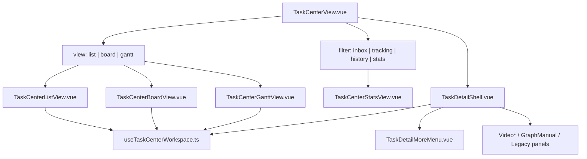
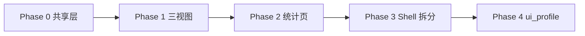

# TC-P2 · 视图重做 + 任务统计 — 落地实施计划

> **状态**: ✅ 已完成 · **日期**: 2026-06-18 · **分支**: `feat/task-center-p2-views-stats` → merged main @ `0.88.0`  
> **父计划**: [`task-center-v2-implementation-plan.md`](./task-center-v2-implementation-plan.md) §TC-P2  
> **产品规格**: [`workflow-video-v1-ui-simplification-design.md`](./workflow-video-v1-ui-simplification-design.md) §7、§11.3  
> **交互基准**: [`../demos/workflow-task-center-v2.1-demo.html`](../demos/workflow-task-center-v2.1-demo.html) S4 示意

---

## 0. 目标

完成 **S4 任务中心 IA 2.0**：三视图（列表 / 看板 / 甘特）按 **用户态 × Run** 重做；新增 **任务统计** 入口；详情页迁出全量引擎日志，`TasksView` 瘦身为壳层 + `TaskDetailShell`。

**验收**（= 设计 §11.3）

- [x] 三视图独立组件且与 Demo §7.2 一致
- [x] 统计入口可看全量 run_events 与部门汇总
- [x] 详情仅保留最近 3 条事件摘要

---

## 1. 现状与差距

| 区域 | 现状（main @ `fd8ad66`） | P2 目标 |
|------|--------------------------|---------|
| `TasksView.vue` | ~2100 行；列表/看板/甘特/详情/统计/负载 **同文件** | 壳层 + 委托子组件 |
| `TaskCenterView.vue` | 已有 `filter` + `view` query；list 用 Master 表 + `detail-only` TasksView | 增加 **统计 Tab**；视图改调独立组件 |
| 列表 | list 模式 Master 在 `TaskCenterView`；TasksView 内仍有 legacy 全列表 | `TaskCenterListView` 统一列规格（Run + 用户态） |
| 看板 | `listTaskBoard()` 按 **`TaskStatus`** 分列；卡片无 Run | 按 **`TaskUserFacingState`** 分列；卡片含 Run chip |
| 甘特 | `listTaskGantt()` 表格占位，非时间轴 | 仅 `due_at` 任务；Run 色条（CSS 时间轴 MVP） |
| 统计 | `page__summary` 四卡 + `page__workload` 在 TasksView 顶部；全量 `workflowRunEvents` 在非 video 详情 | 迁至 `TaskCenterStatsView`；详情 video 仅 **3 条**（已有 partial） |
| Shell | P0 推迟；`TaskDetailMoreMenu` 已独立 | `TaskDetailShell.vue` 收 header / meta / profile 面板 |
| Profile 解析 | 前端 `profile.ts` 硬编码规则 | 可选读模板 `config.ui_profile`（P2-7） |
| 更多菜单 | 无「打开任务统计」 | 链到 `/task-center/stats?instance={id}` |

**已有可复用**

| 模块 | 路径 |
|------|------|
| Profile / 用户态 | `frontend/src/domain/task-detail/profile.ts`、`user-state.ts` |
| 更多菜单 | `frontend/src/components/task-detail/TaskDetailMoreMenu.vue` |
| Run 标签 | `frontend/src/domain/task-detail/run-label.ts` |
| 统计 API | `GET /tasks/stats/summary`、`GET /tasks/stats/workload` |
| Run 事件 | `GET /workflow-graph/instances/{id}/events` |
| ROOT 子 Run | `BatchRunDashboard.vue`（可部分迁入统计页） |

---

## 2. 目标架构



**路由方案（P2-1）**

采用 **Query Tab**（与现有一致，Demo 对齐），不新增 nested route：

| Query | 值 | 行为 |
|-------|-----|------|
| `filter` | `inbox` \| `tracking` \| `history` \| **`stats`** | 主工作流 / 统计 |
| `view` | `list` \| `board` \| `gantt` | 统计 Tab 下禁用 view 切换 |
| `selected` | task id | Master-Detail 选中 |
| `instance` | graph instance id | 统计页聚焦某 Run（可选） |

备选：`/task-center/stats` redirect → `?filter=stats`（SEO/深链友好，P2-1 可选 10 行 redirect）。

---

## 3. 分阶段实施



### Phase 0 · 共享 workspace（前置，~1 PR）

**目的**：三视图 + Shell 共用任务加载、选中、用户态投影，避免复制 `TasksView` 逻辑。

| 项 | 说明 |
|----|------|
| **P2-0a** | 新建 `frontend/src/composables/useTaskCenterWorkspace.ts`：`tasks`/`selectedTaskId`/`loadTasks`/`selectTask`；封装 `listTasks` + inbox/tracking 数据源切换 |
| **P2-0b** | 新建 `frontend/src/composables/useTaskUserFacingProjection.ts`：对 `Task[]` 批量附加 `{ userState, runLabel }`（复用 `resolveTaskUserFacingStateForTask`） |
| **P2-0c** | 新建 `frontend/src/constants/task-center-run-colors.ts`：Run → 色板（甘特条 + 看板 chip） |
| **P2-0d** | Feature flag：`VITE_TASK_CENTER_V2_UI_ENABLED`（默认 `true` on main dev；文档写回滚方式） |

**非目标**：不改 API。

---

### Phase 1 · 三视图独立组件（P2-3～P2-5，~2 PR）

#### P2-3 · `TaskCenterListView.vue`

| 项 | 说明 |
|----|------|
| 数据源 | tracking/inbox/history 当前 filter 对应的 task 集合（与 `TaskCenterView` Master 表一致） |
| 列 | 标题（含 Run 短标签）、Run、`用户态`、截止时间；（**移除**引擎 status 列或降为 secondary） |
| 交互 | row-click → `selected` query；`data-testid="task-center-list-view"` |
| 集成 | `TaskCenterView` list 模式：Master 表 **替换** 为 `TaskCenterListView` |

#### P2-4 · `TaskCenterBoardView.vue`

| 项 | 说明 |
|----|------|
| 分列 | 5 列：`pending` / `in_progress` / `awaiting_confirm` / `completed` / `returned`（`TASK_USER_FACING_STATE_LABELS`） |
| 卡片 | 标题 + Run chip + 执行人 + due；**只读**（设计非目标：拖拽改态） |
| 数据源 | 同 filter 下 tasks，**前端**按 userState 分组（不依赖 `listTaskBoard` 的 status 列） |
| 分组切换 | MVP：仅用户态列；**P2.1 可选**：toolbar「按 Run 分组」折叠同一 Run（Demo 文字说明） |
| testid | `task-center-board-view`、`board-column-{state}` |

#### P2-5 · `TaskCenterGanttView.vue`

| 项 | 说明 |
|----|------|
| 过滤 | `task.due_date != null` |
| 轴 | MVP：相对时间条（`started_at`→`due_date`，缺 start 用 created_at）；Week 窗口可配置 |
| Run | 条背景色 = `runLabel` hash → palette |
| 空态 | 「无截止时间的任务不在甘特中显示」 |
| testid | `task-center-gantt-view` |
| 非目标 | 不引入重型 Gantt 库（除非 UX 评审要求） |

**集成变更**

- `TaskCenterView`：`view !== list` 时渲染 Board/Gantt 组件 + 右侧 `detail-only` Shell（**不再**整页 `TasksView`）
- `TasksView`：删除内嵌 list/board/gantt 模板块（Phase 3 一并清理）

**测试**

| 层 | 内容 |
|----|------|
| vitest | board 分组计数、甘特过滤、list 用户态列 |
| Playwright | 扩展 `e2e/task-center.spec.ts`：切换 board/gantt、断言列名「待处理」非「待办」 |

---

### Phase 2 · 任务统计（P2-1、P2-2、P2-6，~2 PR）

#### P2-1 · 统计 Tab / 路由

- `TaskCenterFilter` 扩展 `'stats'`
- `TaskCenterFilterCards` 或顶栏增加第 4 卡「统计」
- `filter=stats` 时隐藏 view 切换（opacity + disabled，对齐 Demo）
- `router/index.ts` 可选：`path: 'task-center/stats'` → redirect `{ filter: 'stats' }`

#### P2-2 · `TaskCenterStatsView.vue`

**MVP 区块**（设计 §7.3 + 计划风险缓解「MVP 仅事件+计数」）：

| 区块 | 数据源 | 权限 |
|------|--------|------|
| 汇总四卡 | `getTaskStatsSummary()` | 已有 API |
| 负载表 | `getTaskWorkload()` | 已有 API |
| Run 列表 | **新增前端聚合** 或复用 tracking 任务按 `workflow_graph_instance_id` 分组 | manager / admin |
| 事件时间线 | `listInstanceEvents(instanceId, { limit: 100 })` | 选中 Run 后加载 |
| 子 Run 表 | `listInstanceChildren` + `BatchRunDashboard` 逻辑抽取 | ROOT 批次 |

**权限 MVP**

- `authStore.isManagementRole` → 全量
- 否则 → 本部门任务关联的 instance ids（从 tracking/history tasks metadata 收集）

**后端扩展（可选 PR，非阻塞 MVP）**

| API | 用途 | 优先级 |
|-----|------|--------|
| `GET /task-center/stats/runs?department_id=` | 部门 Run 汇总 | P2.1 |
| 现有 `list_instances_for_template` | Admin 模板维度的 Run | 低 |

MVP 可 **不增后端**：统计页用 tracking 任务 + 按需 fetch instance events。

#### P2-6 · 详情迁出

| 从 TasksView 移除 / 迁出 | 保留在详情 |
|--------------------------|------------|
| `page__summary` 四卡 | — |
| `page__workload` 表 | — |
| 非 video 全量 `workflowRunEvents` timeline | video：`slice(0,3)` **已有** |
| `BatchRunDashboard` 全量子 Run + 30 事件 | ROOT 跟踪仍可用 `VideoTrackingPanel`；Dashboard 迁 stats |
| 图节点 `node_instances` 大列表（`!usesVideoWorkflowLayout`） | 折叠或链接「在统计中查看」 |

**更多菜单（P1 预留）**

- `TaskDetailMoreMenu` 增加「打开任务统计」→ `router.push({ filter: 'stats', instance: graphInstance.id })`

---

### Phase 3 · `TaskDetailShell` + TasksView 瘦身（P2-8，~2 PR）

**历史说明**：Phase 3 启动时 P0 Shell 骨架未独立；P2-8 已完成以满足设计 §7.4。

#### `TaskDetailShell.vue` 职责

```
Props: task, graphInstance, profile, users, departments
Slots / emits: action-done, refresh
```

| 区域 | 内容 |
|------|------|
| Header | 标题、用户态 badge、主 CTA 区、`TaskDetailMoreMenu` |
| Compact meta | deadline / 部门 / Run / 执行人（`compactMetadata` profile） |
| Body | `<component :is="profilePanel" />` 动态面板 |
| 折叠 | 评论留痕（video 默认折叠）、最近 3 事件 |

#### 从 `TasksView.vue` 抽出

- `selectedTaskProfile` 相关 template（~400 行）
- `showDetailHeaderActions` / handshake / deliverable handlers → Shell 或 `useTaskDetailActions.ts`
- Profile 面板 import 保留在 Shell

#### `TasksView.vue` 终态

- **删除**：list/board/gantt、summary、workload、重复 view toggle
- **保留**：standalone `/tasks` 路由兼容（若有）或标记 deprecated → 重定向 task-center
- 目标：**≤600 行** 或废弃，由 `TaskCenterView` + Shell 完全替代

**测试**：现有 workflow-video mock E2E **全量回归**；`TasksView.spec.ts` 更新为 Shell 单测。

---

### Phase 4 · `config.ui_profile`（P2-7，~1 PR，可并行靠后）

| 层 | 变更 |
|----|------|
| Schema | `WorkflowGraphTemplateNode.config.ui_profile?: TaskDetailProfileId` |
| 校验 | Pydantic optional enum |
| 前端 | `resolveTaskDetailProfile()`：**优先**读 `template_node_key` 对应 snapshot / node config，fallback 现有启发式 |
| 种子 | `topic_meeting_batch_v1` 节点写入 ui_profile（文档化，非必须 runtime 依赖） |
| 测试 | profile.test.ts 增加 ui_profile override case |

---

## 4. PR 切分建议

| # | 分支/PR | 范围 | 约行数 |
|---|---------|------|--------|
| 1 | `feat/task-center-p2-workspace-composables` | Phase 0 | ~200 |
| 2 | `feat/task-center-p2-list-board-gantt` | Phase 1 三视图 + TaskCenterView 集成 | ~450 |
| 3 | `feat/task-center-p2-stats-view` | Phase 2 统计 Tab + StatsView + 详情迁出 | ~400 |
| 4 | `feat/task-center-p2-detail-shell` | Phase 3 Shell + TasksView 瘦身 | ~500 |
| 5 | `feat/workflow-template-ui-profile` | Phase 4 可选 | ~150 |

每 PR：CI 绿 + 相关 E2E；合并顺序 1→2→3→4→5。

---

## 5. 测试计划

```bash
# 单元
cd frontend && npm run test:unit -- src/domain/task-detail src/components/task-center

# 类型与构建
cd frontend && npm run type-check && npm run build

# E2E mock
cd frontend && npx playwright test e2e/task-center.spec.ts \
  e2e/workflow-video-uat/workflow-video-multi-account-mock.spec.ts

# 后端（ui_profile PR）
cd backend && pytest -q tests/test_workflow_video_w1_contracts.py
```

**新增 E2E**：`e2e/task-center-stats.spec.ts`

1. 打开 `?filter=stats` → 汇总四卡可见
2. 从 ROOT 详情更多菜单 → 跳转 stats 并带 `instance`
3. board 视图列标题为「待处理」等用户态文案

---

## 6. 风险与缓解

| 风险 | 缓解 |
|------|------|
| `TasksView` 回归面大 | Phase 3 前不删旧路径；flag 回滚；mock E2E 全跑 |
| 看板与 inbox 数据源不一致 | 统一 `useTaskCenterWorkspace` + 同一 filter→API 映射 |
| 甘特 MVP 体验弱 | 对齐 Demo 文字预期；图表库列为 P2.1 |
| 统计页 instance 列表不全 | MVP 从 tracking 任务聚合；后续专用 API |
| PR 超 500 行 | Phase 1 拆 list+board 与 gantt 两个 PR |

**回滚**：`VITE_TASK_CENTER_V2_UI_ENABLED=false` → 回退 TaskCenterView 渲染旧 `TasksView` 路径（保留 1 个 release 的 legacy 分支）。

---

## 7. 非目标（本阶段不做）

- 看板拖拽改任务状态 / 用户态
- 合并 workflow E 与图模板运行时（TC-P3）
- N2 `join_mode=any` 门控变更（设计 §9.3 方案 B/C）
- 统计页复杂图表（ECharts 等）— 表格 + 时间线 MVP 即可
- 「结束采集」产品开关

---

## 8. 文档更新（阶段完成时）

| 文件 | 内容 |
|------|------|
| `active-task.md` | P2-x 状态勾选 |
| `progress.md` | 会话摘要 |
| `architecture.md` | §前端组件树 + Shell |
| `data-contracts.md` | `ui_profile`（若 Phase 4 落地） |
| `domains/task-center.md` | 三视图 + 统计 IA |
| `changelog.md` + `VERSION` | minor bump → `0.88.0` |

---

## 9. 建议实施顺序（开发打卡）

| 顺序 | ID | 任务 |
|------|-----|------|
| 1 | p2-composables | workspace + user projection composables |
| 2 | p2-list | TaskCenterListView + TaskCenterView 集成 |
| 3 | p2-board | TaskCenterBoardView 用户态列 |
| 4 | p2-gantt | TaskCenterGanttView MVP 时间条 |
| 5 | p2-stats-route | filter=stats + redirect |
| 6 | p2-stats-view | TaskCenterStatsView MVP |
| 7 | p2-detail-migrate | 详情迁出 summary/workload/events |
| 8 | p2-shell | TaskDetailShell 抽取 |
| 9 | p2-tasksview-slim | TasksView 瘦身 / dead code |
| 10 | p2-ui-profile | 模板 ui_profile（可选） |
| 11 | p2-e2e-docs | E2E + memory-bank 对齐 |

---

## 10. 修订记录

| 日期 | 说明 |
|------|------|
| 2026-06-18 | 初稿：基于 main 代码审计 + 设计 v2.1 / 实施计划 TC-P2 |
