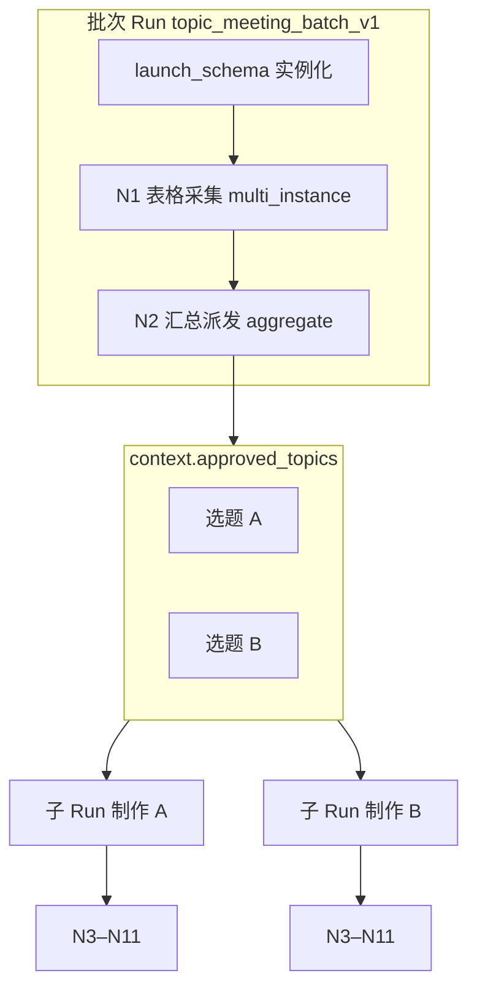
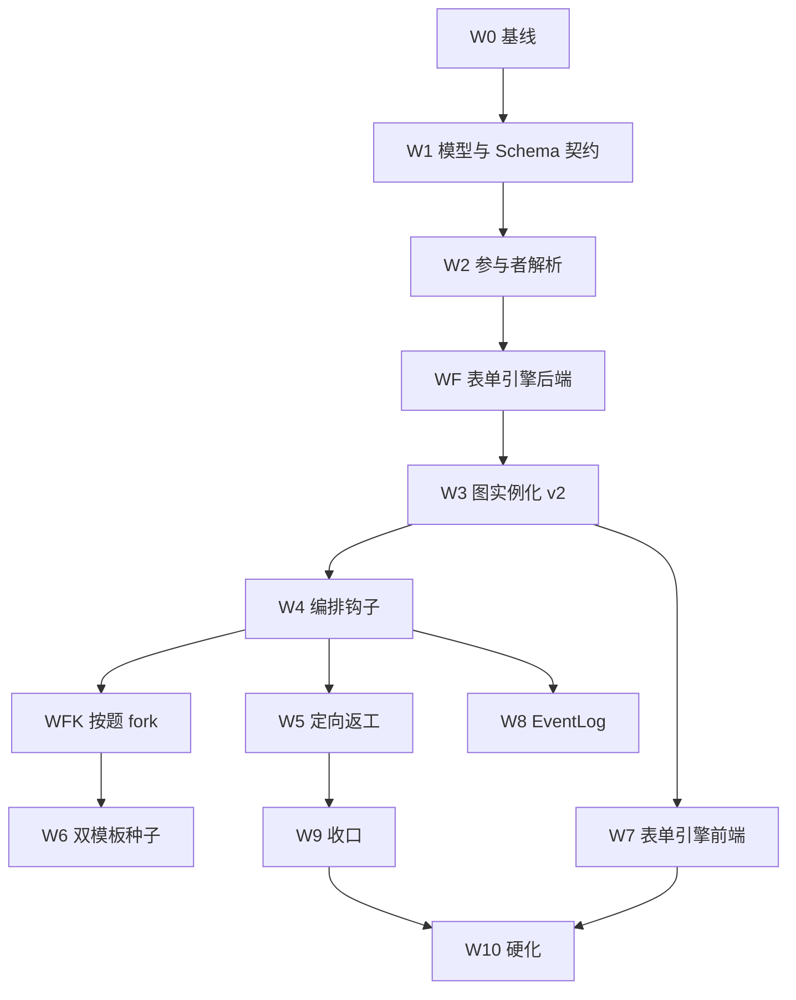

# 工作流深化实施清单（综合版 v2）

## 0. 文档定位

本文件综合仓库现状、业务方案与产品讨论结论，形成**可排期、可验收**的实施清单。

**输入与结论摘要**

1. **仓库现状**：图引擎 Phase 0–11-G 已落地；工作流 E（`task_templates`）为过渡兼容；`create_multi_node_instance` 未产品化，且当前为「一模板节点 → 一个 NodeInstance」。
2. **视频业务**：选题会产出**多条通过选题**；每条选题独立走脚本→配音→后期→发布；同一编辑可承担多篇。
3. **产品形态（已确认）**
   - **一次选题会 = 一张选题清单（批次 Run）**；清单固化后 **按题 fork 多条制作流（子 Run）**。
   - **不设单独「发起选题会」入口**；选题会是图模板库中的**一个模板**，与其他模板共用「选模板 → 实例化」入口。
   - **模板引擎须支持表格采集**：可配置的 `launch_schema` / `capture_schema` / `aggregate_schema`，而非选题会专用页面。

**原则（必须遵守）**

- **不新建第三套运行时**：以 `workflow_graph_*` + `Task` 为主；`task_templates` 只读/导入/兼容，新发起走 graph。
- **编排与执行分离**：引擎负责实例化、激活、门禁、通知、定向返工、按题 fork；**禁止**自动审批通过。
- **Schema 版本固化**：Run 创建时快照 `template_version` + 各节点 form schema，进行中实例不受模板后续改版影响。
- 每个阶段完成后更新 `memory-bank/architecture.md`、`memory-bank/progress.md`；阶段结束跑约定测试命令。

**非目标（v1 不做）**

- 拖拽式全图 DAG 设计器（保留邻接表/步骤表或 JSON 种子即可）。
- 通用条件 DSL 产品化（视频模板 v1 不配条件边）。
- **在同一制作流 Run 内**并行多条脚本→成片 DAG（原「N3 多选题单 Run 分叉」）；改为 **批次 Run + 按题 fork 子 Run**。
- 推翻 Append-Only deep-reject；v1 采用 **结构化打回 + 定向 deep-reject（node_key + instance_key）**。
- 独立业务导航（「发起选题会」「发起制作单」）；统一为 **模板实例化**。
- 通用表单设计器全功能（计算列、跨表公式）；v1 仅支持 **行表格采集 + 有限列类型**。
- 汇总表在线改稿（改稿通过打回采集节点重交）。

---

## 1. 双模板架构与 Run 关系

### 1.1 模板划分

| 模板 code | 用途 | Run 类型 |
|-----------|------|----------|
| `topic_meeting_batch_v1` | 选题会：征集 → 汇总派发 | **批次 Run**（`run_kind=batch`） |
| `video_production_per_topic_v1` | 单条选题：脚本→…→结案 | **制作 Run**（`run_kind=production`） |



### 1.2 Run `context` 约定（批次）

```json
{
  "run_kind": "batch",
  "run_label": "第12周选题会",
  "inputs": { "theme": "春节系列", "description": "...", "due_at": "..." },
  "participants_snapshot": {
    "copywriters": { "mode": "subset", "user_ids": ["uuid", "..."] }
  },
  "root_task_id": "uuid",
  "template_version": 1,
  "schema_snapshot": { "launch": {}, "nodes": { "N1_PROPOSE": {}, "N2_AGGREGATE": {} } },
  "approved_topics": [],
  "fork_status": "pending | completed | partial"
}
```

### 1.3 `approved_topics[]`（派发产出，批次→子 Run 衔接）

```json
{
  "approved_topics": [
    {
      "topic_id": "uuid",
      "title": "年味街头采访",
      "content": "...",
      "reason": "...",
      "source_submitter_id": "uuid",
      "source_node_instance_id": "uuid",
      "script_author_id": "uuid",
      "due_at": "optional"
    }
  ]
}
```

### 1.4 子 Run `context`（制作）

```json
{
  "run_kind": "production",
  "parent_instance_id": "uuid",
  "batch_run_label": "第12周选题会",
  "topic_id": "uuid",
  "topic_title": "...",
  "script_author_id": "uuid",
  "inputs": { "inherited_from_batch": true }
}
```

### 1.5 关联字段（增量）

| 字段 | 落点 | 说明 |
|------|------|------|
| `parent_instance_id` | `workflow_graph_instances.context` 或 DB 列 | 子 → 批 |
| `topic_id` | 子 Run context + 子 ROOT Task 标题 | 幂等 fork 键 |
| `run_kind` | context | `batch` / `production` |
| `forked_child_instance_ids` | 批次 context | 派发后写入 |

---

## 2. 模板表单引擎（跨模板能力）

> 选题会、后续 SOP 模板均通过 **同一套 schema 契约** 配置；前端 **两个通用面板** + 模板设计器/种子 JSON。

### 2.1 三层 Schema

| Schema | 时机 | 渲染位置 | 选题会示例 |
|--------|------|----------|------------|
| `launch_schema` | 模板实例化 | 通用实例化 Dialog（无独立业务按钮） | 主题、截止、参与人多选、说明 |
| `capture_schema` | 执行人处理节点 Task | 任务详情内嵌 `TemplateCapturePanel` | 可增删行表格：标题、内容、理由 |
| `aggregate_schema` | 负责人汇总节点 Task | 任务详情内嵌 `TemplateAggregatePanel` | 跨编辑合并表；通过/打回；选撰写人 |

模板级：`workflow_graph_templates.config` 或版本 JSON 含 `launch_schema`。  
节点级：`workflow_graph_template_nodes.config` 含 `capture_schema` / `aggregate_schema`（与下文 `kind` 等并存）。

### 2.2 `capture_schema` 示例

```json
{
  "mode": "row_table",
  "min_rows": 1,
  "max_rows": 20,
  "columns": [
    { "key": "title", "label": "选题标题", "type": "text", "required": true },
    { "key": "content", "label": "选题内容", "type": "textarea" },
    { "key": "reason", "label": "选题理由", "type": "textarea" }
  ],
  "storage": "deliverable_payload",
  "completion_policy": "on_capture_submitted"
}
```

提交写入 `workflow_deliverables.payload`（或等价 JSON 列），结构：

```json
{ "topics": [{ "topic_id": "uuid", "title": "...", "content": "...", "reason": "..." }] }
```

### 2.3 `aggregate_schema` 示例

```json
{
  "mode": "submission_matrix",
  "source_node_key": "N1_PROPOSE",
  "row_id_field": "topic_id",
  "columns": [
    { "key": "proposer", "label": "提案人", "source": "assignee_display" },
    { "key": "title", "label": "标题", "source": "payload.topics[].title" }
  ],
  "row_actions": ["approve", "reject"],
  "assignee_column": { "key": "script_author_id", "label": "脚本撰写人", "type": "user" },
  "on_confirm": {
    "action": "finalize_topics_and_fork",
    "child_template_code": "video_production_per_topic_v1",
    "idempotency_key": "topic_id"
  }
}
```

`on_confirm` 动作为**有限枚举**（v1 不做任意脚本）：`finalize_topics_and_fork` | `advance_only`。

### 2.4 节点 `config` 完整约定（执行层）

```json
{
  "kind": "single | multi_instance",
  "expand_from": "copywriters",
  "participant_policy_ref": "copywriters",
  "assignee_ref": { "type": "role | department_pool | context_var | user", "..." },
  "reviewer_ref": { "type": "context_var", "var": "script_author_id" },
  "handshake_required": true,
  "capture_schema": {},
  "aggregate_schema": {},
  "acceptance_spec": {
    "reject_to": { "node_key": "N1_PROPOSE", "instance_key_from": "topic_id | assignee" }
  },
  "completion_policy": "on_capture_submitted | on_aggregate_confirmed | on_submit_deliverable | on_review_approved"
}
```

---

## 3. 节点清单（两个模板）

### 3.1 `topic_meeting_batch_v1`（批次）

| node_key | kind | 表单/要点 |
|----------|------|-----------|
| `ROOT` | — | 批次汇总 Task；看板入口 |
| `N1_PROPOSE` | multi_instance | `capture_schema` 表格采集；expand `copywriters`；**一人可多行选题** |
| `N2_AGGREGATE` | single | `aggregate_schema` 汇总+派发；`on_confirm` → 写 `approved_topics` + fork |

**边**：`N1` → `N2`，`join_mode=all`（所有参与人皆已提交采集表）。

### 3.2 `video_production_per_topic_v1`（单题制作）

| node_key | kind | 要点 |
|----------|------|------|
| `ROOT` | — | 标题含 `topic_title`；`parent_instance_id` 链批次 |
| `N3_SCRIPT_WRITE` | single | `assignee_ref` ← `script_author_id` |
| `N4_SCRIPT_REVIEW` | single | 部门负责人；reject → N3 |
| `N5_VO_WRITE` | single | 配音部 pool；`handshake_required` |
| `N6_VO_REVIEW` | single | `reviewer_ref` = `script_author_id`；reject → N5 |
| `N7_EDIT_ASSIGN` | single | 后期负责人指派剪辑（`aggregate` 或 capture 简化 v1：capture 选剪辑人） |
| `N8_EDIT_WORK` | single | 剪辑执行 |
| `N9_EDIT_REVIEW` | single | `reviewer_ref` = `script_author_id`；reject → N8 |
| `N10_UPLOAD` | single | url/附件交付物 |
| `N11_SCHEDULE` | single | 排期字段（结构化 payload，非外部平台发帖） |
| `N12_CLOSE` | single | 负责人确认归档；通知批次 ROOT 关注人 |

> v1 可将 `N7_EDIT_ASSIGN` 与 `N8` 合并为一个节点以减工期；上表为完整目标态。

---

## 4. 用户侧主路径（无单独按钮）

1. **任务中心 / 图模板列表** → 选择模板「选题会」→ **通用实例化 Dialog**（`launch_schema`）。
2. 参与编辑 **待办** → 任务详情 **表格采集** → 提交。
3. 负责人 **待办** → 任务详情 **汇总表**（各编辑提交的题展开为行）→ 选题通过、指定撰写人 → **确认派发**。
4. 系统 **按题 fork** `video_production_per_topic_v1` 子 Run；撰写人/负责人收到对应制作待办。
5. 批次 **Run 看板** 展示子 Run 矩阵（选题 × 当前环节）；点进子 Run 见 `TasksView` 节点追踪。

---

## 5. 验收问题（UAT / E2E）

**批次（选题会）**

1. 本期征集参与人是谁？→ `participants_snapshot`（发起时固化）
2. 谁还没交表？→ N1 各 `instance_key` 未完成 `on_capture_submitted`
3. 通过选题清单是什么？→ `approved_topics[]`
4. 某题派给了谁写脚本？→ `approved_topics[].script_author_id`
5. 汇总表打回是否只影响该题/该人？→ 定向返工 + 采集重交

**制作（子 Run）**

6. 脚本为何被打回、几次？→ `workflow_run_events` + Task 元数据
7. 配音/后期谁接单、是否转办？→ 握手 + EventLog
8. 该题卡在哪？→ 子 Run `current_node_key`
9. 成片链接与排期？→ N10/N11 交付 payload
10. 本周批次下几题已结案？→ 批次看板聚合子 Run 状态

---

## 6. 实施阶段总览



| 阶段 | 名称 | 预估 | 里程碑 |
|------|------|------|--------|
| W0 | 基线冻结 | 2–3 天 | 范围签字；本 v2 口径 |
| W1 | 模型与契约 | 4–6 天 | instance_key、parent、schema Pydantic |
| W2 | 参与者解析 | 5–7 天 | snapshot + preview API |
| **WF** | **表单引擎（后端）** | 5–7 天 | 采集/汇总存储与 API |
| W3 | 图实例化 v2 | 7–10 天 | multi_instance + Task |
| W4 | 编排钩子 | 5–7 天 | capture/aggregate 驱动门禁 |
| W5 | 定向返工 | 5–7 天 | 题级/人级打回 |
| **WFK** | **按题 fork** | 4–6 天 | finalize + 子 Run 幂等 |
| W6 | 双模板种子 | 4–6 天 | 选题会 + 制作模板 |
| W7 | 表单引擎前端 | 12–16 天 | 通用 Dialog + Capture + Aggregate + 批次看板 |
| W8 | EventLog | 3–5 天 | 表 + 时间线 |
| W9 | 收口 | 5 天 | Outbox、图模板 CRUD 最小集 |
| W10 | 硬化 | 5–7 天 | E2E、文档、基线 |

**日历合计**：约 **9–13 周**（1 后端 + 1 前端）；纵向切片可先做批次链（约 5–6 周见 demo）。

---

## 7. 分阶段任务清单

### W0 — 基线冻结

| ID | 任务 | 产出 | 状态 |
|----|------|------|------|
| W0-1 | 确认 v2 产品口径：批次+fork、模板表单引擎、无独立发起按钮 | 本文件 v2 | done |
| W0-2 | `architecture.md` 增「视频 v2 / 表单引擎」摘要指针 | 文档 §2.3 | done |
| W0-3 | Feature：`WORKFLOW_GRAPH_TEMPLATE_ENGINE_ENABLED` gate 新实例化；E 实例化标 legacy | `workflow-video-v1-w0-adr.md` + `workflow_video_policy.py` | done |
| W0-4 | 冻结测试命令清单 | `progress.md` §视频工作流 v1 | done |

**W0 测试（必绿）**

- `pytest -q tests/test_workflow_video_w0_baseline.py tests/test_settings.py::test_settings_parse_workflow_feature_flags`
- `npm run test:unit -- --run tests/workflowVideoW0Baseline.spec.ts`
- `python -m compileall -q app tests`（backend 目录）

---

### W1 — 模型与契约

| ID | 任务 | 说明 |
|----|------|------|
| W1-1 | `workflow_node_instances.instance_key` | `singleton` / `userId` / `topicId` |
| W1-2 | `workflow_graph_instances`：`run_label`；可选 `parent_instance_id` 列 | 批次/子关联 |
| W1-3 | Pydantic：`LaunchSchema`、`CaptureSchema`、`AggregateSchema`、`ApprovedTopic` | `app/schemas/workflow_graph.py` |
| W1-4 | `WorkflowGraphTemplateNodeConfig` 合并 form + kind | 校验互斥 |
| W1-5 | Run 创建时写入 `schema_snapshot` | 版本固化 |
| W1-6 | 前端 TS 类型同步 | `api.ts` |
| W1-7 | 单测：非法 schema、空 subset、aggregate 无 source 422 | pytest |

---

### W2 — 参与者绑定

| ID | 任务 | 说明 |
|----|------|------|
| W2-1 | `ParticipantResolutionService` | department_members + all/subset |
| W2-2 | `workflow_rule_resolver` 扩展 `context_var`、`department_pool` | `script_author_id` 等 |
| W2-3 | `POST .../templates/{id}/preview-participants` | 实例化 Dialog 用 |
| W2-4 | 单测：snapshot 不受事后人事变动影响 | — |

---

### WF — 表单引擎（后端）

| ID | 任务 | 说明 |
|----|------|------|
| WF-1 | `submit_capture(task_id, payload)` | 校验 `capture_schema`；写 deliverable JSON |
| WF-2 | `GET .../instances/{id}/submissions?node_key=N1_PROPOSE` | 汇总 API 数据源 |
| WF-3 | `finalize_aggregate(run_id, approved_topics[], rejected[])` | 写 context；触发 WFK |
| WF-4 | 题级 `topic_id` 生成（客户端或服务端 UUID） | 打回/fork 幂等 |
| WF-5 | 与 `completion_policy=on_capture_submitted / on_aggregate_confirmed` 挂钩 | W4 调用 |

**验收**：API 层可提交多行选题、拉齐汇总 JSON、finalize 写出 `approved_topics`。

---

### W3 — 图实例化 v2

| ID | 任务 | 说明 |
|----|------|------|
| W3-1 | `instantiate_graph_template(template_code, launch_payload, participants_snapshot)` | 写 context + schema_snapshot |
| W3-2 | multi_instance 按 snapshot 展开 N1 | 每人 1 NodeInstance + Task |
| W3-3 | single 节点 1 实例 | N2 等 |
| W3-4 | 创建批次 ROOT Task | 看板入口 |
| W3-5 | `POST /workflow-graph/templates/{id}/runs` | 统一实例化（**非**独立选题会路由） |
| W3-6 | 模板 `run_kind` 元数据 | 区分 batch / production |

**验收**：实例化选题会模板 → 3 人 3 条 N1 待办；N2 未激活。

---

### W4 — 编排钩子

| ID | 任务 | 说明 |
|----|------|------|
| W4-1 | `WorkflowOrchestrationService` | capture 提交 → 节点可完成 |
| W4-2 | aggregate 确认 → 完成 N2；调用 WFK | 事务边界 |
| W4-3 | `on_task_accepted` / deliverable / review | 制作模板各 policy |
| W4-4 | all-of：同 node_key 全部 instance 满足后才激活 N2 | — |
| W4-5 | 接入 `TaskService` 与模板图任务执行路径 | 含 `source_type=template` 图投影任务 |

**验收**：第三人提交采集后 N2 出现在负责人 inbox。

---

### W5 — 定向返工

| ID | 任务 | 说明 |
|----|------|------|
| W5-1 | 汇总表 reject → 定向 N1 `instance_key`（提交人）或 `topic_id` | 仅重开相关采集 |
| W5-2 | 制作链 reject → N3/N5/N8 等 `acceptance_spec` | deep_reject |
| W5-3 | 打回必填原因；EventLog | — |

**验收**：打回小张一题 → 仅小张 N1 待办重现。

---

### WFK — 按题 fork 子 Run

| ID | 任务 | 说明 |
|----|------|------|
| WFK-1 | `fork_production_runs(batch_instance_id, approved_topics[])` | 每题一次 |
| WFK-2 | 幂等：`(parent_instance_id, topic_id)` 唯一 | 重复确认不重复 fork |
| WFK-3 | 子 Run `instantiate` 注入 `topic_*`、`script_author_id` | 制作模板 N3 起激活 |
| WFK-4 | 批次 context：`forked_child_instance_ids`、`fork_status` | 看板用 |
| WFK-5 | 子 ROOT `parent_task_id` 可选链批次 ROOT | 任务树 |

**验收**：派发 5 题 → 5 子 Run；小陈 2 题 → 2 条「写脚本」待办。

---

### W6 — 双模板种子

| ID | 任务 | 说明 |
|----|------|------|
| W6-1 | `topic_meeting_batch_v1`：N1/N2 + schema + 边 | seed 脚本 |
| W6-2 | `video_production_per_topic_v1`：N3–N12 + schema | 同上 |
| W6-3 | `participant_policy` 绑定文案/配音/后期部门 | sample_data |
| W6-4 | 权限与 `can_publish_org_tasks` 对齐 | — |
| W6-5 | Runbook：Docker 复现 | 文档 |

---

### W7 — 前端（模板引擎 + 追踪）

| ID | 任务 | 说明 |
|----|------|------|
| W7-1 | `workflow-graph.ts`：createRun、previewParticipants、submissions、finalize、listChildren | API |
| W7-2 | **通用** `TemplateInstantiateDialog`：`launch_schema` 动态表单 | 挂在图模板列表/任务中心发布入口；**无单独选题会按钮** |
| W7-3 | `TemplateCapturePanel`：按 `capture_schema` 渲染行表格 | `TasksView` / 任务中心详情按 `node_key` 挂载 |
| W7-4 | `TemplateAggregatePanel`：汇总+选人+确认派发 | N2 负责人 Task |
| W7-5 | `BatchRunDashboard`：子 Run 矩阵、进度、跳转 | 链 `ROOT` / 批次 instance |
| W7-6 | `TasksView` 增强：返工原因、链批次/子 Run | 已有节点追踪复用 |
| W7-7 | 图模板列表 Tab（或扩展现有模板页） | 与 E 模板区分 badge |

**验收**：不调用 API，完成选题会采集→汇总派发→至少 1 条子流脚本提交；第二条模板可复用 `capture_schema` 做 smoke。

---

### W8 — Run EventLog

| ID | 任务 | 说明 |
|----|------|------|
| W8-1 | 表 `workflow_run_events` | Alembic |
| W8-2 | append：实例化、capture 提交、aggregate 确认、fork、打回、节点完成 | — |
| W8-3 | `GET .../instances/{id}/events` | 分页 |
| W8-4 | 批次/子 Run 看板时间线 | — |

---

### W9 — 收口

| ID | 任务 | 说明 |
|----|------|------|
| W9-1 | Outbox `workflow_node_activated` | 实例化/激活 |
| W9-2 | 图模板 CRUD 最小 API 或种子+JSON 导入 | 维护 `launch/capture/aggregate` |
| W9-3 | `WORKFLOW_*_ENABLED` 行为与配置清理 | — |
| W9-4 | 工作流 E 模板页只读/legacy 标识 | — |

---

### W10 — 硬化与回归

| ID | 任务 | 说明 |
|----|------|------|
| W10-1 | Playwright：选题会模板实例化 → 3×表格提交 → 汇总派发 → 子流脚本 | mock + 可选 live |
| W10-2 | 打回单题、一人两题 fork 两子 Run | 回归 |
| W10-3 | `architecture.md` / `progress.md` / 测试基线 | — |
| W10-4 | 全量 pytest + vitest + type-check | — |

---

## 8. 纵向切片（推荐排期）

**切片 1（约 5–6 周，可演示）**  
W0 → W1 → W2 → WF → W3 → W4 → W5（题级打回）→ WFK → W6（仅批次+制作前 4 节点）→ W7（Dialog + Capture + Aggregate + 简版看板）

**切片 2**  
制作模板 N5–N12 + 握手/验收 + W8 + W9 + W10 全量 UAT

---

## 9. 风险与缓解

| 风险 | 缓解 |
|------|------|
| 表单引擎范围膨胀 | v1 列类型白名单；`on_confirm` 动作枚举 |
| fork 事务失败部分成功 | finalize 原子；`fork_status=partial` 可重试 |
| 汇总 API 与多人多行性能 | v1 参与人 <30、题 <100 |
| 图任务 vs 手动图握手 | 制作模板跨部门节点显式 `handshake_required` |
| 双模板维护成本 | 种子+版本；E 模板不重复实现采集 |
| 用户混淆批次/子 Run | 标题前缀 `[第12周]` + 看板统一入口 |

---

## 10. 阶段完成检查表

- [ ] `architecture.md` 已更新
- [ ] `progress.md` 已更新验证命令与结论
- [ ] 无未经文档的第三套运行时
- [ ] 自动化测试已绿或遗留项已记录

---

## 11. 参考文件索引

| 主题 | 路径 |
|------|------|
| 图引擎服务 | `backend/app/services/workflow_graph_service.py` |
| 图模型 | `backend/app/models/workflow_graph.py` |
| 图 API | `backend/app/api/routes/workflow_graph_engine.py` |
| Task 执行 | `backend/app/services/task_service.py` |
| 规则解析 | `backend/app/services/workflow_rule_resolver.py` |
| 前端图 API | `frontend/src/api/workflow-graph.ts` |
| 前端模板页 | `frontend/src/views/TaskTemplatesView.vue` |
| 任务详情 | `frontend/src/views/TasksView.vue` |
| 选题会 E 草稿（参考，非主路径） | `memory-bank/templates/A_TOPIC_SELECTION_WF_steps.json` |
| 设计原则 | `memory-bank/design-document.md` §3.7 |

---

*文档版本：v2.0 | 修订：批次 Run + 按题 fork、模板表单引擎（launch/capture/aggregate）、统一模板实例化入口 | 基线 commit 参考 `36c6a77`*
